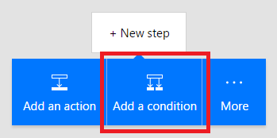

# Een voorwaarde toevoegen aan een stroom
Stel in dat een stroom één of meer taken alleen uitvoert als aan een bepaalde voorwaarde wordt voldaan. Stel bijvoorbeeld in dat u alleen een e-mail ontvangt als een tweet met een trefwoord ten minste tien keer wordt geretweet.

**Vereisten**

* [Een stroom](get-started-logic-template.md) maken van een sjabloon: in deze zelfstudie [wordt deze sjabloon gebruikt](https://flow.microsoft.com/galleries/public/templates/e78571e5c70e4806a18eeacba5a897c8/) als voorbeeld

## Een voorwaarde toevoegen
1. Ga naar [flow.microsoft.com](https://flow.microsoft.com) en selecteer **Mijn stromen** op de navigatiebalk bovenin.
2. Selecteer in de lijst met stromen een stroom die u hebt gemaakt. In deze zelfstudie wordt een voorbeeld gebruikt met een Twitter-trigger en een SharePoint-actie.
3. Maak de laatste actie ongedaan en selecteer de knop **Nieuwe stap**.
4. Selecteer **Een voorwaarde toevoegen**.
   
    
5. Selecteer een leeg gebied in **Objectnaam** en selecteer **Dynamische inhoud toevoegen** om het menu voor dynamische inhoud te openen.
6. Selecteer de parameter **Aantal retweets** om deze toe te voegen aan het vak.
7. In het vak **Relatie** selecteert u de optie **is groter dan of gelijk aan**.
8. In het vak **Waarde** typt u **10**.
   
    
9. Klik op de kop van de actie die u in de voorwaarde wilt hebben (zoals **Item maken**) en sleep dit onder de tekst **IF YES** door. Wanneer u de cursor loslaat, wordt de actie in het vak geplaatst.
   
    
10. Sla de stroom op.

## Bewerken in de geavanceerde modus
U kunt ook de koppeling **Bewerken in geavanceerde modus** selecteren om meer geavanceerde voorwaarden te schrijven. U kunt hier elke expressie van de *Definitietaal van de werkstroom* gebruiken. [Meer informatie over](https://msdn.microsoft.com/library/azure/mt643789.aspx) welke functies beschikbaar zijn.

