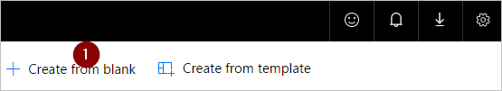
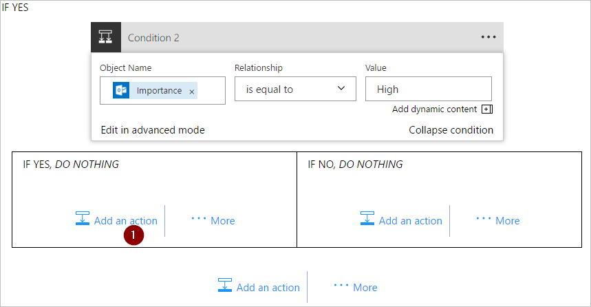
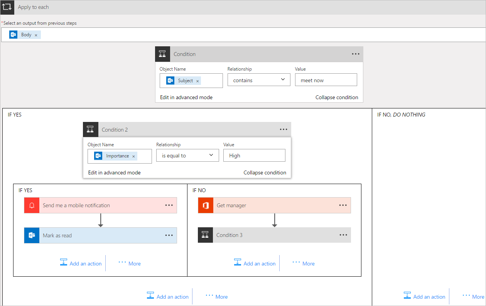

# Gebruik de actie Op elk(e) toepassen in Microsoft Flow om periodiek een lijst met items te verwerken
Veel triggers kunnen direct een stroom starten op basis van een gebeurtenis, zoals de ontvangst van een nieuwe e-mail in uw postvak IN. Deze triggers zijn handig, maar soms wilt u een stroom uitvoeren die een query uitvoert op een gegevensbron volgens een vooraf gedefinieerd schema, waarbij bepaalde acties op basis van de eigenschappen van items in de gegevensbron worden uitgevoerd. U kunt hiervoor een stroom op basis van een schema laten starten (bijvoorbeeld een keer per dag) en een lusactie gebruiken, zoals **Op elk(e) toepassen** om een lijst met items te verwerken. U kunt bijvoorbeeld **Op elk(e) toepassen** gebruiken om records uit een database of een lijst met items van Microsoft SharePoint bij te werken.

Hier maken we een stroom die om de 15 minuten wordt uitgevoerd met de volgende actie:

1. Haalt de laatste 10 ongelezen berichten in uw postvak IN in Office 365 Outlook op.
2. Controleert alle 10 berichten om te bevestigen of een van de berichten **Nu vergaderen** in het onderwerp heeft.
3. Controleert of de e-mail afkomstig is van uw manager of met hoge urgentie is verzonden.
4. Verstuurt een pushmelding en markeert berichten met **Nu vergaderen** in het onderwerp die afkomstig zijn van uw manager of met hoge urgentie zijn verzonden, als gelezen.

In dit diagram worden de details van de stroom weergegeven die we hier gaan maken:

## Vereisten
Dit zijn de vereisten voor het uitvoeren van de stappen in dit overzicht:

* Een account dat is geregistreerd voor het gebruik van [Microsoft Flow](https://flow.microsoft.com).
* Een Office 365 Outlook-account.
* De mobiele app voor Microsoft Flow voor [Android](https://aka.ms/flowmobiledocsandroid), [iOS](https://aka.ms/flowmobiledocsios) of [Windows Phone](https://aka.ms/flowmobilewindows).
* Verbindingen met Office 365 Outlook en de service voor pushberichten.

## Een stroom maken
1. Aanmelden bij [Microsoft Flow](https://flow.microsoft.com):
2. Selecteer het tabblad **Mijn stromen** en maak vervolgens een stroom op basis van een lege stroom:
   
    
3. Voer 'plannen' in het zoekvak in om te zoeken naar alle services en triggers die gerelateerd zijn aan de planning.
4. Selecteer de trigger **Schema - Terugkeerpatroon** om aan te geven dat de stroom worden uitgevoerd op basis van een schema dat u vervolgens instelt:
   
    
5. Stel in dat het schema om de 15 minuten wordt uitgevoerd:
   
    
6. Selecteer **+ Nieuwe stap**, **Een actie toevoegen** en typ vervolgens **outlook** in het zoekvak om te zoeken naar alle acties die zijn gerelateerd aan Microsoft Outlook.
7. Selecteer de actie **Office 365 Outlook - E-mails ophalen**:
   
    
8. Hiermee opent u de kaart **E-mails ophalen**. Configureer de kaart **E-mails ophalen** om de bovenste 10 ongelezen e-mails in het postvak IN op te halen. Neem geen bijlagen op, aangezien deze niet in de stroom worden gebruikt:
   
    
   
   > [!NOTE]
   > U hebt nu een eenvoudige stroom gemaakt waarmee bepaalde e-mails in uw postvak IN worden opgehaald. Deze e-mails worden geretourneerd in een matrix. Voor de actie **Op elk(e) toepassen** is namelijk een matrix vereist.
   > 
   > 

## Acties en voorwaarden toevoegen
1. Selecteer **+ Nieuwe stap**, **Meer** en vervolgens de actie **Een item voor toepassen toevoegen aan elk(e)**:
   
    
2. Plaats het token **Hoofdcode** in het vak **Een uitvoer selecteren uit de vorige stappen** op de kaart **Op elk(e) toepassen**. Hiermee wordt de hoofdtekst van de e-mails opgehaald voor gebruik in de actie **Op elk(e) toepassen**:
   
    
3. Selecteer **Een voorwaarde toevoegen**:
   
    
4. Configureer de kaart **Voorwaarde** om in het onderwerp van elke e-mail te zoeken op 'Nu vergaderen':
   
   * Plaats het token **Onderwerp** in het vak **Objectnaam**.
   * Selecteer **bevat** in de lijst **Relatie**.
   * Voer **Nu vergaderen** in het vak **Waarde** in.
     
     
5. Selecteer **Meer** en selecteer vervolgens **Een voorwaarde toevoegen** van de vertakking **INDIEN JA, NIETS DOEN**. Hiermee opent u de kaart **Voorwaarde 2**. Configureer deze kaart als volgt:
   
   * Plaats het token **Urgentie** in het vak **Objectnaam**.
   * Selecteer **is gelijk aan** in de lijst **Relatie**.
   * Voer **Hoog** in het vak **Waarde** in.
     
     
6. Selecteer **Een actie toevoegen** in het gedeelte **INDIEN JA, NIETS DOEN**. Hiermee opent u de kaart **Kies een actie**, waarin u opgeeft wat er moet gebeuren als de zoekvoorwaarde (de e-mail met het onderwerp **Nu vergaderen** is verzonden met hoge urgentie) waar is:
   
    
7. Zoek op **melding** en selecteer vervolgens de actie **Meldingen - Ik wil een mobiele melding ontvangen**:
   
    
8. Geef op de kaart **Ik wil een mobiele melding ontvangen** de details op voor de pushmelding die wordt verzonden als het onderwerp van een e-mail 'Nu vergaderen' bevat en selecteer vervolgens **Een actie toevoegen**:
   
    
9. Voer **lezen** in als de zoekterm en selecteer vervolgens de actie **Office 365 Outlook - Markeren als gelezen**. Hiermee wordt elke e-mail als gelezen gemarkeerd nadat de pushmelding is verzonden:
   
    
10. Voeg het token **Bericht-id** toe aan het vak **Bericht-id** van de kaart **Markeren als gelezen**. U moet mogelijk **Meer weergeven** selecteren om het token **Bericht-id** te vinden. Hiermee wordt de id weergegeven van het bericht dat wordt gemarkeerd als gelezen:
    
     
11. Teruggaan naar de **Voorwaarde 2**-kaart op de vertakking **INDIEN NEE, NIETS DOEN**:
    
    * Selecteer **Een actie toevoegen** en typ vervolgens **manager ophalen** in het zoekvak.
    * Selecteer de actie **Office 365-gebruikers - Manager ophalen** in de lijst met zoekresultaten.
    * Voer uw *volledige* e-mailadres in het vak **Gebruiker** in van de kaart **Manager ophalen**.
      
      
12. Selecteer **Meer** en selecteer vervolgens **Een voorwaarde toevoegen** van de vertakking **INDIEN NEE**. Hiermee opent u de kaart **Voorwaarde 3**. Configureer de kaart om te controleren of het e-mailadres van de afzender (het token Van) hetzelfde is als het e-mailadres van uw manager (het token E-mail):
    
    * Plaats het token **Van** in het vak **Objectnaam**.
    * Selecteer **bevat** in de lijst **Relatie**.
    * Voer het token **E-mail** in het vak **Waarde** in.
      
      
13. Selecteer **Een actie toevoegen** in het gedeelte **INDIEN JA, NIETS DOEN** van de kaart **Voorwaarde 3**. Hiermee opent u de kaart **INDIEN JA**, waarin u opgeeft wat er moet gebeuren als de zoekvoorwaarde (de e-mail is afkomstig van uw manager) waar is:
    
     
14. Zoek op **melding** en selecteer vervolgens de actie **Meldingen - Ik wil een mobiele melding ontvangen**:
    
     
15. Geef op de kaart **Ik wil een mobiele melding ontvangen 2** de details op voor de pushmelding die wordt verzonden als de e-mail afkomstig is van uw manager en selecteer vervolgens **Een actie toevoegen**:
    
     
16. Voeg de actie **Office 365 Outlook - Markeren als gelezen** toe. Hiermee wordt elke e-mail als gelezen gemarkeerd nadat de pushmelding is verzonden:
    
     
17. Voeg het token **Bericht-id** toe aan de kaart **Markeren als gelezen 2**. U moet mogelijk **Meer weergeven** selecteren om het token **Bericht-id** te vinden. Hiermee wordt de id weergegeven van het bericht dat wordt gemarkeerd als gelezen:
    
     
18. Geef de stroom een naam en maak de stroom:
    
     

Als u de instructies hebt gevolgd, ziet uw stroom er uit zoals in dit diagram:

## De stroom uitvoeren
1. Stuur uzelf een e-mail met hoge urgentie met **Nu vergaderen** in het onderwerp (of laat iemand in uw organisatie u een dergelijke e-mail sturen).
2. Controleer of u de e-mail in uw postvak IN hebt ontvangen en dat de e-mail nog niet gelezen is.
3. Meld u aan bij Microsoft Flow, selecteer **Mijn stromen** en selecteer vervolgens **Nu uitvoeren**:
   
    
4. Selecteer **Stroom uitvoeren** om te bevestigen dat u de stroom echt wilt uitvoeren:
   
    
5. Als het goed is, ziet u na enkele ogenblikken de resultaten van het uitvoeren van de stroom:
   
    

## Resultaten van het uitvoeren weergeven
Nu dat de stroom is uitgevoerd, ontvangt u als het goed is een pushmelding op uw mobiele apparaat.

1. Open de app Microsoft Flow op uw mobiele apparaat en selecteer vervolgens het tabblad **Activiteit**. De pushmelding over de vergadering wordt weergegeven:
   
    
2. Als u de volledige inhoud van de melding wilt weergeven, moet u de melding mogelijk selecteren. De volledige melding ziet er ongeveer als volgt uit:
   
    
   
   > [!NOTE]
   > Als u geen pushmelding hebt ontvangen, controleert u of uw mobiele apparaat een werkende gegevensverbinding heeft.
   > 
   > 

