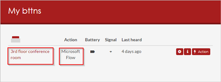

# Voer uw stromen uit met fysieke knoppen (bttns) van de knop Corporation (preview-versie)
[!INCLUDE [view-pending-approvals](includes/cc-rebrand.md)]
Activeer uw stromen door op een BTTN te drukken (een fysieke knop die door [het knop bedrijf](https://my.bt.tn/)is gemaakt). U kunt bijvoorbeeld drukken op een BTTN die een stroom activeert om de volgende taken uit te voeren:

* Neem contact op met de Help Desk met locatie-informatie
* Hiermee wordt een e-mail bericht naar uw team verzonden
* Hiermee wordt uw agenda geblokkeerd
* Bestel benodigdheden

> [!IMPORTANT]
> U moet uw BTTN [registreren](https://my.bt.tn/) voordat u deze in een stroom kunt gebruiken.
> 
> [!TIP]
> Configureer alle BTTN-eigenschappen, zoals de naam, locatie en het e-mail adres op de [BTTN-website](https://my.bt.tn/) voordat u de stroom maakt.
> 
> 

U kunt ook een stroom activeren met behulp van een [fysieke Flic-knop](flic-button-flows.md).

## Vereisten
* Toegang tot [Microsoft flow](https://flow.microsoft.com).
* Ten minste één [geregistreerde BTTN](https://my.bt.tn/).

## Een stroom maken die wordt geactiveerd vanuit een BTTN
In dit overzicht gebruiken we een Help Desk-sjabloon om een stroom te maken die u kunt activeren met één druk op een [BTTN](https://my.bt.tn/). Wanneer de stroom wordt uitgevoerd, wordt er een ondersteunings aanvraag gegenereerd en vervolgens naar de Help Desk verzonden. De ondersteunings aanvraag biedt de Help Desk de locatie van de kamer waar Help is nodig. In dit scenario ziet u hoe u deze stroom maakt op basis van een sjabloon, maar u kunt de lege sjabloon gebruiken, waarmee u volledige controle hebt over alle aspecten van uw stroom.

U kunt elk van de volgende sjablonen gebruiken om snel stromen te maken voor uw BTTN en verbinding met Zendesk, Google en share point tot stand te brengen, onder andere:

Tip: voor de doel einden van dit overzicht geeft u uw BTTN een naam die een Vergader ruimte vertegenwoordigt in een typische kantoor gebouw.

De instellingen voor uw BTTN moeten lijken op dit voor beeld (van de BTTN-website):

Nu u uw BTTN hebt geregistreerd en geconfigureerd, kunt u aan de slag gaan met het maken van de stroom.

### Aanmelden en een sjabloon selecteren
1. Meld u aan bij [Microsoft flow](https://flow.microsoft.com).
   
    
   
    Opmerking: als alternatief kunt u stromen maken in de mobiele app van Microsoft Flow voor [Android](https://aka.ms/flowmobiledocsandroid), [IOS](https://aka.ms/flowmobiledocsios)of [Windows Phone](https://aka.ms/flowmobilewindows).
2. Voer **BTTN** in het zoekvak in en selecteer vervolgens het zoek pictogram.
   
    
   
    Nadat u het zoek pictogram hebt geselecteerd, worden alle sjablonen weer gegeven die u met bttns kunt gebruiken.
3. Selecteer de sjabloon **BTTN gebruiken om technische ondersteuning te bellen voor Vergader ruimte** .
   
    

### Microsoft Flow toestemming geven om verbinding te maken met uw BTTN
1. Meld u aan bij de BTTN en de Office 365 Outlook-services, zodat de knop **door gaan** wordt ingeschakeld.
   
    
2. Wanneer u zich aanmeldt bij de BTTN-service, moet u Microsoft Flow autoriseren om uw bttns te gebruiken.
   
    **Belang rijk**: als u Microsoft flow niet autoriseert om uw bttns te gebruiken, kunt u deze niet zien of er verbinding mee maken via Microsoft flow.
   
    
3. Nadat u zich hebt aangemeld bij beide services, selecteert u **door gaan**.
   
    

### Selecteer de BTTN die de stroom activeert
1. Open in de kaart **Wanneer een BTTN wordt ingedrukt** de lijst met BTTN-id's en selecteer vervolgens de BTTN die u wilt gebruiken.
   
    
   
    De stroom moet er nu uitzien als in dit voor beeld.
   
    
2. Geef uw stroom een naam en selecteer **stroom maken** om deze op te slaan.
   
    

## Uw stroom testen en de resultaten bevestigen
1. Druk op de knop op uw BTTN.
2. Bekijk de uitvoerings geschiedenis van de stroom om te controleren of deze correct is uitgevoerd.
   
    U kunt de uitvoerings geschiedenis controleren op de Microsoft Flow website of op uw mobiele apparaat.
   
    Opmerking: de uitvoerings status wordt ingesteld op **actief** totdat iemand **bevestigen** selecteert in het e-mail bericht voor ondersteuning.
3. U kunt ook controleren of het e-mail bericht is verzonden naar het ondersteunings team.
   
    Als u de e-mail hebt gevolgd, ziet de ondersteunings-e-mail er ongeveer uit als in dit voor beeld:
   
    

## Meer
* Als uw stroom niet is geactiveerd, meldt u zich aan bij de site van de button Corporation en bevestigt u of de knop activiteit (druk persen) wordt vastgelegd.
* U kunt ook inzoomen op de uitvoerings activiteit op de Microsoft Flow-site en controleren op fout berichten.

## Meer informatie
* [Knop stromen delen](share-buttons.md).
* Leer hoe u [knop trigger tokens](introduction-to-button-trigger-tokens.md) kunt gebruiken om de huidige gegevens te verzenden wanneer uw knop stromen worden uitgevoerd.
* [Installeer de Microsoft flow-app voor Android](https://aka.ms/flowmobiledocsandroid).
* [Installeer de Microsoft flow-app voor IOS](https://aka.ms/flowmobiledocsios).

