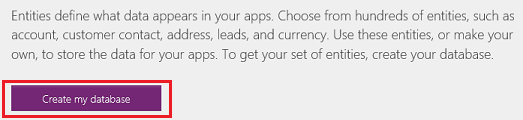
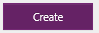
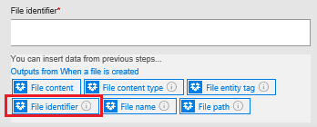
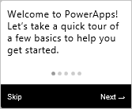

# Bouw een goedkeurings herhalingslus met behulp van Microsoft Flow en de micro soft Common Data Service
[!INCLUDE [view-pending-approvals](includes/cc-rebrand.md)]
De Common Data Service biedt u een manier om stromen te bouwen die gegevens bevatten die zijn opgeslagen in een Data Base, onafhankelijk van een stroom. Het beste voor beeld hiervan is met goed keuringen. Als u de status van de goed keuring in een entiteit opslaat, kan uw stroom hierop worden uitgevoerd.

In dit voor beeld maakt u een goedkeurings proces dat begint wanneer een gebruiker een bestand toevoegt aan Dropbox. Wanneer het bestand wordt toegevoegd, wordt er informatie over weer gegeven in een app, waarbij een revisor de wijziging kan goed keuren of afwijzen. Wanneer de revisor de wijziging goedkeurt of afwijst, wordt het e-mail bericht verzonden en worden de geweigerde bestanden verwijderd uit Dropbox.

Door de stappen in deze sectie te volgen, bouwt u het volgende:

* een **aangepaste entiteit** die informatie bevat over elk bestand dat wordt toegevoegd aan Dropbox en of de status van het bestand is goedgekeurd, afgewezen of in behandeling is.
* een **stroom** waarmee informatie wordt toegevoegd aan de aangepaste entiteit wanneer een bestand wordt toegevoegd aan Dropbox, e-mail verzendt wanneer het bestand is goedgekeurd of afgewezen en geweigerde bestanden verwijdert. Deze stappen laten zien hoe u een nieuwe stroom maakt, maar u kunt een vergelijk bare stroom maken op basis van een sjabloon.
* een **app** waarin een revisor bestanden kan goed keuren of afwijzen die zijn toegevoegd aan Dropbox. U gebruikt PowerApps voor het automatisch genereren van deze app op basis van de velden in de aangepaste entiteit.

**Vereisten**

* Meld u aan voor [Microsoft flow](sign-up-sign-in.md) en [PowerApps](https://powerapps.microsoft.com/tutorials/signup-for-powerapps/).
* Maak verbindingen met Dropbox en Office 365 Outlook, zoals wordt beschreven in [uw verbindingen beheren](https://powerapps.microsoft.com/tutorials/add-manage-connections/) .

## De entiteit bouwen
1. Meld u aan bij [powerapps.com](https://web.powerapps.com).
2. Als de linkernavigatiebalk niet standaard wordt weer gegeven, klikt of tikt u op het pictogram met drie horizontale lijnen in de linkerbovenhoek.
   
    
3. Klik of tik in de linkernavigatiebalk op **beheren**en klik of tik vervolgens op **entiteiten**.
   
    
4. Als u hierom wordt gevraagd, klikt of tikt u op **mijn data base maken**.
   
    
5. Klik of tik in de rechter bovenhoek op **nieuwe entiteit**.
   
    
   
    Als uw browser venster niet is gemaximaliseerd, kan deze knop op een andere plaats worden weer gegeven.
6. Geef onder **naam van entiteit**een naam op die geen spaties bevat en die geen andere entiteit in uw data base heeft.
   
    Als u dit voor beeld precies wilt volgen, geeft u **ReviewDropboxFiles**op.
   
    
7. Geef onder **weergave naam**een beschrijvende naam op.
   
    
8. Klik of tik op **volgende**.
   
    

## Velden toevoegen aan de entiteit
1. Klik of tik in de rechter bovenhoek op **veld toevoegen**.
   
    
2. Stel in de lege rij onder in de lijst met velden de eigenschappen van een **fiatteur** veld in. (Wanneer u deze eigenschappen instelt, kunt u overschakelen naar de volgende kolom door op TAB te drukken.)
   
   * Typ **goed keurder**in de kolom **weergave naam** .
   * Typ **ApproverEmail**in de kolom **naam** .
   * Klik of tik in de kolom **type** op de optie **e-mail** .
   * Schakel in de kolom **vereist** het selectie vakje in.
     
     
3. In de volgende rij stelt u de eigenschappen in van een **status** veld:
   
   * Typ in de kolom **weergave naam** de **status**.
   * Typ **status**in de kolom **naam** .
   * Klik of tik in de kolom **type** op de optie **tekst** .
   * In de kolom **Eigenschappen** , behoud de standaard waarde.
   * Schakel in de kolom **vereist** het selectie vakje in.
     
     
4. In de volgende rij stelt u de eigenschappen in van een **Bestands** -id-veld:
   
   * In de kolom **weergave naam** typt u **bestands-id**.
   * Typ **Bestands**-id in de kolom **naam** .
   * Klik of tik in de kolom **type** op de optie **tekst** .
   * In de kolom **Eigenschappen** , behoud de standaard waarde.
   * Schakel in de kolom **uniek** het selectie vakje in.
   * Schakel in de kolom **vereist** het selectie vakje in.
     
     
5. Klik of tik aan de rechter kant op het weglatings teken (...) voor het veld **Bestands** -id en klik of tik vervolgens op **instellen als titel veld**.
   
    
6. Klik of tik in de linkerbenedenhoek op **maken**.
   
    
7. Beschrijving Wanneer de lijst met entiteiten opnieuw wordt weer gegeven, maximaliseert u het browser venster als dit nog niet is gemaximaliseerd en klikt of tikt u op de kolomkop **type** . De lijst wordt gesorteerd met de aangepaste entiteiten, zoals de entiteit die u zojuist hebt gemaakt, die bovenaan wordt weer gegeven.

## Meld u aan en maak een stroom
1. Open de [Microsoft flow Portal](https://flow.microsoft.com).
2. Maximaliseer uw browser venster als dit nog niet is gemaximaliseerd en klik of tik **in** de rechter bovenhoek op aanmelden.
   
    
3. In het menu rechtsboven selecteert u de omgeving waarin u de Data Base hebt gemaakt in powerapps.com.
   
    **Opmerking**: als u niet dezelfde omgeving selecteert, wordt uw entiteit niet weer geven.
4. Klik of tik in de linkerbovenhoek op **mijn stromen**.
   
    
5. Klik of tik in de rechter bovenhoek op **nieuwe stroom maken**.
   
    

## Starten wanneer een bestand wordt toegevoegd
1. Typ of plak **Dropbox**in het vak **zoeken naar meer triggers**en klik of tik op **Dropbox-wanneer een bestand wordt gemaakt**.
   
    
2. Klik of tik onder **map**op het mappictogram en blader vervolgens naar de map waarin de bestanden worden toegevoegd.
   
    

## Gegevens toevoegen aan de entiteit
1. Klik of tik op **nieuwe stap**en klik of tik vervolgens op **een actie toevoegen**.
   
    
2. Typ of plak **common data service**in het vak **zoeken naar meer acties**en klik of tik vervolgens op **common data service-object maken**.
   
    
3. Onder **de entiteit**, typt of plakt u **controle**en klikt of tikt u op **Dropbox-bestanden weer geven**.
   
    
4. Onder **titel**klikt of tikt u in het vak en klikt of tikt u op **Bestands naam** in de lijst met parameter tokens om dit token toe te voegen aan het veld.
   
    
5. Typ of plak het e-mail adres van de persoon die de bestanden gaat controleren onder **goed keurder**.
   
    **Opmerking**: als u de stroom eenvoudiger wilt testen, moet u uw eigen adres opgeven. U kunt dit later wijzigen wanneer de stroom gereed is voor werkelijk gebruik.
   
    
6. Typ of plak onder **status** **in behandeling**.
   
    
7. Klik of tik onder **bestands-id**in het vak en klik of tik vervolgens op **bestands-id** in de lijst met parameter tokens om dit token toe te voegen aan het veld.
   
    

## Controleren of het bestand is gecontroleerd
1. Klik of tik onder de actie **object maken** op **nieuwe stap**, klik of tik op **meer**, en klik of tik vervolgens op **een do until toevoegen**.
   
    
2. In de linkerbovenhoek van de actie **do until** klikt of tikt u in het vak **een waarde kiezen**.
   
    
   
    **Opmerking**: als het browser venster niet is gemaximaliseerd, klikt of tikt u in het bovenste vak met **een waarde kiezen**.
3. Onder **uitvoer van object maken**klikt of tikt u op **status** om dat parameter token toe te voegen aan het veld.
   
    
4. Open de lijst in het midden van de actie **do until** en klik of tik vervolgens op **is niet gelijk aan**.
   
    
5. In de rechter bovenhoek van de actie **do until** typt of plakt u in **behandeling** in het vak **een waarde kiezen**.
   
    
   
    **Opmerking**: als het browser venster niet is gemaximaliseerd, klikt of tikt u in het onderste vak met **een waarde kiezen**.
6. Klik of tik onder aan de actie **do until** op **een actie toevoegen**.
   
    
7. In het vak **zoeken naar meer acties**typt u **Algemeen**. Klik of tik vervolgens op **common data service-object ophalen**.
   
    
8. Klik of tik onder **de naam ruimte**op uw data base.
9. Onder **de entiteit**, typt of plakt u **controle**en klikt of tikt u op **Dropbox-bestanden weer geven**.
   
    
10. Klik of tik onder **object-id**in het vak en klik of tik vervolgens op het token voor de **bestands-id** -para meter om dit toe te voegen aan het veld.
    
     

## Controleren of het item is goedgekeurd
1. Klik of tik onder de actie **do-until** op **nieuwe stap**en klik of tik vervolgens op **een voor waarde toevoegen**.
   
    
2. In de linkerbovenhoek van de voor waarde klikt of tikt u in het vak **een waarde kiezen**.
   
    
   
    **Opmerking**: als het browser venster niet is gemaximaliseerd, klikt of tikt u in het bovenste vak met **een waarde kiezen**.
3. Onder **uitvoer van object ophalen**klikt of tikt u op het parameter token **status** om dit toe te voegen aan het veld.
   
    
4. In de rechter bovenhoek van de voor waarde, typt of plakt u **goedgekeurd** in het vak **een waarde kiezen**.
   
    
   
    **Opmerking**: als het browser venster niet is gemaximaliseerd, typt of plakt u **goedgekeurd** in het onderste vak met **een waarde kiezen**.

## E-mail melding verzenden
1. Onder **als Ja, niets doen**, klikt of tikt u op **een actie toevoegen**.
   
    
2. Typ of plak **e-mail verzenden**in het vak **zoeken naar meer acties**en klik of tik vervolgens op **Office 365 Outlook-een e-mail verzenden**.
   
    
3. Onder **aan**, typt of plakt u het adres van de persoon die u op de hoogte wilt stellen wanneer een item wordt geaccepteerd.
   
    **Opmerking**: als u de stroom eenvoudiger wilt testen, moet u uw eigen adres opgeven. U kunt deze wijzigen wanneer de stroom gereed is voor werkelijk gebruik.
   
    
4. Onder **onderwerp**klikt of tikt u in het vak en klikt of tikt u op het token voor de **Bestands naam** parameter om dit toe te voegen aan het veld.
   
    
5. Onder **hoofd tekst**, typt of plakt u **het item is goedgekeurd.**
   
    
6. Onder **als Nee, niets doen**, herhaalt u stap 1-5 in deze procedure, met uitzonde ring van de hoofd tekst van het e-mail bericht wanneer **het item is afgewezen.**
   
    

## Geweigerde bestanden verwijderen
1. Klik of tik onder de velden voor de afwijzings mail op **een actie toevoegen**.
   
    
2. Typ of plak **Dropbox**in het vak **zoeken naar meer acties**en klik of tik op **Dropbox-bestand verwijderen**.
   
    
3. Klik of tik onder **bestand**op in het vak en klik of tik op de para meter van de **bestands-id** -token om deze toe te voegen aan het veld.
   
    

## De stroom opslaan
1. Typ of plak aan de bovenkant van het scherm een naam voor de stroom die u maakt, en klik of tik vervolgens op **stroom maken**.
   
    
2. Klik of tik op **sluiten** en klik of tik op **gereed**.
3. Voeg in Dropbox ten minste twee bestanden toe aan de map die u hebt opgegeven: één om goed keuring te testen en één om de weigering te testen.

## De app bouwen
1. Meld u aan bij [powerapps.com](https://web.powerapps.com)en klik of tik onder aan de linkernavigatiebalk op **nieuwe app** .
   
    
2. Klik of tik in het dialoog venster dat wordt weer gegeven op de optie om een PowerApps Studio te openen voor Windows of PowerApps Studio voor het web.
3. Als u PowerApps Studio voor Windows hebt geopend, klikt of tikt u op **Nieuw** in de linkernavigatiebalk.
4. Onder **een app maken op basis van uw gegevens**klikt of tikt u op **telefoon indeling** in de tegel **common data service** .
   
    
5. Typ of plak **beoordeling**in het **zoekvak** .
   
    
6. Onder **Kies een entiteit**klikt of tikt u op **Dropbox-bestanden bekijken**.
   
    
7. Klik of tik in de rechter benedenhoek op **verbinding maken**.
   
    
8. Als het openings scherm van de intro-rond leiding wordt weer gegeven, kunt u de rond leiding volgen om vertrouwd te raken met PowerApps (of klik of tik op **overs Laan**).
   
    
   
    U kunt de rond leiding altijd later volgen door op het vraag teken te klikken of tikken in de linkerbovenhoek en vervolgens te klikken of tikken op **de rond leiding**volgen.
9. Beschrijving Sleep de schuif regelaar aan de onderkant van het scherm om het zoom niveau te verg Roten zodat de app gemakkelijker te zien is.
   
    

## De App aanpassen
1. Klik of tik in de rechter navigatie balk op de indeling die een koptekst en een beschrijving bevat.
   
    
2. Klik of tik in het **BrowseScreen**op net onder de zoek balk om het grotere besturings element voor het tekstvak te selecteren.
   
    
3. Open in het rechterdeel venster de onderste lijst door te klikken of tikken op de pijl-omlaag.
   
    
4. Klik of tik in de onderste lijst op **titel** , zodat de bestands naam van de toegevoegde bestanden wordt weer gegeven.
   
    
5. Open in het rechterdeel venster de bovenste lijst en klik of tik vervolgens op **status** om de status van elk bestand weer te geven.
   
    

## De algemene oplossing testen
1. Open de voorbeeld modus in PowerApps door te klikken of tikken op de afspeel knop in de linkerbovenhoek.
   
    
2. Voor het eerste bestand in de lijst, klikt of tikt u op de pijl om de details van dat bestand weer te geven.
   
    
3. Klik of tik in de rechter bovenhoek op het potlood pictogram om de details van het bestand te wijzigen.
   
    
4. In het vak **status** typt of plakt u **goedgekeurd**.
   
    
5. Klik of tik in de rechter bovenhoek op het vinkje om de wijzigingen op te slaan en terug te keren naar het scherm Details.
   
    
   
    Over een paar minuten ontvangt u een e-mail met de mede deling dat het bestand is goedgekeurd.
6. Klik of tik in de rechter bovenhoek op de knop terug om terug te keren naar het Blader scherm.
   
    
7. Voor het andere bestand in de lijst, klikt of tikt u op de pijl om de details van dat bestand weer te geven.
   
    
8. Klik of tik in de rechter bovenhoek op het potlood pictogram om de details van het bestand te wijzigen.
   
    
9. Typ of plak in het vak **status de instelling** **geweigerd** (of alles behalve **goedgekeurd**, inclusief **Aproved** of **Approoved**).
   
    
10. Klik of tik in de rechter bovenhoek op het vinkje om de wijzigingen op te slaan en terug te keren naar het scherm Details.
    
     
    
     Over een paar minuten ontvangt u een e-mail waarin staat dat het bestand is afgewezen en dat het bestand wordt verwijderd uit Dropbox.

