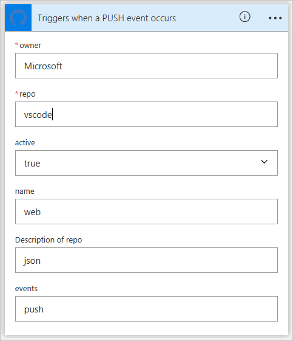

# <a name="use-webhooks-with-microsoft-flow"></a>Webhooks gebruiken met Microsoft Flow
[Webhooks](http://www.webhooks.org/) zijn eenvoudige HTTP-callbacks die worden gebruikt om gebeurtenismeldingen te verzenden.  Met Microsoft Flow kunt u webhooks gebruiken om stromen te activeren.  In deze zelfstudie ziet u hoe u een stroom maakt die is geactiveerd door een webhook.

> [!NOTE]
> GitHub wordt gebruikt als voorbeeld van een service die meldingen kan verzenden via webhooks, maar de technieken die hier worden gedemonstreerd, kunnen worden gebruikt voor alle services waarvoor webhooks worden gebruikt.
> 
> 

## <a name="prerequisites"></a>Vereisten
U hebt het volgende nodig om de zelfstudie te voltooien:

* Basiskennis van [webhooks](http://www.webhooks.org/).
* Basiskennis van de [OpenAPI-specificatie](http://swagger.io/specification/) (Swagger).
* Een [GitHub](https://www.github.com)-account.
* Het [OpenAPI JSON-voorbeeldbestand](http://pwrappssamples.blob.core.windows.net/samples/githubWebhookSample.json) voor deze zelfstudie.
* Als alternatief kunt u ook de [gebruikersinterface van de trigger](customapi-webhooks.md#creating-webhook-triggers-from-the-ui) gebruiken om webhook-triggers te definiëren, in het geval u het OpenAPI-bestand niet met de hand wilt schrijven.

## <a name="the-openapi-file"></a>Het OpenAPI-bestand
Webhooks worden in Microsoft Flow geïmplementeerd als een soort [aangepaste connector](register-custom-api.md). Er moet dus een OpenAPI JSON-bestand worden opgegeven om de vorm van de webhook op te geven.  De OpenAPI bevat drie definities die essentieel zijn om de webhook effectief te maken:

1. De webhook maken
2. De binnenkomende hookaanvraag via de API (in dit geval GitHub) definiëren
3. De webhook verwijderen

### <a name="creating-the-webhook"></a>De webhook maken
De webhook wordt gemaakt aan de GitHub-zijde, middels een HTTP POST naar `/repos/{owner}/{repo}/hooks`.  Microsoft Flow moet naar deze URL posten wanneer er een nieuwe stroom wordt gemaakt met de trigger die in de OpenAPI is gemaakt, of wanneer de trigger wordt bewerkt.  In het onderstaande voorbeeld bevat de eigenschap `post` het schema van de aanvraag die naar GitHub wordt gepost.

```json
"/repos/{owner}/{repo}/hooks": {
    "x-ms-notification-content": {
    "description": "Details for Webhook",
    "schema": {
        "$ref": "#/definitions/WebhookPushResponse"
    }
    },
    "post": {
    "description": "Creates a Github webhook",
    "summary": "Triggers when a PUSH event occurs",
    "operationId": "webhook-trigger",
    "x-ms-trigger": "single",
    "parameters": [
        {
        "name": "owner",
        "in": "path",
        "description": "Name of the owner of targetted repository",
        "required": true,
        "type": "string"
        },
        {
        "name": "repo",
        "in": "path",
        "description": "Name of the repository",
        "required": true,
        "type": "string"
        },
        {
        "name": "Request body of webhook",
        "in": "body",
        "description": "This is the request body of the Webhook",
        "schema": {
            "$ref": "#/definitions/WebhookRequestBody"
        }
        }
    ],
    "responses": {
        "201": {
        "description": "Created",
        "schema": {
            "$ref": "#/definitions/WebhookCreationResponse"
        }
        }
    }
    }
},
```

> [!IMPORTANT]
> De eigenschap `"x-ms-trigger": "single"` is een schema-uitbreiding waardoor Microsoft Flow weet dat de webhook in de lijst met beschikbare triggers in de ontwerpfunctie voor stromen moet worden weergegeven. Voeg deze eigenschap dus toe.
> 
> 

### <a name="defining-the-incoming-hook-request-from-the-api"></a>De binnenkomende hookaanvraag via de API definiëren
De vorm van de binnenkomende hookaanvraag (de melding van GitHub aan Microsoft Flow) wordt gedefinieerd in de aangepaste eigenschap `x-ms-notification-content`, zoals wordt weergegeven in het bovenstaande voorbeeld.  De eigenschap hoeft niet de gehele inhoud van de aanvraag te bevatten, alleen de onderdelen die u wilt gebruiken in uw stromen.

### <a name="deleting-the-webhook"></a>De webhook verwijderen
Het is enorm belangrijk om een definitie in de OpenAPI te plaatsen zodat Microsoft Flow weet hoe de webhook moet worden verwijderd.  Microsoft Flow probeert, telkens wanneer u de trigger in uw stroom bijwerkt of wanneer u de stroom verwijdert, de webhook te verwijderen.

```json
"/repos/{owner}/{repo}/hooks/{hook_Id}": {
    "delete": {
    "description": "Deletes a Github webhook",
    "operationId": "DeleteTrigger",
    "parameters": [
        {
        "name": "owner",
        "in": "path",
        "description": "Name of the owner of targetted repository",
        "required": true,
        "type": "string"
        },
        {
        "name": "repo",
        "in": "path",
        "description": "Name of the repository",
        "required": true,
        "type": "string"
        },
        {
        "name": "hook_Id",
        "in": "path",
        "description": "ID of the Hook being deleted",
        "required": true,
        "type": "string"
        }
    ]
    }
},
```

> [!IMPORTANT]
> Als u ervoor wilt zorgen dat Microsoft Flow webhooks kan verwijderen, **moet** de API een `Location`-HTTP-header bevatten in het 201-antwoord op het moment dat de webhook wordt gemaakt.  De `Location`-header moet het pad naar de webhook bevatten die wordt gebruikt met HTTP DELETE.  De `Location` die is opgenomen in de reactie van GitHub heeft bijvoorbeeld de volgende indeling: `https://api.github.com/repos/<user name>/<repo name>/hooks/<hook ID>`.
> 
> 

## <a name="authentication"></a>Verificatie
De API waarmee de webhookaanvraag naar Microsoft Flow wordt gestuurd, bevat meestal een vorm van verificatie. GitHub vormt daar geen uitzondering op.  Er worden verschillende soorten verificatie ondersteund.  Voor deze zelfstudie worden de persoonlijke toegangstokens van GitHub gebruikt.

1. Navigeer naar [GitHub](https://www.github.com) en meld u aan als u dat nog niet hebt gedaan.
2. Klik in de rechterbovenhoek op uw **profielfoto** en klik vervolgens in het menu op **Instellingen**.
   
    
3. Klik in het menu aan de linkerkant onder **Instellingen voor ontwikkelaars** op **Persoonlijke toegangstokens**.
   
    
4. Klik op de knop **Nieuwe token genereren**.
   
    
5. Voer een beschrijving in het vak **Tokenbeschrijving** een beschrijving in.
6. Schakel het selectievakje bij **admin:repo_hook** in.
   
    
7. Klik op de knop **Token genereren**.
8. Noteer het nieuwe token.
   
    
   
   > [!IMPORTANT]
   > Het is niet mogelijk om opnieuw toegang te verkrijgen tot dit token. Kopieer het token en plak het ergens, zoals in Kladblok, om het verderop in de zelfstudie te kunnen gebruiken.
   > 
   > 

## <a name="adding-the-webhook-to-microsoft-flow"></a>De webhook toevoegen aan Microsoft Flow
U beschikt nu over alles wat u nodig hebt om de webhook als aangepaste connector toe te voegen aan Microsoft Flow.

1. Navigeer naar de [Microsoft Flow-webportal](https://flow.microsoft.com) en meld u aan als u dat nog niet hebt gedaan.
2. Klik op het **instellingen**pictogram en klik vervolgens op **Aangepaste connectors**.
   
    
3. Klik op de knop **Aangepaste connector maken**.
4. Klik op het mappictogram in het vak **OpenAPI importeren** en selecteer vervolgens het OpenAPI-voorbeeldbestand.
5. Klik op **Pictogram uploaden** in het gedeelte **Algemene informatie** en selecteer vervolgens een afbeeldingsbestand om als pictogram te gebruiken.
6. Klik op **Doorgaan**.
   
    
7. In het volgende scherm worden de beveiligingsinstellingen geconfigureerd.  Selecteer onder **Verificatietype** de optie **Basisverificatie**.
8. In het gedeelte **Basisverificatie** voert u voor de labelvelden de **gebruikersnaam** en het **wachtwoord** in.  Deze labels worden alleen weergegeven wanneer de trigger wordt gebruikt in een stroom.
   
    
9. Geef uw stroom boven aan de pagina een naam en klik op **Connector maken**.
   
    

De nieuwe aangepaste connector wordt nu weergegeven in de lijst op de pagina met aangepaste connectors.

## <a name="creating-webhook-triggers-from-the-ui"></a>Webhook-triggers maken vanuit de gebruikersinterface
1. Nadat u de basislijn van uw OpenAPI-bestand hebt gemaakt, gaat u naar het tabblad **Definitie** van de wizard Aangepaste connector.
2. Klik in het linkerdeelvenster op **+ Nieuwe trigger** en vul de beschrijving van de trigger in. In dit voorbeeld maakt u een trigger die wordt geactiveerd wanneer een pull-aanvraag wordt gedaan aan een opslagplaats.
   
    
3. Vervolgens definieert u de aanvraag voor het maken van de webhook-trigger. U kunt dit doen door het importeren van een voorbeeldaanvraag voor het*maken van een webhook-trigger*. Zie het [Github-API-referentiemateriaal](https://developer.github.com/v3/repos/hooks/#create-a-hook) voor het maken van een webhook. 
4. Microsoft Flow voegt automatisch standaard ```content-type``` en beveiligingsheaders toe. Deze hoeven dus niet te worden gedefinieerd als er vanuit een voorbeeld wordt geïmporteerd. 
   
    
5. Na het importeren van de aanvraag voor het maken van een webhook gaan we nu het antwoord van de webhook definiëren door vanuit een voorbeeldantwoord te importeren. Zie het [Github-API-referentiemateriaal](https://developer.github.com/v3/activity/events/types/#pullrequestevent) voor meer informatie over een pull-aanvraaggebeurtenis. 
   
    **Opmerking**: u hoeft het volledige antwoord er niet in te plakken. Alleen de velden die u nodig hebt, moeten worden gedefinieerd.
   In dit voorbeeld worden alleen de URL van de pull-aanvraag en de informatie over de gebruiker die de pull-aanvraag heeft gemaakt, geëxtraheerd.
   
    
6. De laatste stap bestaat eruit om een parameter te selecteren in de aanvraag voor het maken van de webhook, in de waarde waarin Microsoft Flow een retouraanroep-URL moet invullen die door Github van gegevens moet worden voorzien. In dit geval is het de URL-eigenschap in het ```config```-object.
   
    

## <a name="using-the-webhook-as-a-trigger"></a>De webhook als trigger gebruiken
Nu alles is geconfigureerd, kan de webhook in een stroom worden gebruikt.  U gaat een stroom maken waarbij een pushmelding naar de mobiele Microsoft Flow-app wordt verzonden zodra de GitHub-opslagplaats een git-push ontvangt.

1. Klik in de [Microsoft Flow-webportal](https://flow.microsoft.com) boven aan de pagina op **Mijn stromen**.
2. Klik op **Maken van lege**.
3. Zoek in de ontwerpfunctie van Microsoft Flow naar de aangepaste connector die we eerder hebben geregistreerd.
   
    
   
    Klik op een item in de lijst om dit als trigger te gebruiken.
4. Aangezien dit de eerste keer is dat u deze aangepaste connector gebruikt, moet er verbinding mee worden gemaakt.  Voer bij **Verbindingsnaam** een beschrijvende naam.  Voer bij **Gebruikersnaam** uw GitHub-gebruikersnaam in.  Voer bij **Wachtwoord** het **persoonlijke toegangstoken** in dat u eerder hebt gemaakt.
   
    
   
    Klik op **Maken**.
5. Microsoft Flow moet worden voorzien van informatie over de opslagplaats die u wilt bewaken.  Mogelijk herkent u de velden van het object **WebhookRequestBody** in het OpenAPI-bestand.  Bij **Eigenaar** en **Opslagplaats** voert u de naam van de eigenaar van de opslagplaats en de naam van de GitHub-opslagplaats in die u wilt bewaken.
   
    
   
   > [!IMPORTANT]
   > In dit voorbeeld wordt de opslagplaats van [Visual Studio-code](https://code.visualstudio.com) gebruikt. Gebruik een opslagplaats waarvoor uw account machtigingen heeft.  U kunt hiervoor het beste uw eigen opslagplaats gebruiken.
   > 
   > 
6. Klik op **+ Nieuwe stap** en selecteer **Een actie toevoegen**.
7. Zoek en selecteer de actie **Pushmelding**.
   
    
8. Voer in het veld **Tekst** de tekst in.  In het object **WebhookPushResponse** in het OpenAPI-bestand wordt de lijst met parameters gedefinieerd die u kunt gebruiken.
   
    
9. Geef uw stroom boven aan de pagina een naam en klik op **Stroom maken**.
   
    

## <a name="verification-and-troubleshooting"></a>Verificatie en probleemoplossing
Als u wilt controleren of alles goed is ingesteld, klikt u op **Mijn stromen** en vervolgens op het **informatiepictogram** naast de nieuwe stroom om de uitvoeringsgeschiedenis weer te geven.  U moet ten minste één geslaagde uitvoering zien vanaf het moment dat de webhook is gemaakt.  Dit geeft aan dat de webhook is gemaakt aan de GitHub-zijde.  Als de uitvoering is mislukt, bekijkt u meer details om te ontdekken waarom deze is mislukt.  Als de fout is veroorzaakt door de reactie '404 niet gevonden', beschikt uw GitHub-account waarschijnlijk niet over de juiste machtigingen om een webhook te maken voor de opslagplaats die u gebruikt.

## <a name="summary"></a>Overzicht
Als alles goed is geconfigureerd, ontvangt u nu pushmeldingen in de mobiele Microsoft Flow-app wanneer er een git-push plaatsvindt in de GitHub-opslagplaats die u hebt geselecteerd.  Met de bovenstaande procedure kunt u alle met webhooks compatibele services gebruiken als trigger in uw stromen.

## <a name="next-steps"></a>Volgende stappen
* [Een aangepaste connector registreren](register-custom-api.md).
* [Gebruik een ASP.NET Web-API](customapi-web-api-tutorial.md).
* [Registreer een Azure Resource Manager-API](customapi-azure-resource-manager-tutorial.md).

