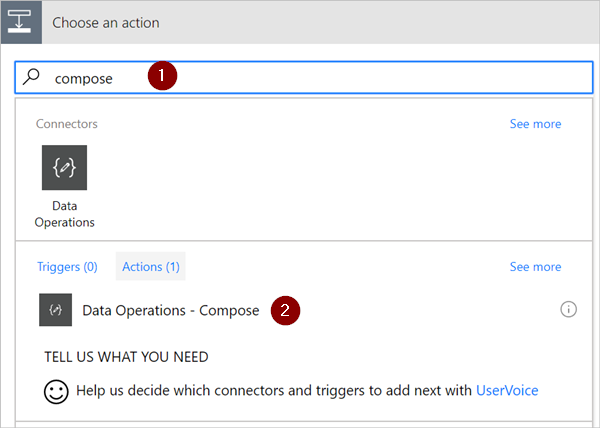

# <a name="use-data-operations-with-microsoft-flow"></a>Gegevensbewerkingen gebruiken met Microsoft Flow
In dit scenario maakt u kennis met enkele populaire bewerkingen van Microsoft Flow, zoals Opstellen, Lid worden, Matrix filteren, Tabel maken en JSON parseren, die beschikbaar zijn voor het manipuleren van gegevens in een stroom.

## <a name="prerequisites"></a>Vereisten
* Toegang tot Microsoft Flow.
* Een hulpprogramma zoals [PostMan](https://www.getpostman.com/postman) om HTTP POST-aanvragen met een JSON-matrix naar de stroom te verzenden.

## <a name="use-the-compose-action"></a>De actie 'Opstellen' gebruiken
Gebruik de actie **Gegevensbewerkingen - Opstellen** (Opstellen) om bij het ontwerpen van een stroom niet meerdere keren dezelfde gegevens te hoeven invoeren. Als u bijvoorbeeld de cijfermatrix ````[0,1,2,3,4,5,6,7,8,9]```` meerdere keren moet invoeren tijdens het ontwerpen van een flow, kunt u de actie Opstellen gebruiken om de matrix als volgt op te slaan:

1. Zoek naar **Opstellen** en selecteer vervolgens de actie **Gegevensbewerkingen - Opstellen** (Opstellen).
   
    
2. Voer in het vak **Invoer** de matrix in die u later opnieuw wilt gebruiken:
   
    

> [!TIP]
> Om de actie later makkelijker te herkennen, wijzigt u de naam van de kaart **Opstellen** door op de tekst 'Opstellen' op de titelbalk van de kaart **Opstellen** te klikken.
> 
> 

Wanneer u de inhoud van de actie Opstellen nodig hebt, kan dit via het token **Uitvoer** in de lijst **Voeg dynamische inhoud toe van de apps en connectors in deze stroom**. Ga hiervoor als volgt te werk:

1. Voeg een actie toe, zoals **Gegevensbewerkingen – Lid worden**.
2. Selecteer het besturingselement waaraan u de inhoud wilt toevoegen die u hebt opgeslagen in de actie Opstellen.
   
    U ziet de lijst **Voeg dynamische inhoud toe van de apps en connectors in deze stroom**.
3. Selecteer in de lijst **Voeg dynamische inhoud toe van de apps en connectors in deze stroom** het token **Uitvoer** (onder de categorie **Opstellen** van het tabblad **Dynamische inhoud**).
   
    

## <a name="use-the-join-action"></a>De actie 'Lid worden' gebruiken
Gebruik de actie **Gegevensbewerkingen - Lid worden** (Lid worden) om een matrix te scheiden met een scheidingsteken van uw keuze. Stel dat uw flow een webaanvraag ontvangt met de volgende matrix met e-mailadressen: ````["d@example.com", "k@example.com", "dal@example.com"]````. Uw e-mailprogramma herkent echter alleen adressen die in één tekenreeks staan en die worden gescheiden met puntkomma's. U kunt dan de actie **Gegevensbewerkingen - Lid worden** (Lid worden) gebruiken om het scheidingsteken komma te wijzigen in een puntkomma. Ga hiervoor als volgt te werk:

1. Voeg een nieuwe actie toe, zoek naar **Lid worden** en selecteer vervolgens **Gegevensbewerkingen - Lid worden** (Lid worden).
   
    
2. Voer in het vak **Van** de matrix in en typ vervolgens het nieuwe scheidingsteken dat u wilt gebruiken in het vak **Samenvoegen met**.
   
    Ik heb hier de puntkomma (;) gebruikt als het nieuwe scheidingsteken.
   
    
3. Sla de stroom op en voer deze vervolgens uit.
4. Nadat de stroom is uitgevoerd, is dit de uitvoer van de actie **Gegevensbewerkingen – Lid worden**:
   
    

## <a name="use-the-select-action"></a>De actie 'Selecteren' gebruiken
Gebruik de actie **Gegevensbewerkingen – Selecteren** (Selecteren) om de vorm van de objecten in een matrix te transformeren. U kunt zo bijvoorbeeld elementen in een matrix toevoegen, verwijderen of een andere naam geven.

> [!NOTE]
> Hoewel u elementen kunt toevoegen en verwijderen met de actie Selecteren, is het niet mogelijk om het aantal objecten in de matrix te wijzigen.
> 
> 

U kunt de actie Selecteren bijvoorbeeld gebruiken als gegevens in deze indeling via een webaanvraag de stroom binnenkomen:

````[ { "first": "Deon", "last": "Herb" }, { "first": "K", "last": "Herb" } ]````

en u de vorm van de binnenkomende gegevens wilt wijzigen door 'first' te wijzigen in 'FirstName' en 'last' in 'LastName', en door een nieuw lid met de naam 'FamilyName' toe te voegen waarin 'first' en 'last' (gescheiden door een spatie) worden gecombineerd:

````[ { "FirstName": "Deon", "FamilyName": "Herb", "FullName": "Deon Herb" }, { "FirstName": "K", "FamilyName": "Herb", "FullName": "K Herb" } ]````.

Dit doet u als volgt:

1. Voeg de actie **Aanvraag/antwoord – Antwoord** (Aanvraag) toe aan de stroom.
2. Selecteer **Voorbeeldnettolading gebruiken om een schema te genereren** op de kaart **Aanvraag**.
3. Plak in het vak dat wordt weergegeven een sample van uw matrix met brongegevens en selecteer vervolgens de knop **Gereed**.
4. Voeg de actie **Gegevensbewerkingen – Selecteren** (Selecteren) toe en configureer deze zoals in de volgende afbeelding.
   
    
   
   > [!TIP]
   > De uitvoer van de actie Selecteren is een matrix met de nieuw gevormde objecten. U kunt deze matrix vervolgens in een andere actie gebruiken, zoals **Opstellen**, die eerder is besproken.
   > 
   > 

## <a name="use-the-filter-array-action"></a>De actie 'Matrix filteren' gebruiken
Gebruik **Gegevensbewerkingen - Matrix filteren** (Matrix filteren) om het aantal objecten in een matrix te verkleinen tot een subset die voldoet aan de criteria die u opgeeft.

> [!NOTE]
> De actie Matrix filteren kan niet worden gebruikt voor het wijzigen van de vorm van de objecten in een matrix. Bovendien is de tekst waarop u filtert hoofdlettergevoelig.
> 
> 

U kunt deze actie bijvoorbeeld gebruiken op deze matrix:

````[ { "first": "Deon", "last": "Herb" }, { "first": "K", "last": "Herb" } ]````

om een nieuwe matrix te maken die alleen objecten bevat waarin *first* is ingesteld op 'Deon'.

Volg hiervoor deze stappen.

1. Zoek de actie **Gegevensbewerkingen - Matrix filteren** (Matrix filteren) en voeg deze toe aan de stroom.
2. Configureer de actie Matrix filteren zoals in de volgende afbeelding.
   
    
3. Sla de stroom op en voer deze vervolgens uit.
   
    U kunt [PostMan](https://www.getpostman.com/postman) gebruiken om een webaanvraag te genereren waarmee een JSON-matrix naar de stroom wordt verzonden.
4. Wanneer de stroom wordt uitgevoerd met JSON-invoer zoals deze matrix:
   
    ````[ { "first": "Deon", "last": "Herb" }, { "first": "K", "last": "Herb" } ]````,
   
    ziet de uitvoer eruit zoals deze matrix (u ziet dat alleen objecten waarin *first* is ingesteld op 'Deon' zijn opgenomen in de uitvoer van de actie):
   
    ````[ { "first": "Deon", "last": "Herb" } ]````

## <a name="use-the-create-csv-table-action"></a>De actie 'CSV-tabel maken' gebruiken
Gebruik de actie **Gegevensbewerkingen - CSV-tabel maken** (CSV-tabel maken) om invoer in de vorm van een JSON-matrix te wijzigen van in een tabel met door komma's gescheiden waarden (CSV-tabel). Desgewenst kunt u de headers zichtbaar laten in de CSV-uitvoer. U kunt de volgende matrix bijvoorbeeld omzetten in een CSV-tabel met behulp van de actie **CSV-tabel maken**:

````[ { "first": "Deon", "last": "Herb" }, { "first": "K", "last": "Herb" } ]````

1. Zoek de actie **Gegevensbewerkingen - CSV-tabel maken**, voeg de actie toe en configureer deze vervolgens zoals in de volgende afbeelding.
   
    
   
    Opmerking: Het token **Body (Hoofdtekst)** in deze afbeelding is afkomstig van een actie **Aanvraag/antwoord - antwoord**. U kunt de invoer voor de actie **CSV-tabel maken** echter opvragen uit de uitvoer van iedere voorgaande actie in de stroom, of u kunt de invoer rechtstreeks opnemen in het vak **Van**.
2. Sla de stroom op en voer deze vervolgens uit.
   
    Wanneer de stroom wordt uitgevoerd, ziet de uitvoer van **CSV-tabel maken** eruit zoals in deze afbeelding:
   
    

## <a name="use-the-create-html-table-action"></a>De actie 'HTML-tabel maken' gebruiken
Gebruik **Gegevensbewerkingen - HTML-tabel maken** om invoer bestaande uit een JSON-matrix te wijzigen in een HTML-tabel. Desgewenst kunt u de headers zichtbaar laten in de HTML-uitvoer.

Volg de stappen in de sectie [CSV-tabel maken](#use-the-create-csv-table-action) voor een gedetailleerd voorbeeld. Zorg er wel voor dat u de actie **Gegevensbewerkingen - HTML-tabel maken** gebruikt in plaats van de actie **Gegevensbewerkingen - CSV-tabel maken**.

> [!TIP]
> Als u van plan bent om de HTML-tabel per e-mail te verzenden, moet u 'IsHtml' selecteren in de actie E-mail.
> 
> 

