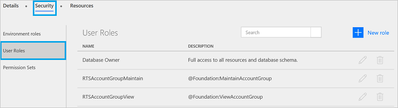

# Omgevingen gebruiken in Microsoft Flow

## Voordelen

Omgevingen bieden de volgende voordelen:

* **Gegevenslocatie**: omgevingen kunnen in verschillende regio's worden gemaakt en zijn gebonden aan die geografische locatie. Wanneer u een stroom in een omgeving maakt, wordt de stroom gerouteerd naar alle datacenters op die geografische locatie. Dit biedt tevens prestatievoordelen.

    Maak en gebruik de omgeving in de regio Europa als uw gebruikers zich in Europa bevinden. Maak en gebruik de omgeving in de Verenigde Staten als uw gebruikers zich in de Verenigde Staten bevinden. 

    > [!IMPORTANT]
    > Als u de omgeving verwijdert, worden ook alle stromen binnen die omgeving verwijderd. Dit geldt voor alle items die u in de omgeving maakt, inclusief verbindingen, gateways, PowerApps en meer.
* **Preventie van gegevensverlies**: als beheerder wilt u niet dat stromen die gegevens van een interne locatie krijgen (zoals *OneDrive voor Bedrijven* of een SharePoint-lijst met salarisinformatie), deze gegevens vervolgens openbaar publiceren (bijvoorbeeld op *Twitter*). Gebruik de functionaliteit voor preventie van gegevensverlies om te controleren welke services gegevens kunnen delen binnen uw Microsoft Flow-implementatie.

    U kunt bijvoorbeeld de services van *SharePoint* en *OneDrive voor Bedrijven* toevoegen aan een beleid voor uitsluitend zakelijke gegevens. Alle stromen die in deze omgeving worden gemaakt, kunnen de services van *SharePoint* en *OneDrive voor Bedrijven* gebruiken. Ze kunnen echter geen gegevens delen met services die niet zijn opgenomen in het beleid voor uitsluitend zakelijke gegevens.

  > [!NOTE]
  > Preventie van gegevensverlies is beschikbaar bij SKU’s van bepaalde licenties, waaronder de P2-licentie.

* **Isolatiegrens voor alle resources**: alle stromen, gateways, verbindingen, aangepaste connectors enz. bevinden zich in een specifieke omgeving. Ze bestaan niet in andere omgevingen.
* **Common Data Service**: als u een stroom wilt maken waarmee gegevens in een service worden ingevoegd, hebt u diverse opties. U kunt:

  * Gegevens invoegen in een Excel-bestand en het Excel-bestand opslaan in een cloudopslagaccount zoals OneDrive.
  * Een SQL-database maken en er vervolgens uw gegevens in opslaan.
  * De Common Data Service gebruiken voor het opslaan van uw gegevens.

    Voor elke omgeving kan de Common Data Service slechts één database voor uw stromen bevatten. Toegang tot de Common Data Service is afhankelijk van de licentie die u hebt aangeschaft. De Common Data Service is niet inbegrepen in de gratis licentie.

## Beperkingen

Hoewel omgevingen veel voordelen bieden, brengen ze ook enkele beperkingen met zich mee. Het feit dat omgevingen een isolatiegrens vormen, betekent dat u nooit resources kunt hebben die verwijzen naar resources in *andere* omgevingen. U kunt bijvoorbeeld niet in de ene omgeving een aangepaste connector maken en deze vervolgens via een stroom in een andere omgeving gebruiken.

## De standaardomgeving gebruiken

De **standaardomgeving** wordt gedeeld door alle gebruikers. In de **standaardomgeving** kan elke gebruiker stromen maken.

> [!TIP]
> Als u een Preview-gebruiker bent, bevinden alle bestaande stromen zich in de standaardomgeving. Een *Preview-gebruiker* is iemand die Microsoft Flow gebruikte voordat dit algemeen beschikbaar werd.

## Het beheercentrum

Als u beheerdersrechten hebt, kunt u het beheercentrum gebruiken om omgevingen te maken en te beheren. Er zijn twee manieren om het beheercentrum te openen:

### Optie 1: selecteer Instellingen

1. Meld u aan bij [flow.microsoft.com](https://flow.microsoft.com).
1. Selecteer het tandwiel Instellingen en kies **Beheercentrum** in de lijst:

   
1. Het beheercentrum wordt geopend.

### Optie 2: open admin.flow.microsoft.com

Ga naar [admin.flow.microsoft.com](https://admin.flow.microsoft.com) en meld u aan met uw werkaccount.

## Een omgeving maken

1. Selecteer in het [Beheercentrum van Microsoft Flow](https://admin.flow.microsoft.com) de optie **Omgevingen**. U ziet alle bestaande omgevingen: 
1. Selecteer **Nieuwe omgeving** en geef vervolgens de vereiste gegevens op:

   | Eigenschap | Beschrijving |
   | --- | --- |
   | Naam van omgeving |Voer de naam van uw omgeving in, zoals `Human Resources`, of `Europe flows`. |
   | Regio |Kies de locatie voor het hosten van uw omgeving. Gebruik voor de beste prestaties de regio die het dichtst bij uw gebruikers ligt.|
   |Type omgeving | Kies een type omgeving op basis van uw licentie: Productielicentie of Proeflicentie.| 
     
1. Klik op **Een omgeving maken**.
1. U hebt nu de optie **Database maken** of **Overslaan**.
1. Als u **Database maken** kiest, wordt u om een **Valuta** en **Taal** voor de database gevraagd. Bovendien kunt u er ook voor kiezen om voorbeeld-apps en -gegevens te laten implementeren.
   
   

U kunt nu gebruikers toevoegen aan de omgeving.

## Uw bestaande omgevingen beheren

1. Ga naar het [Beheercentrum van Microsoft Flow](https://admin.flow.microsoft.com) en selecteer de optie **Omgevingen**.

   
1. Selecteer een omgeving om de eigenschappen daarvan te openen.
1. Op het tabblad **Details** kunt u aanvullende informatie bekijken over een omgeving, waaronder wie de omgeving heeft gemaakt, wat de geografische locatie is en meer:

   
1. Selecteer **Security**.

    Als in de vorige stappen niet hebt gekozen voor **Database maken**, ziet u in **Rollen van de omgeving** twee opties: **Omgevingsbeheerder** en **Omgevingsmaker**.

    

    Een **maker** kan in een omgeving nieuwe resources maken, zoals stromen, gegevensverbindingen en gateways.

   > [!NOTE]
   > Een gebruiker hoeft geen **maker** te zijn om in een omgeving resources te *bewerken*. Een maker bepaalt zelf wie zijn of haar resources kan bewerken door toestemmingen te verlenen aan gebruikers die geen makers voor de omgeving zijn.
   > 
   > 

    Een **beheerder** kan beleid voor preventie van gegevensverlies maken en ook andere beheertaken uitvoeren, zoals omgevingen maken, gebruikers toevoegen aan omgevingen en beheer-/makermachtigingen toewijzen.

   1. Selecteer de rol **Omgevingsmaker** en selecteer vervolgens **Gebruikers**: 
   1. Geef een naam, e-mailadres of gebruikersgroep op waaraan u de rol **Maker** wilt toewijzen.
   1. Selecteer **Opslaan**.

1. Selecteer binnen **Beveiliging** de optie **Gebruikersrollen**:

    

    Alle eventueel bestaande rollen worden vermeld, waaronder de opties om de rol te bewerken of verwijderen.

    Selecteer **Nieuwe rol** om een nieuwe rol te maken.
1. Selecteer binnen **Beveiliging** de optie **Machtigingensets**:

    

    U ziet alle bestaande machtigingensets en opties om rollen te bewerken of te verwijderen.

    Selecteer **Nieuwe machtigingenset** om een nieuwe machtigingenset te maken.
1. Als u voor **Database maken** hebt gekozen, is deze database onderdeel van de Common Data Service om uw gegevens op te slaan. Wanneer u op het tabblad **Beveiliging** klikt, wordt u gevraagd om naar het **Beheercentrum voor de Dynamics 365-instantie** te gaan. Daar kunt u beveiliging op basis van rollen toepassen.

1. Selecteer de gebruiker in de lijst met gebruikers van de omgeving/het exemplaar.
  

1. Wijs de rol aan de gebruiker toe.

   

> [!NOTE]
> Gebruikers of groepen die zijn toegewezen aan deze omgevingsrollen, krijgen niet automatisch toegang tot de database van de omgeving (indien deze bestaat). Ze moeten afzonderlijk toegang krijgen van een database-eigenaar. 
>
>

### Databasebeveiliging
De mogelijkheid om een databaseschema te maken en te wijzigen en om verbinding te maken met de gegevens die in een database in uw omgeving zijn opgeslagen, wordt aangestuurd door de gebruikersrollen van de database en machtigingensets. U kunt de gebruikersrollen en machtigingensets voor de database van uw omgeving beheren in de gedeelten **Gebruikersrollen** en **Machtigingensets** op het tabblad **Beveiliging**. 

   

## Veelgestelde vragen

### Kan ik een stroom tussen omgevingen verplaatsen?

Ja, u kunt een stroom uit één omgeving exporteren en in een andere omgeving importeren.

### In welke licentie is de Common Data Service opgenomen?

Alleen Microsoft PowerApps Plan 2 heeft rechten om databases te maken met de Common Data Service. Alle betaalde abonnementen (Microsoft Flow Plan 1 en 2, en Microsoft PowerApps Plan 1 en 2) hebben de rechten om de Common Data Service te gebruiken.

Ga naar de pagina [Prijzen voor Microsoft Flow](https://flow.microsoft.com/pricing/) en kies een abonnement dat bij u past.

Raadpleeg het document [Vragen over facturering](billing-questions.md) voor antwoorden op veelgestelde vragen over facturering.

### Kan de Common Data Service buiten een omgeving worden gebruikt?

Nee. Voor de Common Data Service is een omgeving vereist. [Meer informatie](common-data-model-intro.md) hierover.

### In welke regio's is Microsoft Flow beschikbaar?

Microsoft Flow ondersteunt de meeste regio's die ook worden ondersteund door Office 365. Bekijk het [Overzicht van de regio's](regions-overview.md) voor meer informatie.

### Wat is er nodig om mijn eigen aangepaste omgeving te maken?

Alle gebruikers met een licentie voor Microsoft Flow Plan 2 kunnen hun eigen omgevingen maken. Alle Microsoft Flow-gebruikers kunnen omgevingen gebruiken die zijn gemaakt door beheerders van Plan 2, maar zij kunnen niet hun eigen omgevingen maken.
