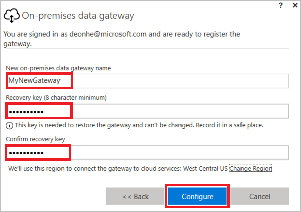

# <a name="understand-on-premises-data-gateways-for-microsoft-flow"></a>Over on-premises gegevensgateways voor Microsoft Flow
Gebruik de on-premises gegevensgateway in combinatie met Microsoft Flow om beveiligde verbindingen tot stand te brengen met uw on-premises gegevensbronnen zoals Microsoft SQL Server.

## <a name="installation-and-configuration"></a>Installatie en configuratie
### <a name="prerequisites"></a>Vereisten
Minimum:

* [.NET Framework 4.6](https://www.microsoft.com/download/details.aspx?id=48130)
* 64-bits versie van Windows 7 of Windows Server 2008 R2 (of hoger)

Aanbevolen:

* 8-core CPU
* 8 GB werkgeheugen
* 64-bits versie van Windows Server 2012 R2 (of hoger)

Relevante overwegingen:

* U kunt een gateway niet installeren op een domeincontroller.
* U moet een gateway niet installeren op een computer die kan worden uitgeschakeld, in slaapstand gaat of de internetverbinding kan verliezen.
* Het gebruik van een draadloze netwerkverbinding kan leiden tot slechtere gatewayprestaties.

## <a name="install-a-gateway"></a>Een gateway installeren
> [!IMPORTANT]
> Microsoft SharePoint-gegevensgateways ondersteunen nu zowel HTTP- als HTTPS-verkeer.
> 
> 

1. [Download het installatieprogramma](https://go.microsoft.com/fwlink/?LinkID=820931) en voer dit vervolgens uit.
   
    
2. Selecteer in het eerste scherm van de installatiewizard **Volgende** om aan te geven dat u de waarschuwing over het installeren van een gateway op een laptop hebt gelezen.
   
    
3. Selecteer de locatie voor de installatie.
4. Accepteer de gebruiksvoorwaarden en de privacyverklaring.
5. Selecteer **Installeren**.
   
    
6. Selecteer **Ja** in de dialoogvensters voor **Gebruikersaccountbeheer** om door te gaan.
7. In het scherm **On-premises gegevensgateway** voert u het e-mailadres in voor het account dat u wilt gebruiken voor aanmelding bij de gateway. Vervolgens selecteert u **Aanmelden** en doorloopt u het aanmeldingsproces.
   
    

## <a name="register-new-gateway-or-take-over-existing-gateway"></a>Nieuwe gateway registreren of de bestaande gateway overnemen
1. Selecteer **Een nieuwe gateway registreren op deze computer** of **Een bestaande gateway migreren, herstellen of overnemen**. Selecteer daarna **Volgende**.
   
    
2. Om een nieuwe gateway te configureren typt u een naam in het vak **Naam van nieuwe on-premises gegevensgateway**. In het vak**Herstelsleutel** typt u een herstelsleutel, en dezelfde herstelsleutel typt u ook in het vak **Herstelsleutel bevestigen**. Selecteer **Configureren** en vervolgens **Sluiten**.
   
    
3. Geef een herstelsleutel van ten minste acht tekens op en bewaar deze op een veilige plaats. U hebt deze sleutel nodig als u de gateway wilt migreren, herstellen of overnemen.
4. Als u een bestaande gateway wilt migreren, herstellen of overnemen, geeft u de naam van de gateway en de herstelsleutel op, selecteert u **Configureren** en volgt u alle verdere aanwijzingen.
   
    

## <a name="restart-the-gateway"></a>De gateway opnieuw starten
De gateway wordt uitgevoerd als een Windows-service en kan, net als alle andere Windows-services, op meerdere manieren worden gestart en gestopt. U kunt bijvoorbeeld een opdrachtprompt met verhoogde bevoegdheden openen op de computer waarop de gateway wordt uitgevoerd en vervolgens een van deze opdrachten invoeren:

* Gebruik deze opdracht om de service te stoppen:

```batchfile
    net stop PBIEgwService
```

* Gebruik deze opdracht om de service te starten:

```batchfile
    net start PBIEgwService
```

## <a name="configure-a-firewall-or-proxy"></a>Een firewall of proxy configureren
Zie [Configure proxy setting (Proxy-instellingen configureren)](https://powerbi.microsoft.com/documentation/powerbi-gateway-proxy/) voor meer informatie over het invoeren van proxy-informatie voor uw gateway.

U kunt controleren of uw firewall of proxyserver verbindingen blokkeert door de volgende opdracht uit te voeren in een PowerShell-prompt. Met deze opdracht wordt de verbinding met de Azure Service Bus getest. Met deze opdracht wordt alleen de netwerkverbinding getest. De cloudserverservice en de gateway worden niet beïnvloed. Zo kunt u bepalen of uw computer verbinding met internet heeft.

```powershell
Test-NetConnection -ComputerName watchdog.servicebus.windows.net -Port 9350
```

De resultaten moeten eruitzien als in het volgende voorbeeld. Als **TcpTestSucceeded** niet *waar* is, wordt de verbinding mogelijk geblokkeerd door een firewall.

    ComputerName           : watchdog.servicebus.windows.net
    RemoteAddress          : 70.37.104.240
    RemotePort             : 5672
    InterfaceAlias         : vEthernet (Broadcom NetXtreme Gigabit Ethernet - Virtual Switch)
    SourceAddress          : 10.120.60.105
    PingSucceeded          : False
    PingReplyDetails (RTT) : 0 ms
    TcpTestSucceeded       : True

Als u grondig wilt zijn, kunt u de waarden **ComputerName** en **Port** vervangen door de waarden die verderop in dit onderwerp worden genoemd onder **Poorten configureren**.

Het is ook mogelijk dat de firewall de verbindingen van de Azure Service Bus naar de Azure-datacenters blokkeert. Als dat het geval is, moet u alle [IP-adressen](https://www.microsoft.com/download/details.aspx?id=41653) van deze datacenters voor uw regio whitelisten (de blokkering opheffen).

## <a name="configure-ports"></a>Poorten configureren
De gateway maakt een uitgaande verbinding naar de Azure Service Bus. Er wordt gecommuniceerd via de volgende uitgaande poorten: TCP 443 (standaard), 5671, 5672 en 9350 t/m 9354. De gateway vereist geen inkomende poorten.

Meer informatie over [hybride oplossingen](https://azure.microsoft.com/documentation/articles/service-bus-fundamentals-hybrid-solutions/).

| Domeinnamen | Uitgaande poorten | Beschrijving |
| --- | --- | --- |
| *.analysis.windows.net |443 |HTTPS |
| *.login.windows.net |443 |HTTPS |
| *.servicebus.windows.net |5671-5672 |Advanced Message Queuing Protocol (AMQP) |
| *.servicebus.windows.net |443, 9350-9354 |Listeners op Service Bus Relay via TCP (443 vereist voor ophalen Access Control-token) |
| *.frontend.clouddatahub.net |443 |HTTPS |
| *.core.windows.net |443 |HTTPS |
| login.microsoftonline.com |443 |HTTPS |
| *.msftncsi.com |443 |Gebruikt voor het testen van de internetverbinding als de gateway onbereikbaar is. |

Als u IP-adressen wilt whitelisten in plaats van domeinen, kunt u de [lijst met Microsoft Azure Datacenter IP-adresbereiken ](https://www.microsoft.com/download/details.aspx?id=41653) downloaden en gebruiken. In sommige gevallen worden Azure Service Bus-verbindingen gemaakt op basis van IP-adres in plaats van een volledig gekwalificeerde domeinnaam.

## <a name="sign-in-account"></a>Aanmeldingsaccount
Gebruikers zullen zich aanmelden met een werk- of schoolaccount. Dit is uw organisatieaccount. Als u zich hebt geregistreerd voor een Office 365-aanbieding en niet uw zakelijke e-mailadres hebt opgegeven, kan iets zijn als nancy@contoso.onmicrosoft.com. Uw account binnen een cloudservice is opgeslagen in een tenant in Azure Active Directory (AAD). In de meeste gevallen zal het UPN van uw AAD-account overeenkomen met het e-mailadres.

## <a name="windows-service-account"></a>Windows-serviceaccount
De on-premises gegevensgateway is geconfigureerd om *NT SERVICE\PBIEgwService* te gebruiken als aanmeldingsreferenties voor de Windows-service. Standaard heeft deze rechten voor Aanmelden als service. Dit betreft specifiek de computer waarop u de gateway installeert.

Dit is niet het account dat wordt gebruikt om verbinding te maken met on-premises gegevensbronnen, of het werk- of schoolaccount waarmee u zich aanmeldt bij cloudservices.

## <a name="frequently-asked-questions"></a>Veelgestelde vragen
### <a name="general-questions"></a>Algemene vragen
**Vraag:** Welke gegevensbronnen ondersteunt de gateway?
**Antwoord:**

* SQL Server
* SharePoint
* Oracle
* Informix
* Bestandssysteem
* DB2

**Vraag:** Heb ik een gateway nodig voor gegevensbronnen in de cloud, zoals SQL Azure?
**Antwoord:** Nee. Een gateway maakt alleen verbinding met on-premises gegevensbronnen.

**Vraag:** Hoe heet de Windows-service zelf?
**Antwoord:** In Services wordt de gateway weergegeven als **Power BI Enterprise-gatewayservice**.

**Vraag:** Zijn er inkomende verbindingen naar de gateway vanuit de cloud?
**Antwoord:** Nee. De gateway gebruikt uitgaande verbindingen naar de Azure Service Bus.

**Vraag:** Wat als uitgaande verbindingen worden geblokkeerd? Wat moet ik openstellen?
**Antwoord:** Zie de [poorten](gateway-reference.md#configure-ports) en hosts waarvan de gateway gebruikmaakt.

**Vraag:** Moet de gateway op dezelfde computer worden geïnstalleerd als de gegevensbron?
**Antwoord:** Nee. De gateway maakt verbinding met de gegevensbron met behulp van de opgegeven verbindingsinformatie. Zie de gateway in dit opzicht als een clienttoepassing. De gateway hoeft alleen verbinding te kunnen maken met de opgegeven server.

**Vraag:** Wat is de vertraging van de gateway voor het uitvoeren van query's op een gegevensbron? Wat is de beste architectuur?
**Antwoord:** Installeer de gateway zo dicht mogelijk bij de gegevensbron om de netwerkvertraging te minimaliseren. Als u de gateway op de gegevensbron zelf kunt installeren, zorgt dit voor minimale vertraging. Houd ook rekening met de datacenters. Als uw service bijvoorbeeld gebruikmaakt van het datacentrum VS - west en u SQL Server in een Azure VM host, dient u de Azure VM ook in VS - west onder te brengen. Dit minimaliseert vertragingen en voorkomt kosten voor uitgaand verkeer voor de Azure VM.

**Vraag:** Zijn er vereisten wat betreft netwerkbandbreedte?
**Antwoord:** Een netwerkverbinding met een goede doorvoersnelheid wordt aanbevolen. Elke omgeving is anders en de hoeveelheid gegevens die wordt verzonden is van invloed op de resultaten. Door ExpressRoute te gebruiken, kunt u een zekere mate van doorvoer garanderen tussen uw locatie en de Azure-datacenters.

U kunt gebruik maken van de app [Azure Speed Test](http://azurespeedtest.azurewebsites.net/), een hulpprogramma van derden, om te bepalen wat de doorvoersnelheid is.

**Vraag:** Kan de Windows-service van de gateway worden uitgevoerd met een Azure Active Directory-account?
**Antwoord:** Nee. De Windows-service moet een geldig Windows-account hebben. Standaard wordt deze uitgevoerd met de service-SID *NT SERVICE\PBIEgwService*.

**Vraag:** Hoe worden de resultaten verzonden naar de cloud?
**Antwoord:** De resultaten worden verzonden via Azure Service Bus. Zie [hoe het werkt](gateway-reference.md#how-the-gateway-works) voor meer informatie.

**Vraag:** Waar zijn mijn referenties opgeslagen?
**Antwoord:** De referenties die u voor een gegevensbron invoert, worden versleuteld en opgeslagen in de gateway-cloudservice. De referenties worden bij de gateway on-premises ontsleuteld.

### <a name="high-availabilitydisaster-recovery"></a>Hoge beschikbaarheid en herstel na noodgevallen
**Vraag:** Zijn er plannen voor het inschakelen van scenario's voor hoge beschikbaarheid van de gateway?
**Antwoord:** Dit staat op de planning, maar hiervoor is nog geen tijdlijn beschikbaar.

**Vraag:** Welke opties zijn beschikbaar voor herstel na noodgevallen?
**Antwoord:** U kunt de herstelsleutel gebruiken om een gateway te herstellen of verplaatsen.

**Vraag:** Wat is het voordeel van de herstelsleutel?
**Antwoord:** De herstelsleutel biedt een manier om uw gateway te migreren of de gateway-instellingen te herstellen.

### <a name="troubleshooting-questions"></a>Vragen over probleemoplossing
**Vraag:** Waar vind ik de logboeken van de gateway?
**Antwoord:** Zie [Hulpprogramma’s](gateway-reference.md#tools) verderop in dit onderwerp.

**Vraag:** Hoe kan ik zien wat voor query's worden verzonden naar de on-premises gegevensbron?
**Antwoord:** U kunt querytracering inschakelen, waarmee u ook bijhoudt wat voor query's worden verzonden. Vergeet niet om dit weer uit te schakelen wanneer u klaar bent met het oplossen van problemen. Als u querytracering ingeschakeld laat, worden de logboeken groter.

U kunt ook kijken wat voor hulpprogramma's uw gegevensbron biedt voor het traceren van query's. U kunt bijvoorbeeld Extended Events of SQL Profiler gebruiken voor SQL Server en Analysis Services.

## <a name="how-the-gateway-works"></a>De werking van de gateway


Wanneer een gebruiker gebruikmaakt van een element dat is verbonden met een on-premises gegevensbron:

1. De cloudservice maakt een query, combineert deze met de versleutelde referenties voor de gegevensbron en stuurt de query naar de wachtrij om te worden verwerkt door de gateway.
2. De gateway-cloudservice analyseert de query en stuurt de aanvraag naar de [Azure Service Bus](https://azure.microsoft.com/documentation/services/service-bus/).
3. De on-premises gegevensgateway pollt de Azure Service Bus voor in behandeling zijnde aanvragen.
4. De gateway haalt de query op, ontsleutelt de referenties en maakt met deze referenties verbinding met de gegevensbron(nen).
5. De gateway stuurt de query naar de gegevensbron voor uitvoering.
6. De resultaten worden teruggestuurd van de gegevensbron naar de gateway en vervolgens naar de cloudservice verzonden. De service gebruikt vervolgens de resultaten.

## <a name="troubleshooting"></a>Problemen oplossen
### <a name="update-to-the-latest-version"></a>Bijwerken naar de nieuwste versie
Als de gatewayversie verouderd is, kunnen er allerlei problemen optreden. Zorg ervoor dat u de nieuwste versie gebruikt.  Als u de gateway niet onlangs hebt bijgewerkt, kunt u overwegen de nieuwste versie te installeren en vervolgens te controleren of het probleem zich nog steeds voordoet.

#### <a name="error-failed-to-add-user-to-group---2147463168---pbiegwservice---performance-log-users---"></a>Fout: kan gebruiker niet toevoegen aan groep.  (-2147463168   PBIEgwService   Prestatielogboekgebruikers)
Deze fout kan optreden als u probeert de gateway te installeren op een domeincontroller. Dit wordt niet ondersteund. U moet de gateway installeren op een computer die geen domeincontroller is.

## <a name="tools"></a>Hulpprogramma 's
### <a name="collecting-logs-from-the-gateway-configurator"></a>Logboeken van de gatewayconfigurator ophalen
U kunt verschillende logboeken ophalen voor de gateway. Begin altijd bij de logboeken!

1. Logboeken van installatieprogramma
   
    %localappdata%\Temp\On-premises_data_gateway_*.log
2. Configuratielogboeken
   
    %localappdata%\Microsoft\on-premises data gateway\GatewayConfigurator*.log
3. Logboeken van Enterprise-gatewayservice
   
    C:\Users\PBIEgwService\AppData\Local\Microsoft\on-premises data gateway\Gateway*.log
4. Gebeurtenislogboeken

De gebeurtenislogboeken van de **On-premises gegevensgatewayservice** vindt u onder **Logboeken Toepassingen en Services**.


### <a name="fiddler-trace"></a>Traceren met Fiddler
[Fiddler](http://www.telerik.com/fiddler) is een gratis hulpprogramma van Telerik dat HTTP-verkeer bewaakt.  U kunt hiermee het verkeer tussen de Power BI-service en de clientcomputer inzien. Zo kunt u fouten en andere gerelateerde informatie weergegeven.

