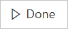

# Een stroom maken in Microsoft Flow

> [!VIDEO https://www.youtube.com/embed/Gt3CMhLAQqE?list=PL8nfc9haGeb55I9wL9QnWyHp3ctU2_ThF]

U kunt een stroom maken om een of meer taken automatisch uit te voeren nadat de stroom door een bepaalde trigger is geactiveerd. U kunt bijvoorbeeld een stroom maken waarmee u per e-mail wordt gewaarschuwd wanneer iemand een tweet verstuurt met daarin een trefwoord dat u opgeeft. In dit voorbeeld is het verzenden van de tweet de gebeurtenis en is het verzenden van de e-mail de actie.

## Vereisten

* Een account op [flow.microsoft.com](https://flow.microsoft.com)
* Een Twitter-account
* Office 365-referenties

## Een gebeurtenis opgeven voor het starten van de stroom

Eerst moet u selecteren door welke gebeurtenis, of *trigger*, de stroom wordt geactiveerd.

1. Ga naar [flow.microsoft.com](https://flow.microsoft.com), selecteer **Mijn stromen** op de navigatiebalk bovenaan en selecteer **Een volledig nieuwe stroom maken**.

    
1. Selecteer het vak **Honderden connectors en triggers doorzoeken** aan de onderkant van het scherm, voer **Twitter** in het vak met de tekst **Alle connectors en triggers doorzoeken** in en selecteer vervolgens **Twitter - Wanneer een nieuwe tweet wordt gepost**.

    

1. Als u uw Twitter-account nog niet met Microsoft Flow hebt verbonden, selecteert u **Aanmelden bij Twitter** en geeft u uw referenties op.

1. Typ in het vak **Zoektekst** het trefwoord dat u wilt zoeken.

    

## Een actie opgeven

1. Selecteer de knop **Nieuwe stap** en vervolgens **Een actie toevoegen**.

    

1. Typ of plak in het vak **Alle connectors en acties doorzoeken** de tekst **e-mail verzenden** en selecteer vervolgens **Office 365 Outlook - Een e-mail verzenden**.

    

1. Klik op de knop Aanmelden als u hierom wordt gevraagd en geef uw referenties op.

1. Typt of plak uw e-mailadres in het vak **Aan** van het formulier dat verschijnt en selecteer vervolgens uw naam in de lijst met contactpersonen die wordt weergegeven.

    
1. Typ of plak in het vak **Onderwerp** de tekst **Nieuwe tweet van:** en typ vervolgens een spatie.

    
1. Selecteer **Getweet door** in de lijst met parameters om een tijdelijke aanduiding voor de tweet toe te voegen.

    
1. Selecteer het vak **Hoofdtekst** en selecteer het token **Tekst van tweet** om een tijdelijke aanduiding voor de tekst van de tweet toe te voegen.
1. (optioneel) Voeg meer tokens, andere inhoud of beide toe aan de hoofdtekst van het e-mailbericht.
1. Ga naar de bovenkant van het scherm en geef uw stroom een naam. Selecteer vervolgens **Stroom maken**.

    
1. Selecteer **Gereed** om de lijst met stromen bij te werken.

     
1. Verzend een tweet met het trefwoord dat u hebt opgegeven of wacht totdat iemand anders een tweet met het trefwoord post.

     Binnen een minuut na het posten van de tweet wordt u via een e-mailbericht op de hoogte gebracht van de nieuwe tweet.

> [!TIP]
> Gebruik de **e-mail verzenden (V2)** actie om de opmaak van e-mailadres waarop u het lettertype, gebruik vet, cursief of onderstreping aanpassen de kleur aanpassen en markeren en maak lijsten of koppelingen en meer.

## Een stroom beheren

1. Ga naar [flow.microsoft.com](https://flow.microsoft.com) en selecteer **Mijn stromen** op de navigatiebalk bovenin.
1. Ga op een van de volgende manieren te werk in de lijst met stromen:

   * Als u een stroom wilt onderbreken, zet u de wisselknop op **Uit**.

       
   * Als u een stroom wilt hervatten, zet u de wisselknop op **Aan**.

       
   * Als u een stroom wilt bewerken, selecteert u het potloodpictogram bij de stroom die u wilt bewerken.

       
   * Als u een stroom wilt verwijderen, selecteert u het pictogram **...** , selecteert u **Verwijderen** en selecteert u ten slotte **Verwijderen** in het bericht dat wordt weergegeven.

       
   * Als u de uitvoeringsgeschiedenis van een stroom wilt weergeven, selecteert u de stroom op de pagina **Mijn stromen** en bekijkt u de geschiedenis in de sectie **Uitvoeringsgeschiedenis** op de pagina die wordt geopend.

       

     Selecteer een stroomuitvoering in de lijst met uitvoeringen om de invoer en uitvoer van elke stap weer te geven.

> [!NOTE]
> Uw account kan maximaal vijftig stromen bevatten. Als u al vijftig stromen hebt en u een nieuwe stroom wilt maken, moet u eerst een stroom verwijderen.
>
>

## Volgende stappen

* [Voeg stappen toe](multi-step-logic-flow.md) aan de stroom, bijvoorbeeld verschillende manieren om te worden gewaarschuwd.
* [Voer taken uit op basis van een schema](run-scheduled-tasks.md) wanneer u een actie dagelijks, op een bepaalde datum of na een bepaald aantal minuten wilt uitvoeren.
* [Voeg een stroom aan een app toe](https://powerapps.microsoft.com/tutorials/using-logic-flows/) om toe te staan dat de app een bepaalde logica in de cloud kan starten.
* [Ga aan de slag met teamstromen](create-team-flows.md) en nodig anderen uit om samen met u stromen te ontwerpen.
