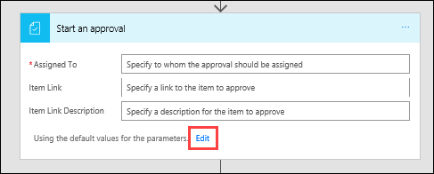
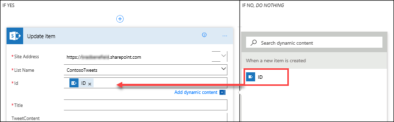
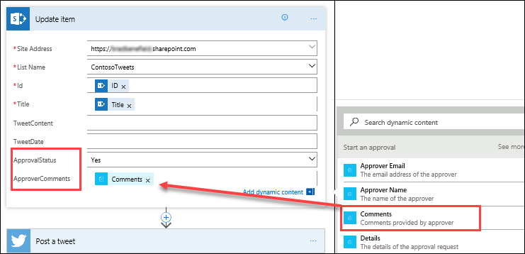
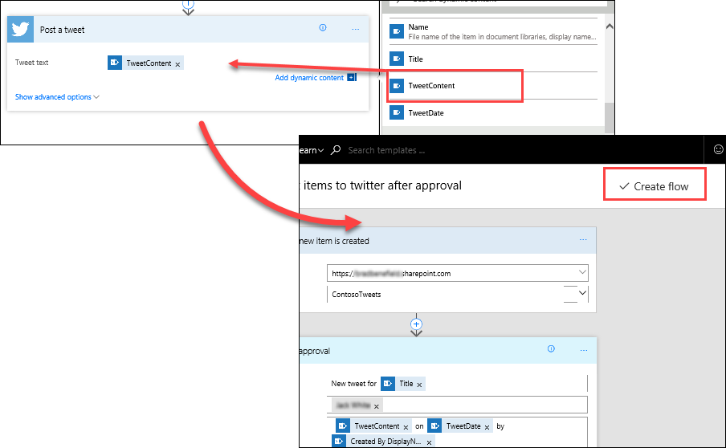

# Een goedkeuringsaanvraag maken
In een vorig onderwerp is beschreven hoe u uw Twitter-feed eenvoudig kunt activeren met behulp van een SharePoint-lijst. In dit onderwerp leert u hoe u een scenario voor bedrijven maakt met goedkeuringen. Op die manier kan iedereen met toegang tot de SharePoint-lijst bijdragen aan de tweets en kan het sociale-mediateam deze tweets goedkeuren of afwijzen. Het team houdt de controle over het account en de inhoud die naar klanten wordt verzonden. 

## Een goedkeuringsaanvraagstroom maken
1. Selecteer op de startpagina van **Microsoft Flow** de optie **Goedkeuringen**, selecteer **Goedkeuringsstroom maken**, schuif omlaag en selecteer de sjabloon **Lijstitems op Twitter plaatsen na goedkeuring**. 
   
    
2. Controleer uw accountreferenties voor **SharePoint**, **Goedkeuringen** en **Twitter** en selecteer **Doorgaan**. 
   
    

Standaard wordt met deze sjabloon een goedkeuringsproces gestart wanneer er een nieuw item wordt gemaakt in een bepaalde lijst. Als het item wordt goedgekeurd, wordt er een tweet geplaatst op Twitter. In dit onderwerp wijzigt u dit proces door stappen toe te voegen waarmee de SharePoint-lijst wordt bijgewerkt met het goedkeuringsantwoord, wordt aangegeven of het item al dan niet is goedgekeurd en opmerkingen worden toegevoegd die de goedkeurder mogelijk heeft toegevoegd aan de voorgestelde tweet. 

1. In de SharePoint-lijst **ContosoTweets** die u eerder hebt gemaakt, voegt u twee nieuwe kolommen toe:
   
   1. Selecteer het plusteken **+** en selecteer **Ja/nee**
   2. Typ **Goedkeuringsstatus** en selecteer **Maken**
   3. Selecteer het plusteken **+** en selecteer **Eén tekstregel**
   4. Typ **Opmerkingen van goedkeurder** en selecteer **Opslaan**
      
      
2. Voer in **Microsoft Flow** de volgende waarden in bij de actie **Wanneer een nieuw item is gemaakt**:
   
   * **Siteadres**: de SharePoint-URL van uw team
   * **Lijstnaam**: ContosoTweets
     
     
3. Selecteer in de actie **Een goedkeuring starten** de optie **Bewerken** om alle velden weer te geven. 
   
    
4. Typ **Nieuwe tweet voor** bij **Titel** en selecteer **Titel** in de lijst met dynamische inhoud. 
   
    
5. Typ uw naam of een testgebruikersnaam in **Toegewezen aan** en selecteer deze. 
   
    
6. Bij **Details** verwijdert u de standaarditems en voegt u **Inhoud tweet**, **Datum tweet** en **Gemaakt door weergavenaam** toe vanuit de lijst met dynamische inhoud en verbindt u deze item met de woorden **op** en **door**. 
   
    
7. Kopieer en plak bij **Itemkoppeling** de URL van uw SharePoint-lijst en typ **Contoso-tweetlijst** bij **Beschrijving van itemkoppeling**. 
   
    
8. Houd de muisaanwijzer in de actie **Voorwaarde** op het vak **ZO JA**, selecteer het plusteken **+** en selecteer **Een actie toevoegen**. 
   
    
9. Zoek naar **Item bijwerken**, selecteer de **SharePoint**--connector en selecteer de actie **SharePoint - Item bijwerken**.
   
    
10. Voer bij **Siteadres** en **Lijstnaam** de URL van de site en de lijst **ContosoTweets** in en typ **Id** bij **Id** in de lijst met dynamische inhoud. 
    
     
11. Selecteer het veld **Titel** en zoek in de lijst met dynamische inhoud naar **Titel**. Voeg het item **Titel** toe vanuit de actie **Wanneer een nieuw item is gemaakt**. 
    
     
12. Selecteer **Goedkeuringsstatus** en stel de waarde in op **Ja**. Selecteer daarna **Opmerkingen van goedkeurder** en stel de waarde in op **Opmerkingen** vanuit de lijst met dynamische inhoud. 
    
     
13. Selecteer **Een actie toevoegen** onderaan het vak **ZO NEE, *NIETS DOEN***.
    
     
14. Met dezelfde stappen die u hebt gebruikt voor de configuratie van **ZO JA**, maakt u een actie **SharePoint - Item bijwerken** en configureert u de velden met dezelfde waarden, maar stelt u **Goedkeuringsstatus** nu in op **Nee**. 
    
     
15. Selecteer de actie **Een tweet plaatsen**, selecteer **Bewerken** en stel **Tweettekst** in op **Inhoud tweet** uit de lijst met dynamische inhoud.  Selecteer **Stroom maken** bovenaan de pagina om uw werk op te slaan. 
    
     

Dit is slechts één manier waarop u met Microsoft Flow de productiviteit van uw team kunt verbeteren. Uw team kan ideeën, relevant nieuws of productrichtlijnen bijdragen en u houdt nog steeds controle over wat er wordt getweet naar klanten.

In het volgende onderwerp ziet u hoe het eruit ziet wanneer een goedkeurder een nieuwe aanvraag voor een voorgestelde tweet ontvangt. 

