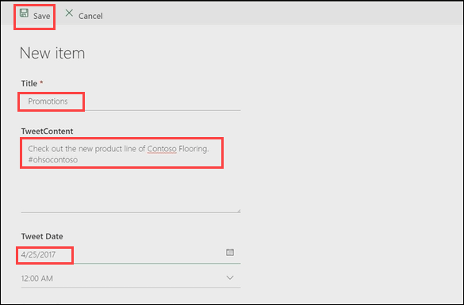

# Een goedkeuringsaanvraag verwerken
In een vorig onderwerp hebt u gezien hoe u een goedkeuringsproces maakt voor tweets die zijn opgeslagen in een SharePoint-lijst.  In dit onderwerp ziet u hoe de ervaring eruitziet wanneer een goedkeurder een nieuwe goedkeuringsaanvraag ontvangt. 

## Een aanvraag maken en verwerken
Eerst voegen we een item toe aan onze SharePoint-lijst. Vervolgens kunnen we een goedkeuringsaanvraag voor dit item verwerken.

1. Open de SharePoint-lijst **Contoso-tweets**, die is geconfigureerd in een vorig onderwerp.  Selecteer **Nieuw** om een nieuwe tweet te maken. 
   
    
2. Voeg de volgende waarden toe aan de velden en selecteer **Opslaan**.
   
   * **Titel** - Aanbiedingen
   * **Inhoud tweet**: Bekijk de nieuwe productlijn van Contoso Flooring #ohsocontoso
   * **Datum tweet**: de datum van vandaag
     
     
3. Selecteer in **Microsoft Flow** de optie **Mijn stromen**. 
4. Selecteer de stroom **Lijstitems op Twitter plaatsen na goedkeuring** die is geconfigureerd in het vorige onderwerp en selecteer de actieve stroom onder **UITVOERINGSGESCHIEDENIS**.
   
    
5. Selecteer de trigger **Wanneer een nieuw item is gemaakt**. Controleer of de gegevens voor het lijstitem dat u zojuist hebt gemaakt, worden weergegeven.
   
    
6. Open in **Outlook** de geautomatiseerde goedkeuringse-mail in het Postvak IN en selecteer **Goedkeuren**. 
   
    
7. Bekijk in het **Goedkeuringscentrum** de details van de aanvraag, voeg een opmerking toe en selecteer **Bevestigen**. 
   
    
8. Vernieuw in **SharePoint** de lijst **Contoso-tweets** en controleer of **Goedkeurigsstatus** is ingesteld op **Ja** en de ingevoerde opmerking wordt weergegeven. 
   
    

In dit onderwerp hebt u de ervaring gezien vanuit het perspectief van de goedkeurder: van het ontvangen van een e-mail met een goedkeuringsaanvraag tot het verwerken van de aanvraag in het Goedkeuringscentrum.

