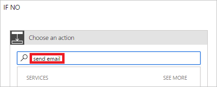

1. Selecteer **Een actie toevoegen** in de vertakking **INDIEN NEE, NIETS DOEN**.
2. Voer in het zoekvak op de kaart **Een actie kiezen** de tekst **E-mail verzenden** in.
   
    
3. Selecteer de actie **Office 365 Outlook: Een e-mail verzenden**.
   
    
4. Configureer de e-mailkaart op basis van uw behoeften.
   
     Deze kaart is een sjabloon voor het e-mailbericht dat wordt verzonden wanneer de status van vakantieaanvragen wordt gewijzigd.

