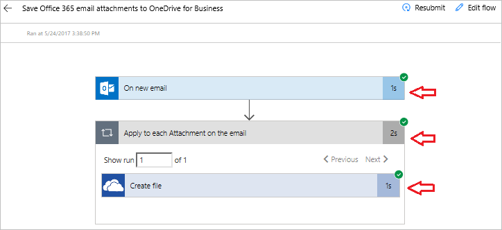

Welkom terug bij Begeleide training voor Microsoft Flow. In deze les ziet u meer van de Microsoft Flow-omgeving en kunt u **uw eerste stroom maken**.

U kunt eenvoudig aan de slag gaan met Microsoft-Flow omdat u uit zeer veel **sjablonen kunt kiezen**, waarmee u op een zinvollere manier verbinding kunt maken met de services die u al gebruikt.  

## Microsoft Flow-sjablonen
Bekijk de [Microsoft Flow-website](https://ms.flow.microsoft.com) en open het menu **Sjablonen**. Wanneer u door de lijst bladert, ziet u dat u in Microsoft Flow verbinding kunt maken met een groot aantal services.

## Een sjabloon kiezen
Het **zoeken naar bijlagen** via e-mail kan een tijdrovende bezigheid zijn. Met deze stroom bespaart u tijd doordat **al uw e-mailbijlagen worden opgeslagen** in een map in uw OneDrive.

Selecteer de sjabloon **Office 365-e-mailbijlagen opslaan in OneDrive voor Bedrijven**.

## Een stroom maken en beheren
Dit is een van onze sjablonen **met één klik**, waarbij u alleen relevante vragen beantwoordt die **nodig zijn voor het maken van de stroom**.

Op de sjabloonafbeelding ziet u een **beschrijving** van de **werking van en vereisten voor** de sjabloon.

U wordt gevraagd om **referenties** op te geven voor de **Office 365 Outlook**- en **SharePoint**-services. Als u beide services regelmatig gebruikt, bent u hier al bij aangemeld.

1. Selecteer **Stroom maken**.
   
    
   
    Vervolgens ziet u de resultaten. 
   
    
   
    In uw OneDrive is **een map gemaakt**, waarin nu automatisch **elke bijlage** wordt geplaatst die per e-mail wordt verzonden naar het e-mailadres van uw werk.
2. Open **Mijn stromen**.
   
    
3. Selecteer de **stroom die u zojuist hebt gemaakt** om te zien hoe deze werkt.
   
    
4. U ziet een **groen vinkje**, waarmee wordt aangegeven dat de **stroom is geslaagd**. Selecteer **Geslaagd** om de uitvoeringsgeschiedenis en de resultaten te bekijken.
   
    
   
    **Alle onderdelen van de stroom** zijn geslaagd. 
   
    

## Belangrijke concepten in Microsoft Flow
Wat u moet weten over het maken van stromen. Elke stroom bestaat uit twee belangrijke onderdelen: een **trigger** en **een of meer acties**. 

U kunt de **trigger** beschouwen als de startactie voor de stroom. Dit kan zoiets zijn als **Bij nieuwe e-mail** wat u hier ziet of **wanneer er een nieuw item wordt toegevoegd**, als u SharePoint gebruikt. Dit kan ook een vast schema zijn, als u de trigger **Terugkeerpatroon** gebruikt, die later wordt beschreven.

**Acties zijn de activiteiten** die moeten worden uitgevoerd wanneer **een trigger wordt aangeroepen**. Met **Bestand maken** bijvoorbeeld wordt het bestand opnieuw gemaakt in OneDrive.

Andere acties zijn bijvoorbeeld het verzenden van een **e-mail**, het posten van een **Tweet**, het starten van een **goedkeuring** enzovoort.
Deze komen later allemaal aan de orde wanneer u uw eigen stromen gaat maken. 

## Volgende les
In de volgende les kijken we naar de mobiele app van Microsoft Flow en de mogelijkheden hiervan. 

