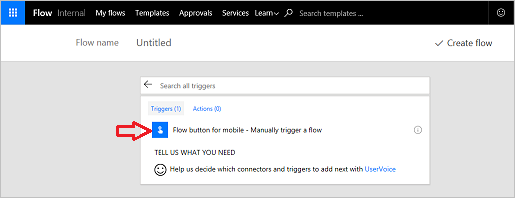
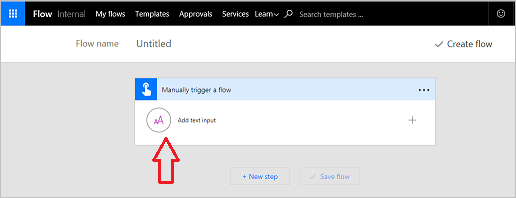
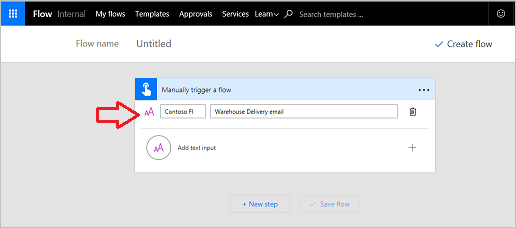
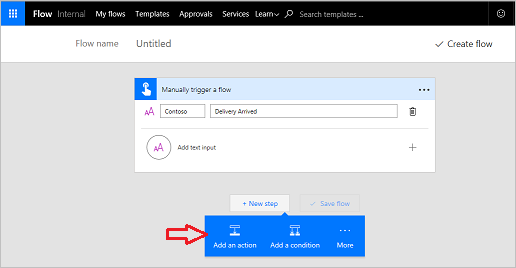

In dit onderwerp leert u hoe u **een knopstroom maakt** voor het bedrijf Contoso Flooring. 

Knopstromen kunnen worden gebruikt om **e-mail**  te verzenden naar een team en **hen een melding te sturen over taken** die ze moeten uitvoeren. Het **eigendom** van de stromen **kan worden toegewezen aan één**medewerker of worden **gedeeld door meerdere** leden van een team.  

1. Ga eerst naar de [Microsoft Flow-website](https://ms.flow.microsoft.com) en meld u aan.
2. Wanneer u zich hebt aangemeld, selecteert u achtereenvolgens **Mijn stromen** en **Leeg item maken**.
   
    
   
    U hebt eerst een trigger nodig. De knopstroom is handig om te gebruiken. 
3. Als deze niet beschikbaar is in de lijst, selecteert u onderaan de pagina **Honderden connectors en triggers zoeken**, typt u **knop**, waarna deze wordt weergegeven. 
4. Selecteer **De knop Stroom voor mobiel**.
   
     
5. Selecteer **De knop Stroom voor mobiel - Handmatig een stroom activeren**.
   
    
6. Selecteer in het invoerscherm **Invoertekst toevoegen**,
   
    
7. Typ **Contoso Flooring** in het eerste tekstvak en typ **e-mailadres magazijnlevering** in het tweede tekstvak.
   
    
8. Selecteer **Nieuwe stap**. 
   
    
9. Selecteer **Een actie toevoegen**. 
   
    
10. Selecteer de connector **Office 365 Outlook**. Als deze niet beschikbaar is, zoekt u naar **outlook**.
    
     
11. Selecteer **Office 365 Outlook - Een e-mail verzenden**.
    
     
    
     Wanneer u op de knop drukt, wordt er een e-mail verzonden naar het hele team van het Contoso-magazijn, ongeacht waar ze zich bevinden in het gebouw, om hen te laten weten dat de levering is aangekomen.
12. Breid de velden uit en stem de e-mail af op Contoso Flooring.
    
    1. Geef in het veld **Aan** een e-mailadres op dat geldig is in uw organisatie.
    2. Typ **Levering aangekomen** in het veld **Onderwerp**. 
    3. Aan de rechterkant ziet u nu het vak **Dynamische inhoud**. Selecteer **Datum** en **Tijdstempel** als u op de onderwerpregel de exacte datum en tijd waarop op de knop is gedrukt, wilt weergeven. 
       
        
13. Typ nu een eenvoudige **hoofdtekst** voor de e-mail, bijvoorbeeld, **Magazijnteam, kom naar de losplaats omdat de levering van vandaag is aangekomen**.
14. Selecteer **Stroom maken** om de stroom op te slaan.
    
     

## Een teamstroom maken
U kunt deze knopstroom gebruiken als voorbeeld van het maken van een teamstroom. En wat nu als de maker van deze stroom ziek is? Of als de maker het bedrijf verlaat? U wilt ervoor zorgen dat deze stroom actief blijft. Hiervoor voegt u mede-eigenaars toe.

1. Selecteer het **teampictogram** in uw stroom om een mede-eigenaar toe te voegen.
   
     
2. Geef namen, e-mailadressen of gebruikersgroepen op om mede-eigenaars toe te voegen.
   
    
3. Als u mede-eigenaars wilt verwijderen, selecteert u de Prullenbak rechts van hun naam.
   
    
4. Selecteer **Deze eigenaar verwijderen** om het verwijderen te voltooien.
   
    

## Overzicht
In deze les hebt u gezien hoe u **een knopstroom maakt**. 

Via de stroom kon een magazijnmedewerker in een paar minuten **een melding sturen naar het team** over de **komst van een levering**, zodat het team niet onnodig hoefde te wachten en aan andere taken kon werken. 

De medewerker deelde deze knop vervolgens met het team, zodat anderen dezelfde stroom konden activeren wanneer ze niet aanwezig was.

## Volgende les
Bekijk de volgende les om te zien hoe u een stroom maakt waarin **pushmeldingen** worden gebruikt.

