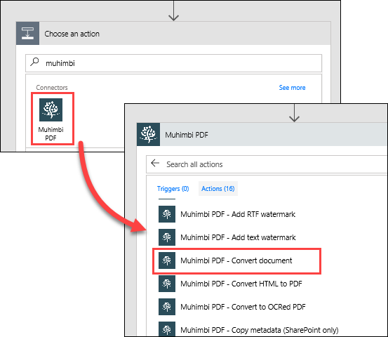

In dit onderwerp ziet u hoe Contoso Flooring Microsoft Flow gebruikt om documenten automatisch te converteren naar een standaardindeling en deze vervolgens op te slaan in SharePoint Online, zodat deze veilig worden opgeslagen in de cloud. U maakt een stroom waarmee wordt gedetecteerd wanneer er een nieuw bestand is toegevoegd aan een OneDrive voor Bedrijven-map. Vervolgens wordt dit bestand geconverteerd naar PDF en opgeslagen in een SharePoint Online-map. 

## Vereisten
In dit scenario hebt u een account nodig bij **Muhimbi**, een PDF-conversieservice. Als u nog geen Muhimbi-account hebt, kunt u zich registreren voor een [gratis proefperiode van 30 dagen](http://www.muhimbi.com/Products/PDF-Converter-for-SharePoint/Products-PDF-Converter-for-SharePoint-Free-Trial.aspx). Volg de instructies op de desbetreffende pagina voor het implementeren van de app via uw SharePoint Online-site. 

## De bron- en doelmappen maken
Eerst moet u de bron- en doelmappen maken in OneDrive voor Bedrijven en SharePoint Online. 

1. Maak in OneDrive voor Bedrijven onder **Bestanden** een map met de naam **Voltooide documenten**. 
   
    
2. Maak in SharePoint Online in **Gedeelde documenten** een map met de naam **PDF - Voltooide documenten**. 
   
    

## De stroom maken
1. Selecteer in Microsoft Flow achtereenvolgens **Mijn stromen** en **Leeg item maken**. 
   
    
2. Selecteer **Honderden connectors en triggers zoeken**.
3. Zoek naar **OneDrive**, selecteer **OneDrive voor Bedrijven** en selecteer vervolgens de trigger **OneDrive voor Bedrijven - Wanneer een bestand is gemaakt**. Selecteer in **Map** de mappictogram en selecteer de map **Voltooide documenten** die u in de vorige stap hebt gemaakt. 
   
    
4. Selecteer de knop **Nieuwe stap** en vervolgens **Een actie toevoegen**. 
   
    
5. Zoek naar **Muhimbi**, selecteer de connector **Muhimbi-PDF** en selecteer de actie **Muhimbi-PDF - Document converteren**.
   
    
6. Op dit punt wordt u in Microsoft Flow mogelijk gevraagd om Muhimbi te verifiëren. U moet Muhimbi registreren met uw **SharePoint-tenant-id**, zodat de Muhimbi-service kan worden gebruikt in Microsoft Flow. 
   
   1. Als u wilt zoeken naar uw tenant-id, selecteert u het tandwielpictogram **Instellingen** in SharePoint Online en selecteert u **Site-instellingen**.
   2. Selecteer **Machtigingen voor siteverzamelings-app** onder **Beheer van de siteverzameling**. Uw tenant-id is de id die volgt op het symbool **@** in een van de app-vermeldingen. 
      
       
7. Stel de volgende waarden in de actie **Document converteren** in:
   
   * **Naam van bronbestand**: selecteer **Bestandsnaam** in de lijst met dynamische inhoud.
   * **Inhoud van bronbestand**: selecteer **Bestandsinhoud** in de lijst met dynamische inhoud.
   * **Uitvoerindeling**: selecteer **PDF** in de vervolgkeuzelijst.
     
     

Tot nu toe hebt u uw stroom geconfigureerd met de volgende stappen: 

1. De stroom wordt geactiveerd wanneer er een nieuw bestand wordt toegevoegd aan een specifieke OneDrive voor Bedrijven-map 
2. Dit bestand wordt geconverteerd naar PDF met de Muhimbi-service. 

Voor de laatste stap voegt u een actie toe waarmee het PDF-document wordt verplaatst naar een SharePoint Online-map waarin het team dit kan openen.  

1. Selecteer de knop **Nieuwe stap** en vervolgens **Een actie toevoegen**.  Zoek naar **SharePoint** en selecteer de actie **SharePoint - Bestand maken**. 
   
    
2. Stel de volgende waarden in de actie **Bestand maken** in:
   
   * **Siteadres**: de URL van uw SharePoint-site.  
   * **Mappad**: selecteer het mappictogram en ga naar de map **PDF - Voltooide bestanden**.
   * **Bestandsnaam**: selecteer in de lijst met dynamische inhoud voor **Document converteren** de optie **Basisbestandsnaam** , voeg '**.pdf**' toe, zodat het bestand wordt opgeslagen in SharePoint met de bestandsextensie. 
   * **Bestandsinhoud**: selecteer in de lijst met dynamische inhoud voor **Document converteren** de optie **Verwerkte bestandsinhoud**.
3. Selecteer **Stroom maken** bovenaan de pagina om uw werk op te slaan.
   
    

## De stroom testen
1. Als u de stroom wilt testen, voegt u een nieuw bestand toe aan uw map **Voltooide documenten** in OneDrive voor Bedrijven. 
2. Selecteer in Flow **Mijn stromen** en selecteer vervolgens de nieuwe stroom om de uitvoeringsgeschiedenis weer te geven. Standaard is de stroom zo geconfigureerd dat deze om de vijf minuten wordt uitgevoerd. 
3. Wanneer de stroom is uitgevoerd, controleert u of het bestand is geconverteerd naar PDF en is opgeslagen in de SharePoint-map **PDF - Voltooide bestanden**. 
   
    

