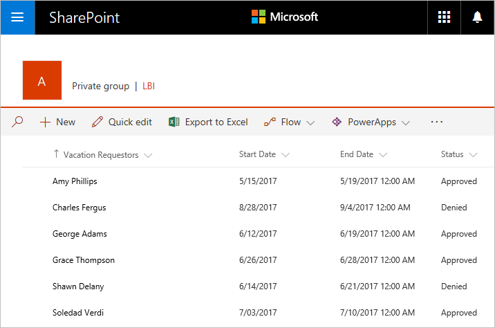
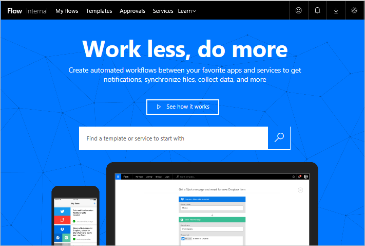

Welkom bij Begeleide training voor Microsoft Flow. In deze **onlinecursus die u in eigen tempo** kunt volgen, wordt Microsoft Flow stapsgewijs beschreven, zodat u uw kennis vanaf de basis kunt opbouwen. De cursus is zo ontworpen dat u **stapsgewijs wordt begeleid** met veel **visuele elementen en voorbeelden**, waarbij een logische opbouw wordt aangehouden om u te helpen bij het leren van de basisbeginselen en details.

In deze cursus leert u meer over Microsoft Flow en de concepten hiervan, ziet u hoe u **stromen maakt** en **deze** **beheert** en in uw omgeving. In de cursus wordt gewerkt met informatie en scenario's voor het fictieve bedrijf Contoso Flooring, maar u ziet hoe u dezelfde scenario's kunt gebruiken in uw bedrijf of de bedrijven van uw klanten.

Als u een beginnende gebruiker van Microsoft Flow bent, zal deze cursus u goed op weg helpen. Als u al enige ervaring hebt, ziet u hoe in deze cursus concepten met elkaar zijn verbonden en kunt u ontbrekende kennis aanvullen. Deze cursus is continu in ontwikkeling. **Laat ons daarom weten wat u van de training vindt** en welke andere onderwerpen u in deze cursus wilt zien.

## Wat is Microsoft Flow?
Microsoft Flow is een online**werkstroomservice** waarmee u slimmer en efficiënter kunt werken door **werkstromen te automatiseren** voor de meest voorkomende apps en services. U kunt bijvoorbeeld een stroom maken waarmee een potentiële klant wordt toegevoegd aan **Dynamics 365** en een record aan **MailChimp** wanneer iemand met meer dan 100 volgers tweet over uw bedrijf.

Wanneer u zich registreert, kunt u **verbinding maken met meer dan 100 services** en **gegevens in de cloud of on-premises bronnen beheren**, zoals SharePoint en SQL Server. De lijst met toepassingen en services die u met Microsoft Flow kunt gebruiken, groeit voortdurend.

## Wat kunt u doen met Microsoft Flow?
U kunt Microsoft Flow gebruiken om **werkstromen te automatiseren** tussen uw favoriete **toepassingen en services**, bestanden te synchroniseren, meldingen te ontvangen, gegevens te verzamelen en meer. 

U kunt bijvoorbeeld de volgende taken **automatiseren**:

* Direct reageren op meldingen of e-mails met hoge prioriteit.
* Nieuwe verkoopleads vastleggen, volgen en opvolgen.
* Bestanden tussen twee services kopiëren.
* Gegevens verzamelen over uw bedrijf en deze informatie delen met uw team.
* Goedkeuringswerkstromen automatiseren 

Microsoft Flow wordt vaak gebruikt om **meldingen te ontvangen**. U kunt bijvoorbeeld direct een e-mail of een pushmelding op uw telefoon ontvangen wanneer er een verkooplead wordt toegevoegd aan Dynamics 365 of Salesforce.

U kunt **Microsoft Flow ook gebruiken om bestanden te kopiëren**. U kunt er bijvoorbeeld voor zorgen dat een bestand dat wordt toegevoegd aan Dropbox, **automatisch wordt gekopieerd** naar SharePoint waar uw team dit kan vinden.

 

 

U kunt **bijhouden wat mensen zeggen** over uw bedrijf door een stroom te maken die wordt uitgevoerd wanneer **iemand een tweet verzendt** met een bepaalde hashtag. Via de stroom kan informatie over deze tweet worden geplaatst in een SQL Server-database, een SharePoint-lijst of zelfs in een Excel-bestand dat wordt gehost op OneDrive, wat voor u het beste werkt. Met de gegevens die u verzamelt, kunt u acties maken om de service te verbinden met Power BI, trends te spotten en vragen te stellen over de gegevens.

En ten slotte **kunt u goedkeuringslussen automatiseren** voor bijvoorbeeld vakantieaanvragen in een SharePoint-lijst.

**Blader in onze lijst met sjablonen** voor meer ideeën. Zo kunt u in een paar stappen stromen maken. U kunt bijvoorbeeld eenvoudig stromen maken om bijvoorbeeld het volgende naar uzelf te sturen: **weersverwachtingen**, herinneringen met vaste intervallen of telefoonmeldingen wanneer u e-mail van uw manager ontvangt.

Hebt u een idee voor een stroom die niet wordt weergegeven in de lijst? Maak uw eigen stroom en deel deze desgewenst met de community!

## Waar kan ik een stroom maken en beheren?
U kunt een stroom maken en beheertaken uitvoeren **in een browser** of **op uw telefoon**, als u de mobiele app voor Microsoft Flow downloadt.

  

U kunt onder andere de volgende taken uitvoeren:

* Stromen in- of uitschakelen, waar u ook bent.
* Zien wanneer een stroom is mislukt.
* Gedetailleerde rapporten van de uitvoeringsgeschiedenis bekijken.
* Uitvoeringen weergeven en filteren op meldingstype.

## Een korte rondleiding door Microsoft Flow
Ga naar het hulpprogramma om de rondleiding te starten. We hebben uitgebreide informatie voor u over het gebruik van Microsoft Flow.

Op de startpagina ziet u menu's voor:

* **Mijn stromen**, dit is de locatie van uw stromen.
* **Sjablonen**, dit is een goed punt om te starten.
* **Goedkeuringen**, hier kunt u uw goedkeuringsproces automatiseren en stroomlijnen.
* **Connectors** (voorheen **Services**), hier kunt u vanuit een service verbinding maken met een andere service.
* **Informatie**, hier vindt u informatie waarmee u snel met Microsoft Flow aan de slag kunt.

We richten ons nu op **Informatie**. Dit menu bevat het volgende:

* Met **Begeleide training** leert u stapsgewijs te werken met Microsoft Flow, van basistechnieken tot geavanceerde scenario's.
* In **Documentatie** vindt u onze geavanceerde onderwerpen. Als u uitgebreid inzicht wilt krijgen in de werking van een voorziening of functie, kunt u hier terecht om u hierin te verdiepen.
* **Ondersteuning** is de locatie bij uitstek om hulp te zoeken.
* **Community** kunt u gebruiken om erachter te komen hoe andere mensen Microsoft Flow gebruiken.
* Met **Feedback geven** gaat u naar een community van ervaren gebruikers, waar u **opmerkingen en vragen kunt verzenden** voor ontwikkelaars en andere gebruikers.
* Via **Blog** blijft u op de hoogte van de recentste ontwikkelingen en versies in het Microsoft Flow-ecosysteem.
* Bij **Prijzen** kunt u het juiste abonnement voor u of uw bedrijf kiezen.

Op de pagina **Sjablonen** kunt u een aantal van de populairste sjablonen bekijken. Hier kunt u ideeën opdoen over stromen die u wilt uitproberen.

## Volgende les
Nu u in het kort hebt gezien wat Microsoft Flow is en wat de mogelijkheden zijn, gaan we kijken waaruit een stroom bestaat.

