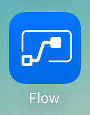
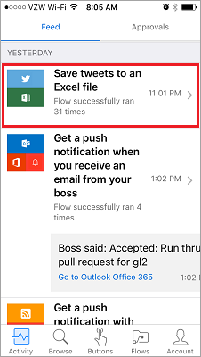
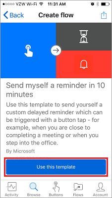

In deze les wordt de mobiele app van Microsoft Flow en de mogelijkheden hiervan beschreven. Vanuit de mobiele app, kunt u toegang tot deze functies: **Activiteitsfeed**, **Bladeren**, **knoppen**, en **beheren van stromen**.

Eerst moet u de Microsoft Flow-app **downloaden** en **installeren** vanuit uw App Store.

Wanneer de app is geïnstalleerd, **opent u deze** en **meldt u zich aan**. Wanneer u de app opent, gaat u naar de **Activiteitsfeed**.

In de activiteitsfeed kunt u zien wat er met uw stromen gebeurt, **wanneer u onderweg bent** en mogelijk geen **toegang hebt tot uw computer**, voor een volledige ervaring.

Als u bijvoorbeeld een van deze stromen selecteert, kunt u de **laatste activiteit** van de desbetreffende stroom **in detail bekijken**: of deze is geslaagd of mislukt en als deze is mislukt, bij welke stap dit is gebeurd.

Zoals u ziet, is deze stroom geslaagd in beide stappen. Nu kunt u het pictogram **Knoppen** selecteren.

## Hoe stromen worden gestart
   Knoppen zijn stromen die worden gestart met een handmatige actie. U kunt bijvoorbeeld de volgende knop maken: **De e-mail 'Werk vandaag thuis' verzenden naar uw manager**.
U kunt deze knop bijvoorbeeld gebruiken als u ver weg woont en op dagen waarop er veel verkeersproblemen zijn.

Gebruik de knop **Bladeren** om in sjablonen te zoeken naar **meer knopstromen** die u kunt toevoegen aan uw verzameling.

We gebruiken de knopstroom **Mijzelf een herinnering sturen over 10 minuten** om te zien hoe dit werkt.

1. Selecteer achtereenvolgens **Knoppen** en **Bladeren in sjablonen**.
2. Selecteer de knopstroom Herinnering.
3. Tik op **Deze sjabloon gebruiken**.
   
    
4. Tik op **Maken**.
   
    
   
    De stroom is **opgeslagen**.
   
    
5. Tik op **knoppen** om de nieuwe stroom te bekijken. 
   
    
6. Tik hierop, zodat u om de 10 minuten **een herinnering ontvangt**.
   
    

U kunt eenvoudig extra knoppen toevoegen aan uw verzameling.

## Een stroom wijzigen of verwijderen
Het is niet moeilijk om een van uw stromen te wijzigen of te verwijderen.

1. Tik op de knop **Stromen**. Dit is het gebied waarin u uw stromen mobiel kunt beheren.
   
    
2. Tik nu op een van de stromen.
   
    
   
    U kunt zien dat er een paar opties zijn:
   
   * Tik op de wisselknop **Stroom inschakelen** om de stroom in of uit te schakelen.
   * U kunt de stroom altijd bewerken als u deze voor andere doeleinden wilt gebruiken. 
   * En u kunt de uitvoeringsgeschiedenis van de stroom bekijken om een idee te krijgen van de geslaagde en mislukte uitvoeringen.
   * U kunt de stroom ook verwijderen door op de knop **Stroom verwijderen** te tikken.
     
     
     
     Hier ziet u dat de **stroom is verwijderd**.
     
     

## Volgende les
De volgende les gaat over **het maken van een knopstroom** voor een team. 

