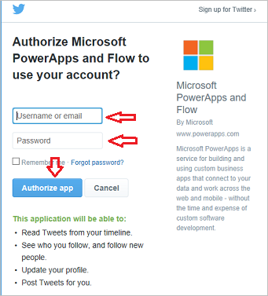
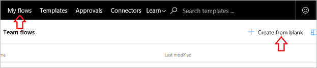
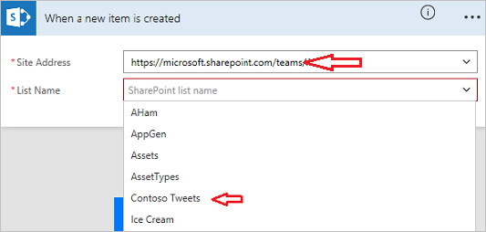

Voor deze stroom maakt u een **SharePoint**-lijst waarin het marketingteam van **Contoso Flooring** hun **Twitter-berichten** en publicatiedatums opslaat. Daarna maakt u een stroom waarmee de inhoud automatisch voor hen wordt getweet. 

## Verbinding maken met Microsoft Flow-services
In dit onderwerp gebruikt u de **SharePoint**- en **Twitter**-services. Als u een service nog niet eerder hebt gebruikt, moet u eerst verbinding maken met de nieuwe service. 

1. Selecteer in Microsoft Flow achtereenvolgens het **tandwielpictogram**, **Verbindingen**,
   
     
2. Selecteer **+ Verbinding maken**.
   
     
3. Schuif omlaag in de lijst, zoek Twitter en selecteer **+**.
   
    
4. Als u een Twitter-account wilt autoriseren, geeft u uw gebruikersnaam of e-mailadres en uw wachtwoord op en selecteert u **App autoriseren**.
   
    
5. Als u uw verbindingen wilt controleren, selecteert u het **tandwielpictogram** en **Verbindingen**.
   
    
   
    U ziet uw nieuwe Twitter-verbinding en andere verbindingen die u hebt gemaakt. 
   
    

## Een SharePoint-lijst maken
U maakt eerst een nieuwe SharePoint Online-lijst voor Contoso Flooring. 

1. Selecteer in SharePoint Online achtereenvolgens **Nieuw** en **Lijst**.
   
    
2. Geef als naam van de lijst **Contoso-tweets** op. 
3. Schakel het selectievakje **Weergeven in sitenavigatie** uit en selecteer **Maken**.
   
    
   
    Wanneer u **Maken** selecteert, gaat u automatisch naar de nieuwe lijst.
4. De lijst heeft standaard één kolom: **Titel**. Voeg nog een kolom toe en geef deze de naam **Inhoud tweet**. De inhoud van uw tweets wordt hierin geplaatst. 
   
   1. Selecteer achtereenvolgens het plusteken en **Meer...**
      
       
   2. Selecteer achtereenvolgens **Meerdere regels tekst** en **OK**.
      
       
5. Voeg een kolom toe voor de datum en tijd van de tweet en geef als naam **Datum tweet** op.
   
   1. Net als bij **Inhoud tweet** hiervoor selecteert u achtereenvolgens het plusteken en **Meer...**
      
       
   2. Schuif omlaag naar **Datum- en tijdnotatie**. Selecteer **Datum en tijd**, zodat beide worden opgenomen.
      
       
   3. Selecteer **OK**. U ziet de lijst **Contoso-tweets** in uw SharePoint-site en u kunt nu nieuwe items toevoegen aan de lijst.

## De stroom maken
Uw lijst is gemaakt. Nu kunt u de stroom maken.

### Een trigger kiezen
1. Ga in Microsoft Flow naar **Mijn stromen** en selecteer **Leeg item maken**.
   
    
2. Selecteer **Wanneer een item is gemaakt**.
   
    
   
    We willen dat onze trigger wordt geactiveerd wanneer er een nieuwe rij wordt toegevoegd met tweetinhoud.
3. Selecteer uw SharePoint-site en selecteer vervolgens de lijst die u eerder hebt ingesteld: **Contoso-tweets**.
   
    

De trigger is nu klaar.

### Een actie toevoegen om het plaatsen te vertragen
1. Selecteer achtereenvolgens **+ Nieuwe stap** en **Een actie toevoegen**. 
   
    
2. Selecteer **Vertragen tot** onder de **Planning**-service. 
   
      
3. Stel de waarde voor de vertraging in.
   
   1. Klik of tik in het veld **Tijdstempel**. 
   2. Wanneer het vak met dynamische inhoud wordt geopend, schuift u helemaal naar beneden, waarna u de drie kolommen van de SharePoint-lijst ziet: **Titel**, **Datum tweet** en **Inhoud tweet**.
   3. Selecteer **Datum tweet**. 
      
       
      
       Wanneer iemand iets toevoegt aan uw SharePoint-lijst, worden acties vertraagd tot aan de datum en tijd die u hebt ingesteld in de kolom **Datum tweet**.
      
       

### Een actie toevoegen om een tweet te plaatsen
Nu voegt u een andere actie voor de stroom toe die u wilt uitvoeren op de datum en tijd die is opgegeven in de kolom **Datum tweet**.

1. Selecteer **+ Nieuwe stap**, **Een actie toevoegen** en zoek naar **Twitter**.
   
     
2. Kies de actie **Twitter - Een tweet plaatsen**.
   
     
3. Klik of tik in het veld **Tekst van de tweet** en selecteer **Inhoud tweet** in het vak met dynamische inhoud. Hier ziet u de reeks die u hebt gemaakt. 
   
    
4. Selecteer **Stroom maken...**
   
     
5. Selecteer **Gereed**.
   
    
   
    De stroom is nu voltooid.
   
    
   
    Wanneer er een nieuw item wordt gemaakt in de SharePoint-lijst, wordt de publicatie ervan vertraagd tot aan vooraf ingestelde datum. Als deze datum wordt bereikt, wordt de stroom op Twitter geplaatst met de tekst uit de kolom **Inhoud tweet** in uw lijst.

## Volgende les
In de volgende les leert u hoe u **stromen op basis van een schema uitvoert** met behulp van de trigger **Terugkeerpatroon**.

