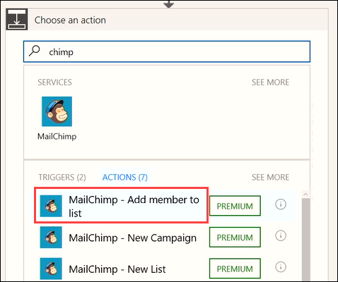
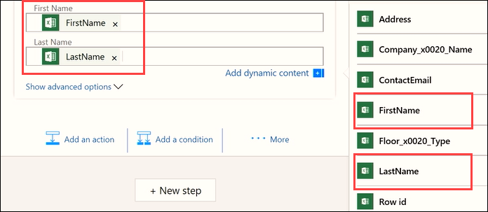

In dit onderwerp ziet u hoe u vooraf geplande stromen kunt uitvoeren met de trigger **Terugkeerpatroon**.  U maakt een stroom voor het marketingteam van Contoso waarmee e-mailadressen van klanten automatisch worden opgehaald uit een Excel-tabel in OneDrive. U hebt de stroom zo geconfigureerd dat er één keer per dag nieuwe e-mailadressen die zijn toegevoegd aan het werkblad, worden toegevoegd aan een MailChimp-klantenlijst. 

## Een geplande stroom maken
1. Open **Microsoft Flow**, selecteer **Mijn stromen** en selecteer vervolgens **Leeg item maken**. 
   
    
2. Selecteer **Honderden connectors en triggers zoeken**.
3. Zoek naar de **Planning**-service, selecteer deze en selecteer de trigger **Planning - Terugkeerpatroon**
   
    
4. Stel **Frequentie** in op **Dag** en stel **Interval** in op **1**. Selecteer **Nieuwe stap** en selecteer **Een actie toevoegen**. 
   
    
5. Zoek naar **Excel**, selecteer de **Excel**-service en selecteer de actie **Excel - Rijen ophalen**. 
   
    
   
    **Opmerking**: Zorg ervoor dat u selecteert **rijen ophalen**, niet **rij ophalen**. 
6. Selecteer **Bestandsnaam** en navigeer naar de bestandslocatie. Selecteer **Tabelnaam** en selecteer de gewenste tabel in het werkblad. 
   
    
7. Voeg een nieuwe actie toe. 
   
    
8. Zoek naar de **MailChimp**-service en selecteer de actie **MailChimp - Lid aan lijst toevoegen**.
   
    
   
    **Opmerking**: MailChimp is een *premium* connector. Afhankelijk van uw Microsoft Flow-licentie moet u zich mogelijk registreren voor een proefversie om deze connector te gebruiken.
9. Voeg de velden **Lijst-id** en **Status** toe uit het vervolgkeuzemenu's:
   
   * **Lijst-id**: selecteer de gewenste MailChimp-adressenlijst
   * **Status**: selecteer **Geabonneerd** 
     
     
10. Gebruik bij **E-mailadres** de functie voor dynamische inhoud om het veld **ContactEmail** toe te voegen. 
    
     
    
     U ziet dat via de stroom automatisch een aanvullende stap wordt gemaakt. In Flow wordt gedetecteerd dat u een actie wilt instellen waarvoor een aanvullende actie is vereist. Wanneer de stroom een nieuw e-mailadres leest, wordt er ook een nieuwe actie voor elke rij gemaakt. 
    
     
11. Gebruik dynamische inhoud om de velden **Voornaam** en **Achternaam** in te vullen:
    
    * **Voornaam**: FirstName
    * **Achternaam**: LastName
      
      

Nu wordt deze stroom eenmaal per dag uitgevoerd om nieuwe rijen uit deze Excel-tabel op te halen met het e-mailadres en de naam en deze te gebruiken om de MailChimp Contoso-adressenlijst in te vullen, wat u tijd en geld bespaart. 

