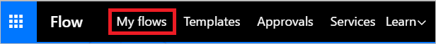

1. Meld u aan bij [Microsoft Flow](https://flow.microsoft.com).
   
    
2. Selecteer het tabblad **Mijn stromen**.
   
    
3. Selecteer **Maken van lege**.
   
    

4. Klik op de knop **Maken van lege**.

