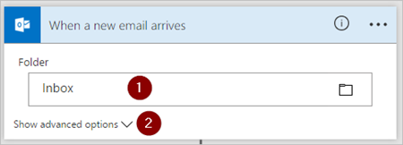

1. Meld u aan bij [Microsoft Flow](https://flow.microsoft.com) en selecteer het tabblad **Mijn stromen**.
2. Selecteer **Maken van lege**.
   
    
3. Zoek op 'e-mail' en selecteer vervolgens **Office 365 Outlook - Wanneer er een nieuwe e-mail binnenkomt** uit de lijst met triggers. Deze trigger wordt elke keer uitgevoerd wanneer u een e-mailbericht ontvangt.
   
    
4. Selecteer de map die de stroom moet controleren op binnenkomende e-mailberichten en selecteer vervolgens **Geavanceerde opties weergeven**.
   
     >[!NOTE]
     > Als u alle e-mailmappen wilt weergeven, selecteert u het pictogram **Kiezer weergeven** aan de rechterkant van het vak **Map** op de kaart **Wanneer er een nieuwe e-mail binnenkomt**.
   
    

