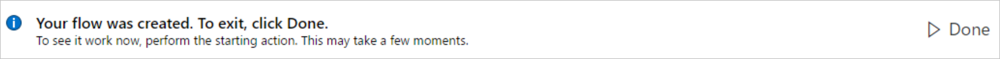
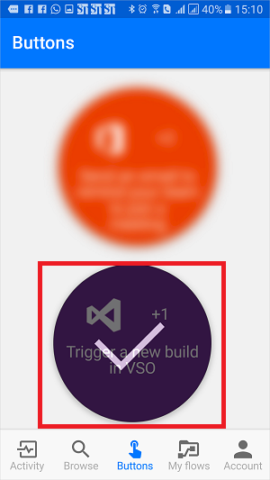

# Kennismaken met knopstromen
## Wat zijn knopstromen?
Er zijn veel terugkerende taken die we allemaal graag met één tik op een knop willen kunnen uitvoeren. U moet bijvoorbeeld snel uw team een e-mail sturen om hen eraan te herinneren deel te nemen aan de dagelijkse teamsynchronisatie, of wilt een nieuwe Visual Studio Online-build van de codebasis starten nadat u hebt ervan op de hoogte bent gesteld dat er voor die dag geen checkins zijn gepland. Met knopstromen kunt u deze en vele andere taken uitvoeren door op een knop op uw mobiele apparaat te tikken.

**Opmerking**: u kunt knopstromen maken vanaf uw mobiele apparaat of vanuit de Flow-portal.  
    

## Waarom knoppen maken?
Maak knoppen om eenvoudig terugkerende taken overal en altijd vanaf het mobiele apparaat te kunnen uitvoeren. Met knoppen bespaart u tijd. Omdat de taken automatisch worden uitgevoerd, is er bovendien minder kans op fouten dan wanneer u ze handmatig uitvoert.  

## Een knop maken
### Vereisten
* Toegang tot Flow. De beheerder kan u toegang verlenen.
* Een account met machtigingen om de connectoren te gebruiken waarmee u de knop maakt. U moet bijvoorbeeld een Dropbox-account hebben om een knop te kunnen maken die toegang heeft tot Dropbox.

### Vanuit de portal
In deze walkthrough maken we een knop waarmee een VSO-build (Visual Studio Online) wordt gestart en meldingen worden verzonden zodat u weet wanneer de build start:  

1. Selecteer de vervolgkeuzelijst **Weergeven** en kies de categorie **Knop**. Hiermee wordt de lijst met sjablonen gefilterd tot alleen die sjablonen worden weergegeven die kunnen worden gebruikt in knopstromen.  
      
2. Selecteer de sjabloon **Trigger a new build in VSO** (Een nieuwe build activeren in VSO) uit de lijst met sjablonen.  
     
3. Selecteer de knop **Deze sjabloon gebruiken** op de pagina **Trigger a new build in VSO** (Een nieuwe build activeren in VSO).   
     
4. Als u niet bent aangemeld, wordt u gevraagd dit nu te doen:  
     
5. Nadat u zich bij Flow hebt aangemeld, wordt u gevraagd zich aan te melden bij de connectors die worden gebruikt in de sjabloon die u hebt geselecteerd. In dit voorbeeld hebben we in stap 2 hierboven de sjabloon **Trigger a new build in VSO** (Een nieuwe build activeren in VSO) geselecteerd, zodat we moeten aanmelden bij VSO (en eventuele andere connectors waarmee u werkt) als u nog niet bent aangemeld:  
       
6. Selecteer de knop **Accepteren** als u ermee akkoord gaat Flow toegang tot uw VSO-account te geven.  
      
   **Opmerking**: u moet elke connector op dezelfde manier toestemming geven. De designer moet als er volgt uitzien als u klaar bent om verder te gaan naar de volgende stap. Selecteer de knop **Doorgaan** om verder te gaan:  
      
7. U bent nu klaar om de eigenschappen te configureren voor de build die u wilt starten:    
     
8. Selecteer de **Accountnaam**, **Projectnaam**, **Build-definitie-id**, **Bronvertakking** en desgewenst **Parameters** of voer deze in op de kaart **Queue a new build** (Een nieuwe build in de wachtrij plaatsen):    
     
9. Configureer vervolgens de eigenschappen van de pushmelding op de kaart **Send a push notification** (Een pushmelding verzenden). Deze pushmelding is standaard geconfigureerd voor het verzenden van een HTML-koppeling naar een webpagina waarop de status van de build wordt weergegeven:  
     
10. Selecteer de knop **Stroom maken** om uw knopstroom op te slaan:   
11. Binnen enkele ogenblikken ziet u dit bericht:  
      

U hebt een knopstroom gemaakt. U kunt deze knopstroom nu altijd en overal uitvoeren, vanaf het tabblad **Knoppen** in de Flow-app. Druk op de 'knop' en de stroom wordt uitgevoerd. De mobiele app voor Microsoft Flow is beschikbaar voor [Android](https://aka.ms/flowmobiledocsandroid), [iOS](https://aka.ms/flowmobiledocsios) en [Windows Phone](https://aka.ms/flowmobilewindows).

### Op uw mobiele apparaat
**Opmerking**: in dit overzicht worden schermafbeeldingen weergegeven van een Android-apparaat. De schermen en ervaring op een iOS-apparaat zijn vergelijkbaar.

In de Flow-app:

1. Selecteer het tabblad **Bladeren** en schuif naar de categorie **Knop**.  
     
2. Selecteer de koppeling **See all** (Allemaal weergeven). Hiermee worden alle sjablonen vooraf geconfigureerde knopsjablonen weergegeven.     
     
3. Selecteer de sjabloon **Send an email to remind your team to join a meeting** (Een e-mail sturen naar uw team om hen te herinneren aan een vergadering)    
     
4. Selecteer de koppeling **USE THIS TEMPLATE** (DEZE SJABLOON GEBRUIKEN) onder aan de pagina.    
     
5. U moet zich aanmelden bij alle services die gebruikmaken van dit sjabloon:    
     
6. Selecteer de koppeling **Volgende** nadat u zich hebt aangemeld bij alle services.      
     
7. Selecteer de koppeling **maken**. Hier kunt u ook de stroom bekijken en bijvoorbeeld wijzigingen aanbrengen die u nodig vindt om het e-mailbericht te personaliseren.        
     
8. Na enkele ogenblikken wordt de knopstroom gemaakt. Selecteer **SEE MY FLOW** (ZIE MIJN STROOM):   
     
9. Al uw stromen bekijken op het tabblad **Mijn stromen**  
     

U hebt een knopstroom gemaakt. U kunt deze knopstroom nu altijd en overal uitvoeren, vanaf het tabblad **Knoppen** in de Flow-app. Druk op de 'knop' en de stroom wordt uitgevoerd. De Flow-app is momenteel beschikbaar op mobiele Android- en iOS-apparaten.  

  

## Een knopstroom activeren
Nu u een knopstroom hebt gemaakt, is het tijd deze uit te voeren. Omdat u knopstromen alleen kunt uitvoeren vanuit de Flow-app, moet Flow zijn geïnstalleerd op uw mobiele Android- of iOS-apparaat.  

1. Start de Flow-app, tik op het tabblad **Knoppen** onder aan de pagina en tik op de *knop* van de knopstroom die u wilt activeren:  
      
2. Bekijk de voortgang terwijl de stroom wordt uitgevoerd:  
      
3. Ten slotte wordt de pagina bijgewerkt en wordt aangegeven dat de knopstroom is voltooid:  
      

Meer heeft het uitvoeren van een stroom niet om het lijf. 

U ontvangt nu de pushmelding waarin wordt aangegeven dat het e-mailbericht is verzonden.  

## De uitvoering van uw knopstromen bewaken
U kunt knopstromen bewaken vanaf het tabblad **Activiteit** van de Flow-app:   
  

**Opmerking**: tik op elke activiteit om te zoomen op de resultaten van de uitvoering voor meer informatie over de uitvoering.  

  

## Knopstromen beheren
U hebt volledige controle over knopstromen. U kunt een knop daarom altijd en overal in- of uitschakelen. Selecteer vanuit de mobiele app of van de Flow-portal **Mijn stromen** om uw stromen te beheren.    

Op het tabblad **Mijn stromen** van de Flow-app:

1. Selecteer de stroom die u wilt beheren:    
      
2. Tik op een van deze opties, afhankelijk van wat u wilt bereiken:    
     
3. Tik op **Delete flow** (Stroom verwijderen) om een stroom te verwijderen.  

**Opmerking**: de volledige uitvoeringsgeschiedenis wordt verwijderd wanneer u een stroom verwijdert:   
   

1. Tik op **Update** (Bijwerken) als u klaar bent met het bewerken van een stroomknop om uw wijzigingen op te slaan:   
      
2. Tik op **Run history** (Uitvoeringsgeschiedenis) om de resultaten van alle uitvoeringen van een bepaalde knopstroom te bekijken:    
     
3. Als u een stroom uitschakelt, is deze niet meer beschikbaar op het tabblad **Knoppen**:    
     

## Volgende stappen
* [Knopstromen delen](share-buttons.md).
* Leer hoe u [knoptriggertokens](introduction-to-button-trigger-tokens.md) kunt gebruiken om realtimegegevens te verzenden wanneer uw knopstromen worden uitgevoerd.
* Installeer de mobiele app voor Microsoft Flow voor [Android](https://aka.ms/flowmobiledocsandroid), [iOS](https://aka.ms/flowmobiledocsios) of [Windows Phone](https://aka.ms/flowmobilewindows).

