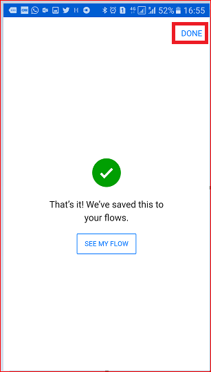

# Aan de slag met knoptriggertokens
## Wat zijn de knoptriggertokens?
Knoptriggertokens zijn gegevenspunten die bekend en beschikbaar zijn op het apparaat waarop een [knopstroom](introduction-to-button-flows.md) wordt uitgevoerd. Deze tokens veranderen op basis van factoren zoals de huidige tijd of de geografische locatie van het apparaat op een bepaald tijdstip.  

Als u bijvoorbeeld een knopstroom op een smartphone uitvoert, is het waarschijnlijk zo dat de **telefoon de tijd kent** op uw huidige locatie, evenals de datum en uw huidige adres. In deze context worden de tijd, datum en het adres waar de telefoon zich bevindt, bepaald op het moment dat de knopstroom wordt uitgevoerd. Deze informatie is automatisch beschikbaar voor gebruik in de knopstromen die op het apparaat worden uitgevoerd. Op basis van deze triggertokens kunt u nuttige stromen maken waarmee terugkerende taken tot een minimum worden beperkt, zoals het verstrekken van uw locatie aan iemand of het bijhouden van de tijd die u aan een bepaalde taak of een bepaald serviceverzoek hebt besteed.

### Lijst met knoptriggertokens
Hieronder vindt u een lijst met de knoptriggertokens die u kunt gebruiken bij het maken van uw knopstromen.

| Parameter | Beschrijving |
| --- | --- |
| Plaats |De plaats waar het apparaat zich bevindt waarop de stroom wordt uitgevoerd. |
| Land/regio |Het land of de regio waar het apparaat zich bevindt waarop de stroom wordt uitgevoerd. |
| Volledig adres |Het volledige adres waar het apparaat zich bevindt waarop de stroom wordt uitgevoerd. |
| Breedtegraad |De breedtegraad van het apparaat waarop de stroom wordt uitgevoerd. |
| Lengtegraad |De lengtegraad van het apparaat waarop de stroom wordt uitgevoerd. |
| Postcode |De postcode van het adres waar het apparaat zich bevindt waarop de stroom wordt uitgevoerd. |
| Staat |De staat van het adres waar het apparaat zich bevindt waarop de stroom wordt uitgevoerd. |
| Straat |De straat waar het apparaat zich bevindt waarop de stroom wordt uitgevoerd. |
| Tijdstempel |De tijd in het gebied waar het apparaat zich bevindt waarop de stroom wordt uitgevoerd. |
| Datum |De datum in het gebied waar het apparaat zich bevindt waarop de stroom wordt uitgevoerd. |
| Gebruikersnaam |De gebruikersnaam van de persoon die is aangemeld bij het apparaat waarop de stroom wordt uitgevoerd. |
| E-mailadres van de gebruiker |Het e-mailadres van de persoon die is aangemeld bij het apparaat waarop de stroom wordt uitgevoerd. |

## Een knopstroom maken waarin gebruik wordt gemaakt van triggertokens
Wanneer u een knop maakt, kunt u triggertokens gebruiken om uitgebreide functionaliteit aan de knop toe te voegen.

In deze walkthrough gaat u een knopstroom op een Android-apparaat maken. In de knopstroom wordt gebruikgemaakt van triggertokens om de datum en uw volledige adres in de e-mail **Working from home** (Ik werk thuis) naar uw baas te verzenden.

In deze procedure ziet u schermafbeeldingen van een Android-apparaat, maar de ervaring is vergelijkbaar op iOS- en Windows Phone-apparaten.

### Vereisten
* Een werk- of school-e-mailadres of een [Microsoft-account](https://account.microsoft.com/about?refd=www.microsoft.com) met toegang tot Microsoft Flow.
* De mobiele app voor Microsoft Flow voor [Android](https://aka.ms/flowmobiledocsandroid), [iOS](https://aka.ms/flowmobiledocsios) of [Windows Phone](https://aka.ms/flowmobilewindows).

Laten we beginnen:

1. Start Flow en selecteer **Browse**  (Bladeren)  
     
2. Selecteer de service **Send a 'Working from home today' email to your manager** onder de categorie **Button**   
     
3. Selecteer **USE THIS TEMPLATE**  
     
4. Selecteer **Edit** op de kaart **Send an email**  
     
5. Tik op het tekstvak **Subject** en voer **today -** in het tekstvak achter de tekst WFH in. Wanneer u op het tekstvak klikt, ziet u dat er ook een lijst met parameters/tokens wordt geopend. We gebruiken een van deze tokens in de volgende stap om de datum aan het onderwerp van de e-mail toe te voegen.  
     
6. Zorg dat de cursor nog in het tekstvak met het onderwerp is geplaatst, schuif naar de parameterlijst **manual** en tik op **Date**. U ziet dat de datumparameter nu in het tekstvak **Subject** (Onderwerp) wordt weergegeven:  
     
7. Schuif naar het tekstvak **Body** en tik achter het standaardbericht, zodat hier de aanvullende tokens kunnen worden opgenomen.  
     
8. Tik op de parameter **Full address** en tik op **Create**.  
     
9. Tik op **Done**. De knopstroom is nu gemaakt.  
     

## De knopstroom uitvoeren
**OPMERKING**: met deze knopstroom wordt uw huidige locatie via e-mail verzonden.  

1. Tik op de categorie **Buttons** aan de onderkant van het scherm. U ziet een lijst met de knoppen die u mag gebruiken. Tik op de knop van de knopstroom die u zojuist hebt gemaakt:  
     
2. Tik op **ALLOW** om aan te geven dat de knopstroom toegang mag krijgen tot de locatiegegevens van het apparaat:  
     
3. Na enkele minuten ziet u dat de e-mail naar uw baas is verzonden:  
     

U hebt zojuist een knopstroom gemaakt waarin triggertokens voor zowel de datum als het volledige adres worden gebruikt. 

## Volgende stappen
* [Knopstromen delen](share-buttons.md)
* [Meer informatie over knopstromen](introduction-to-button-flows.md)
