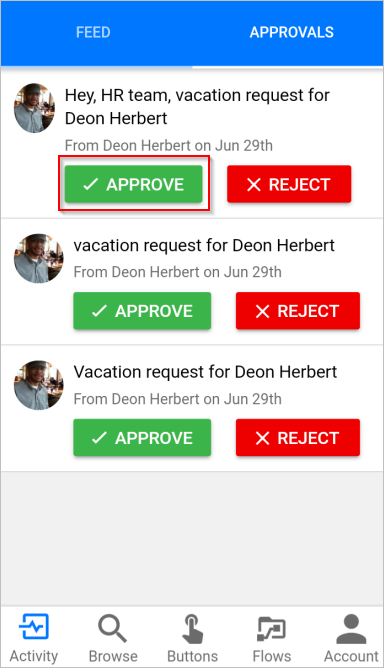

# Aanvragen goed keuren op uw mobiele apparaat met behulp van Microsoft Flow
[!INCLUDE [view-pending-approvals](includes/cc-rebrand.md)]
Als een stroom u identificeert als fiatteur en u de mobiele app voor Microsoft Flow hebt geïnstalleerd, ontvangt u een push melding wanneer u wordt gevraagd om uw goed keuring uit te voeren.

In dit artikel vindt u een aantal veelvoorkomende scenario's die waarschijnlijk optreden tijdens het beheren van goedkeurings aanvragen in de mobiele app voor Microsoft Flow.

> [!NOTE]
> De afbeeldingen in dit onderwerp zijn afkomstig van een Android-apparaat. de ervaring op iOS is echter vergelijkbaar.
> 
> 

## Vereisten
U hebt het volgende nodig om dit scenario te volt ooien:

* Een [Android](https://aka.ms/flowmobiledocsandroid) -of [IOS](https://aka.ms/flowmobiledocsios) -apparaat met de mobiele app voor Microsoft flow.
* Moet worden aangewezen als fiatteur in een goedkeurings stroom.
* Aanvragen voor goed keuring in behandeling.

## In behandeling zijnde aanvragen weer geven
1. Open de mobiele app voor Microsoft Flow.
   
    
2. Selecteer **goed keuringen** in de rechter bovenhoek.
   
    
3. Alle in behandeling zijnde goed keuringen weer geven:
   
    

Als er geen goedkeurings aanvragen in behandeling zijn, maakt u een [goedkeurings stroom](modern-approvals.md), stelt u zichzelf in als fiatteur en vervolgens de stroom activeren. Goedkeurings aanvragen worden een paar seconden weer gegeven in het goedkeurings centrum en verzenden een aanvraag voor goed keuring.

## Aanvragen goed keuren en een optionele opmerking laten staan
1. Als u dit nog niet hebt gedaan, volgt u de voor gaande stappen om [aanvragen in behandeling weer te geven](mobile-approvals.md#view-pending-requests).
2. Selecteer **goed keuren** in de aanvraag die u wilt goed keuren.
   
    
3. (Optioneel) Selecteer **Opmerking toevoegen (optioneel)** .
   
    
   
    Voer een opmerking in het scherm **Opmerking toevoegen** in.
   
    
4. Selecteer **bevestigen** in de rechter bovenhoek.
   
    
   
    Het scherm geslaagd wordt weer gegeven nadat uw beslissing is vastgelegd door de stroom.
   
    

## Aanvragen afwijzen en een optionele opmerking plaatsen
Volg de [stappen voor het goed keuren van een aanvraag](mobile-approvals.md#approve-requests-and-leave-an-optional-comment), maar Selecteer in de tweede stap **afwijzen** .

## Meer informatie
[Moderne goedkeurings stromen maken](modern-approvals.md).

