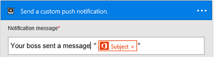

# Stromen in Microsoft Flow beheren op uw telefoon
U kunt een lijst weergeven met alle stromen die u hebt gemaakt en voor elke stroom de gebeurtenissen en acties weergeven, de stromen in- of uitschakelen en de uitvoeringsgeschiedenis verkennen.

**Vereisten**

* Installeer de mobiele app voor Microsoft Flow voor [Android](https://aka.ms/flowmobiledocsandroid), [iOS](https://aka.ms/flowmobiledocsios) of [Windows Phone](https://aka.ms/flowmobilewindows) op een [ondersteund apparaat](getting-started.md#use-the-mobile-app). Op de afbeeldingen in dit artikel is de iPhone-versie van de app te zien, maar de afbeeldingen op een Android- en Windows Phone-apparaat zien er vergelijkbaar uit.
* Als u nog geen stroom hebt, kunt u er een maken op [de website van Microsoft Flow](https://flow.microsoft.com/). Om het testen gemakkelijker te maken, gebruikt u een stroom die u zelf kunt activeren. U bent dan niet afhankelijk van een externe gebeurtenis.

De stroom in deze zelfstudie wordt uitgevoerd wanneer u een e-mail ontvangt van een specifiek adres:

U kunt uw persoonlijke e-mailadres instellen voor het testen en vervangen door een ander adres (bijvoorbeeld dat van uw manager) wanneer de stroom gereed is voor gebruik.

Wanneer de stroom wordt uitgevoerd, wordt een aangepaste pushmelding (met deze syntaxis) naar uw telefoon verzonden:

**Opmerking**: u kunt ook de [stroomactiviteit controleren](mobile-monitor-activity.md) via de mobiele app.

## Een stroom beheren
1. Open de mobiele app en tik op **Mijn stromen** aan de onderkant van het scherm om alle stromen weer te geven.
   
    Voor elk item ziet u de naam van de stroom, pictogrammen voor de bijbehorende gebeurtenissen en acties, de tijd waarop de stroom voor het laatst is uitgevoerd en een pictogram waarmee wordt aangegeven of de meest recente uitvoering is geslaagd.
   
    
2. Tik op een stroom om beheeropties voor de stroom weer te geven.
   
    
3. Tik op de wisselknop **Stroom inschakelen** om de stroom in- of uit te schakelen.
4. Tik op **Stroom weergeven** om de gebeurtenissen en acties voor de stroom weer te geven. Tik op een gebeurtenis of een actie om deze uit te vouwen en tik vervolgens op **Terug**.
   
    
5. Tik op **Uitvoeringsgeschiedenis** om de geslaagde uitvoeringen, de mislukte uitvoeringen of beide voor een stroom weer te geven.
   
    
6. Tik op een uitvoering om aan te geven of de gebeurtenissen en acties zijn geslaagd en hoeveel tijd de uitvoering (in seconden) heeft geduurd.
   
    

