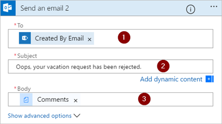

# Een goedkeuringswerkstroom maken en testen met Microsoft Flow

Met Microsoft Flow kunt u de goedkeuring van documenten of processen beheren binnen diverse services, waaronder SharePoint, Dynamics CRM, Salesforce, OneDrive voor Bedrijven, Zendesk of WordPress.

U kunt een goedkeuringswerkstroom maken door de actie **Goedkeuringen - Een goedkeuring starten** aan een stroom toe te voegen. Nadat u deze actie hebt toegevoegd, kan uw stroom de goedkeuring van documenten of processen beheren. U kunt bijvoorbeeld goedkeuringsstromen voor documenten maken die facturen, werkorders of verkoopoffertes goedkeuren. U kunt ook goedkeuringsstromen voor processen maken, die vakantieaanvragen, overwerk of reisplannen goedkeuren.

Fiatteurs kunnen aanvragen beantwoorden via hun Postvak IN, het [goedkeuringscentrum](https://flow.microsoft.com/manage/approvals/received/) op de Microsoft Flow-website of de Microsoft-Flow-app.

## Een goedkeuringswerkstroom maken
Hier volgt een overzicht van de stroom die we gaan maken en testen:

   

De stroom voert de volgende stappen uit:

1. Start wanneer iemand een vakantieaanvraag maakt in een SharePoint Online-lijst.
2. Voegt de vakantieaanvraag toe aan het goedkeuringscentrum en verzendt de aanvraag per e-mail naar de fiatteur.
3. Verzendt een e-mail met de beslissing van de fiatteur naar de persoon die vakantie heeft aangevraagd.
4. Werkt de SharePoint Online-lijst bij met opmerkingen van de fiatteur over de beslissing.

## Vereisten
Om dit scenario te voltooien, moet u toegang hebben tot:

[!INCLUDE [prerequisites-for-modern-approvals](includes/prerequisites-for-modern-approvals.md)]

Maak deze kolommen in uw SharePoint Online-lijst:

   

Noteer de naam en de URL van de SharePoint Online-lijst. U hebt deze items later nodig om de trigger **SharePoint: wanneer een item wordt gemaakt** te configureren.

## De stroom maken op basis van een lege sjabloon
[!INCLUDE [sign-in-and-create-flow-from-blank-template](includes/sign-in-and-create-flow-from-blank-template.md)]

## Een trigger toevoegen

[!INCLUDE [add-trigger-when-sharepoint-item-created](includes/add-trigger-when-sharepoint-item-created.md)]

Het **Siteadres** en de **Lijstnaam** zijn de items die u eerder in dit scenario hebt genoteerd.

## Een profielactie toevoegen

1. Selecteer de knop **Nieuwe stap** en vervolgens **Een actie toevoegen**.
   
    
2. Voer in het zoekvak **Een actie kiezen** de tekst **profiel** in.
   
    
3. Zoek en selecteer vervolgens de actie **Office 365-gebruikers: Mijn profiel ophalen**.
   
    
4. Geef een naam voor de stroom op en selecteer vervolgens **Stroom maken** om het werk op te slaan dat u tot nu toe hebt gedaan.
   
    

## Een goedkeuringsactie toevoegen

[!INCLUDE [add-an-approval-action](includes/add-an-approval-action.md)]

> [!NOTE]
> Deze actie verzendt de goedkeuringsaanvraag naar het e-mailadres in het vak **Toegewezen aan**.
>
>

## Een voorwaarde toevoegen

[!INCLUDE [add-approval-condition-response](includes/add-approval-condition-response.md)]

## Een e-mailactie voor goedkeuringen toevoegen

Gebruik deze stappen om een e-mail te verzenden als de vakantieaanvraag wordt goedgekeurd:

[!INCLUDE [add-action-to-send-email-when-vacation-approved](includes/add-action-to-send-email-when-vacation-approved.md)]

   

## Een bijwerkactie voor goedgekeurde aanvragen toevoegen

[!INCLUDE [add-action-to-update-sharepoint-with-approval](includes/add-action-to-update-sharepoint-with-approval.md)]

> [!NOTE]
> **Siteadres**, **Lijstnaam**, **Id** en **Titel** zijn vereist.
>
>

## Een e-mailactie voor weigering toevoegen

[!INCLUDE [add-action-to-send-email-when-vacation-rejected](includes/add-action-to-send-email-when-vacation-rejected.md)]

## Een bijwerkactie voor geweigerde aanvragen toevoegen

[!INCLUDE [add-action-to-update-sharepoint-with-rejection](includes/add-action-to-update-sharepoint-with-rejection.md)]

   > [!NOTE]
   > **Siteadres**, **Lijstnaam**, **Id** en **Titel** zijn vereist.
   >
   >

1. Selecteer **Stroom bijwerken** om uw werk op te slaan.
   
    

Als u de stappen tot zover hebt gevolgd, moet uw stroom eruitzien als deze schermopname:

U hebt de stroom nu gemaakt en het is tijd om deze te testen.

## Een goedkeuring aanvragen

[!INCLUDE [request-vacation-approval](includes/request-vacation-approval.md)]

U hebt nu uw stroom gemaakt en getest. Laat vervolgens aan anderen weten hoe ze deze kunnen gebruiken.

## Meer informatie

* [Goedkeuringsaanvragen in behandeling](approve-reject-requests.md) weergeven en beheren
* [Sequentiële goedkeuringsstromen](sequential-modern-approvals.md) maken.
* [Parallelle goedkeuringsstromen](parallel-modern-approvals.md) maken.
* Installeer de mobiele app voor Microsoft Flow voor [Android](https://aka.ms/flowmobiledocsandroid), [iOS](https://aka.ms/flowmobiledocsios) of [Windows Phone](https://aka.ms/flowmobilewindows).
