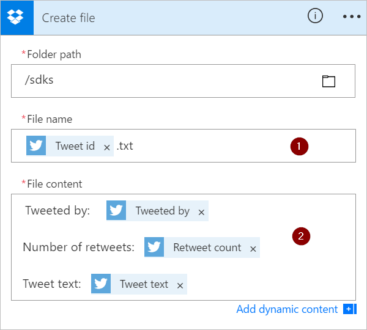

# Meerdere acties en geavanceerde opties toevoegen aan een stroom
Pas een stroom aan door een of meer geavanceerde opties en meerdere acties voor dezelfde trigger toe te voegen. Voeg bijvoorbeeld een geavanceerde optie toe waarmee een e-mailbericht met hoge prioriteit wordt verzonden. Verzend niet alleen een e-mail wanneer een item wordt toegevoegd aan een SharePoint-lijst, maar maak ook een bestand in Dropbox dat dezelfde informatie bevat.

## Vereisten
* [Een stroom maken](get-started-logic-flow.md)

## Nog een actie toevoegen
In deze procedure voegt u een actie toe in het midden van de stroom. Met deze actie wordt een bestand opgeslagen in uw Dropbox en wordt het item in de lijst gearchiveerd.

1. Ga naar [flow.microsoft.com](https://flow.microsoft.com) en selecteer **Mijn stromen** in de navigatiebalk bovenin.
2. Selecteer in de lijst met stromen de stroom die u wilt bewerken.
3. Selecteer de knop **Nieuwe stap** en vervolgens **Een actie toevoegen**.
   
    
4. Zoek **Bestand maken** in de lijst met mogelijke acties en selecteer vervolgens op **Dropbox: Bestand maken**.
   
    
5. Voer uw referenties voor Dropbox in als u hierom wordt gevraagd.
6. Selecteer het mappictogram aan de rechterkant van het vak **Mappad**.
7. Zoek en selecteer vervolgens de map waarin u het nieuwe bestand wilt opslaan.
   
    
8. Voer de naam van het nieuwe bestand in het vak **Bestandsnaam** in. Zorg ervoor dat u een extensie toevoegt aan de bestandsnaam, zoals .txt. Hier wordt de **Tweet-id** gebruikt in de bestandsnaam om ervoor te zorgen dat de bestanden een unieke naam hebben. U moet mogelijk **Meer weergeven** selecteren om het token **Tweet-id** te vinden.
9. Voeg de tekst voor het bestand toe door in het vak **Bestandsinhoud** te typen. U kunt ook tokens toevoegen aan het vak **Bestandsinhoud**.
   
    
   
   > [!IMPORTANT]
   > Als u het bestand een naam geeft die overeenkomt met de naam van een bestaand bestand (in de geselecteerde map), wordt het bestaande bestand overschreven.
   > 
   > 
10. Selecteer de optie **Stroom bijwerken**, die zich in het menu boven aan het scherm bevindt.
11. Stuur een tweet met het opgegeven trefwoord.
    
     Binnen een minuut wordt er een bestand gemaakt in uw Dropbox-account.

## De volgorde wijzigen of een actie verwijderen
* Om een e-mail te ontvangen nadat het bestand in Dropbox is gemaakt, versleept u de titelbalk van de Dropbox-actie tot deze zich boven de e-mailactie bevindt. Laat de Dropbox-actie los boven de pijl tussen de trigger (**Wanneer er een nieuwe tweet wordt geplaatst**) en de e-mailactie. (De cursor geeft aan of de actie correct is geplaatst.)
  
  > [!NOTE]
  > U kunt een stap niet vóór de andere plaatsen als er uitvoer van deze stap wordt gebruikt.
  > 
  > 
  
    
* Selecteer het weglatingsteken (...) aan de rechterkant van de titelbalk van de actie die u wilt verwijderen, selecteer **Verwijderen** en vervolgens **OK**.
  
    
  
     **Opmerking:** u kunt een actie niet verwijderen als u ergens in de stroom gebruikmaakt van uitvoer van deze actie. Verwijder eerst velden die gebruikmaken van deze uitvoer. Vervolgens kunt u de actie verwijderen.

## Geavanceerde opties toevoegen
Begin met een stroom met een actie voor **E-mail verzenden**.

1. Selecteer de optie **Geavanceerde opties weergeven**, die zich onderaan de kaart **Een e-mail verzenden** bevindt.
   
     U ziet vervolgens de geavanceerde opties voor het verzenden van een e-mailbericht.
   
    
2. Selecteer de optie **Hoog** in de lijst **Urgentie** en selecteer vervolgens **Geavanceerde opties verbergen** om de geavanceerde opties te verbergen.
3. Selecteer de optie **Stroom bijwerken**, die zich in het menu boven aan het scherm bevindt.
   
     Uw wijzigingen worden opgeslagen in deze stap.

