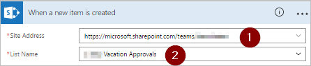
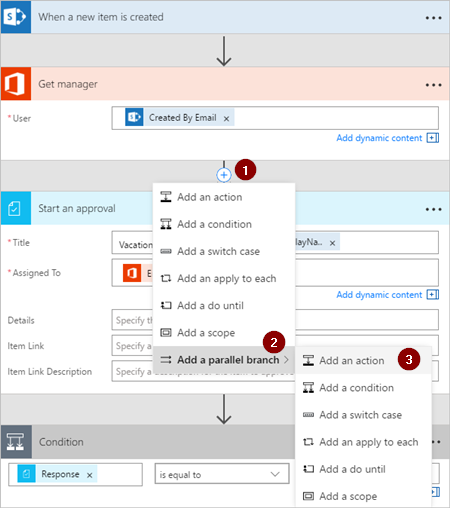

# Parallelle moderne goedkeuringswerkstromen maken met Microsoft Flow

In een parallelle goedkeuringswerkstroom moeten meerdere personen items goedkeuren, waaronder facturen, inkooporders, vakantieaanvragen, enz. De individuele goedkeuring van alle personen is onafhankelijk van alle andere goedkeurders.

In dit scenario gebruiken we Microsoft Flow voor het maken van een stroom die een parallelle goedkeuringswerkstroom automatiseert. Deze stroom automatiseert een vakantieaanvraag van een werknemer, waarbij goedkeuring is vereist van alle personen (of teams) die de werknemer regelmatig ondersteunt. Werknemers gebruiken een [SharePoint-lijst](https://support.office.com/article/Introduction-to-lists-0a1c3ace-def0-44af-b225-cfa8d92c52d7) om vakantie aan te vragen. Vakantiegoedkeuringen zijn vereist van de directe manager van de werknemer, het verkoopteam en het Human Resources-team. Elke vakantieaanvraag wordt ter beoordeling doorgestuurd naar elke goedkeurder. De stroom verzendt e-mailberichten met de statuswijzigingen en werkt SharePoint vervolgens bij met de beslissingen.

## Vereisten

[!INCLUDE [prerequisites-for-modern-approvals](includes/prerequisites-for-modern-approvals.md)]

De SharePoint Online-lijst die u maakt, moet de volgende kolommen bevatten:

   

Noteer de naam en de URL van de SharePoint Online-lijst. We gebruiken deze items later om de trigger **SharePoint: wanneer een item wordt gemaakt** te configureren.

## De stroom maken op basis van een lege sjabloon

[!INCLUDE [sign-in-and-create-flow-from-blank-template](includes/sign-in-and-create-flow-from-blank-template.md)]

## Een trigger toevoegen

[!INCLUDE [add-trigger-when-sharepoint-item-created](includes/add-trigger-when-sharepoint-item-created.md)]

   

## De manager van degene die de vakantieaanvraag heeft ingediend ophalen

[!INCLUDE [add-get-manager-action](includes/add-get-manager-action.md)]

## Uw stroom een naam geven en opslaan

1. Geef een naam voor de stroom op en selecteer vervolgens het pictogram **Opslaan** om het werk op te slaan dat u tot nu toe hebt gedaan.

   

> [!NOTE]
> Selecteer het pictogram**Opslaan** om wijzigingen van uw stroom periodiek op te slaan.
> 
> 

## Een goedkeuringsactie voor de directe manager toevoegen

[!INCLUDE [add-an-approval-action](includes/add-an-approval-action.md)]

> [!IMPORTANT]
> Met deze actie wordt de vakantieaanvraag verzonden naar het e-mailadres in het vak **Toegewezen aan**, dus voer het token **E-mail** uit de lijst **Manager ophalen (v2)** in.
> 
> 

## Een goedkeuringsactie met een parallelle vertakking voor het verkoopteam invoegen

1. Selecteer de pijl-omlaag tussen de kaart **Manager ophalen (v2)** en **Een goedkeuring starten**.
2. Selecteer het plusteken dat wordt weergegeven op de pijl-omlaag nadat u deze hebt geselecteerd.
3. Selecteer **Een parallelle vertakking toevoegen**.
4. Selecteer **Een actie toevoegen**.

    
5. Zoek de actie **Een goedkeuring starten** en selecteer en configureer deze vervolgens. Deze actie verzendt de vakantieaanvraag naar het verkoopteam. Zie de stappen bij [Een goedkeuringsactie voor de directe manager toevoegen](parallel-modern-approvals.md#add-an-approval-action-for-immediate-manager) als u niet weet hoe u de actie **Een goedkeuring starten** toevoegt.

> [!IMPORTANT]
> Gebruik het e-mailadres van het verkoopteam in het vak **Toegewezen aan** van de actie **Een goedkeuring starten**.
> 
> 

## Een goedkeuringsactie met een parallelle vertakking voor het Human Resources-team invoegen

1. Herhaal de stappen bij [Een parallelle vertakking voor het verkoopteam invoegen](parallel-modern-approvals.md#insert-a-parallel-branch-approval-action-for-the-sales-team) om de actie **Een goedkeuring starten** toe te voegen en te configureren. Hierbij worden vakantieaanvragen verzonden naar de afdeling Human Resources.

> [!IMPORTANT]
> Gebruik het e-mailadres van het Human Resources-team in het vak **Toegewezen aan** van de actie **Een goedkeuring starten 3**.
> 
> 

Als u de stappen tot zover hebt gevolgd, moet uw stroom eruitzien als dit voorbeeld:

   

## Opties na het toevoegen van parallelle vertakkingen

Nadat u de acties aan parallelle vertakkingen hebt toegevoegd, hebt u twee opties om meer stappen aan uw stroom toe te voegen:

1. Gebruik de kleine knop **Een nieuwe stap invoegen** (de kleine ronde knop met een plus die wordt weergegeven wanneer u witruimte in een vertakking of het gebied direct onder een vertakking selecteert). Deze knop voegt een stap toe aan die **specifieke vertakking**. Stappen die u met deze knop toevoegt worden uitgevoerd nadat deze specifieke vertakking is voltooid.
1. Gebruik de grotere knop **Nieuwe stap** onder aan de volledige werkstroom. Stappen die u met deze knop toevoegt, worden uitgevoerd nadat alle vertakkingen zijn voltooid.

In de volgende secties gebruiken we de kleine knop **Een nieuwe stap invoegen** om deze stappen in elke vertakking uit te voeren:

* Een voorwaarde toevoegen waarmee wordt gecontroleerd of de vakantieaanvraag is goedgekeurd of afgewezen.
* Een e-mailbericht verzenden dat de werknemer informeert over de beslissing.
* De vakantieaanvraag in SharePoint bijwerken met de goedkeuringsbeslissing.

Vervolgens gebruiken we de grotere knop **Nieuwe stap** om een e-mail te verzenden met een overzicht van alle beslissingen voor de vakantieaanvraag.

Laten we verdergaan:

## Een voorwaarde toevoegen aan elke vertakking

1. Selecteer een willekeurig stuk witruimte in de vertakking **Een goedkeuring starten**.
2. Selecteer de kleine knop **Een nieuwe stap invoegen** (de ronde knop met een plusteken die wordt weergegeven nadat u de witruimte in de vorige stap selecteert).
3. Selecteer **Een voorwaarde toevoegen** in het menu dat verschijnt.
4. Selecteer het eerste vak op de kaart **Voorwaarde** en selecteer vervolgens het token **Antwoord** van de categorie **Een goedkeuring starten** in de lijst met dynamische inhoud.

    
5. Bevestig dat de lijst (in het midden van de **kaart Voorwaarde**) is ingesteld op **Is gelijk aan**.
6. Voer **Goedkeuren** (deze tekst is hoofdlettergevoelig) in het laatste vak in.
7. De kaart Voorwaarde moet er nu uitzien zoals weergegeven in de volgende afbeelding:

    

   > [!NOTE]
   > Deze voorwaarde controleert de reactie van de actie **Een goedkeuring starten** die naar de manager van de werknemer gaat.
   > 
   > 
8. Herhaal de voorgaande stappen op de vertakkingen **Een goedkeuring starten 2** (de goedkeuringsaanvraag aan het verkoopteam) en **Een goedkeuring starten 3** (de goedkeuringsaanvraag aan het Human Resources-team).

## E-mailacties toevoegen aan elke vertakking

Voer de volgende stappen uit aan de zijde **INDIEN JA** van de vertakking **Voorwaarde**.

   Opmerking: Uw stroom gebruikt deze stappen om een e-mailbericht te verzenden wanneer de aanvraag is goedgekeurd:

[!INCLUDE [add-action-to-send-email-when-vacation-approved](includes/add-action-to-send-email-when-vacation-approved.md)]

   

Gebruik de zijde **INDIEN NEE** van de vertakking **Voorwaarde** om een e-mailbericht te verzenden wanneer een aanvraag wordt afgewezen. Herhaal vervolgens de voorgaande stappen voor het toevoegen van een sjabloon voor de afwijzing via e-mail.

Herhaal de voorgaande stappen op de vertakkingen **Een goedkeuring starten 2** (de goedkeuringsaanvraag aan het verkoopteam) en **Een goedkeuring starten 3** (de goedkeuringsaanvraag aan het Human Resources-team).

## De vakantieaanvraag bijwerken met de beslissing

Voer de volgende stappen uit om SharePoint bij te werken wanneer beslissingen zijn genomen.

   Opmerking: Zorg ervoor dat u deze stappen uitvoert op zowel de zijde **INDIEN JA** als de zijde **INDIEN NEE** van de vertakking.

[!INCLUDE [add-action-to-update-sharepoint-with-approval](includes/add-action-to-update-sharepoint-with-approval.md)]

   

Herhaal de voorgaande stappen in de vertakkingen **Een goedkeuring starten 2** en **Een goedkeuring starten 3**.

## De stroom voltooien

1. Selecteer **Nieuwe stap** > **Een actie toevoegen**

    
1. Gebruik de stappen die u eerder hebt gebruikt om een e-mailbericht te verzenden met een overzicht van de resultaten van elke goedkeuring. Verzend dit e-mailbericht naar de werknemer die de vakantie heeft aangevraagd. Uw kaart lijkt mogelijk op dit voorbeeld:

   

## Meer informatie over moderne goedkeuringen

[Inleiding tot moderne goedkeuringen](modern-approvals.md)

