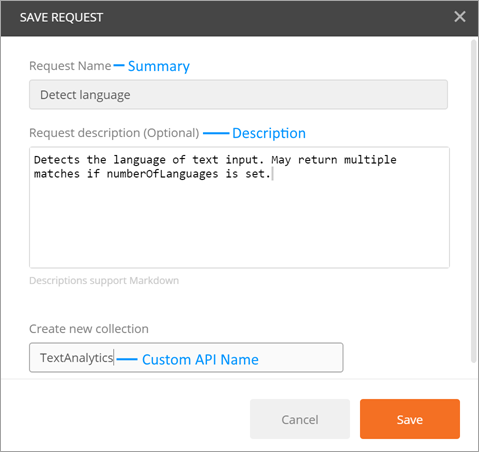

# Een aangepaste connector met Postman beschrijven
[Postman](https://www.getpostman.com/) is een hulpmiddel waarmee u sneller en gemakkelijker API’s kunt ontwikkelen. Deze zelfstudie laat zien hoe u een Postman Collection kunt maken die u vervolgens kunt gebruiken om gemakkelijk [aangepaste connectors](register-custom-api.md) in Microsoft Flow te maken.

## Vereisten
* Installeer de [Postman-app](https://www.getpostman.com/apps).

## Een Postman Collection maken
U gaat nu Postman Collection bouwen voor de [Tekstanalyse-API](https://www.microsoft.com/cognitive-services/text-analytics-api) van Azure Cognitive Services. Deze API identificeert de taal, de gevoelswaarde en belangrijke zinnen in de tekst waarop u de API uitvoert.

1. De eerste stap bij het maken van een Postman Collection bestaat eruit om een aanvraag te maken. Bij het maken van de aanvraag kunt u de HTTP-term, de aanvraag-URL, query- of padparameters, headers en de hoofdtekst instellen. Zie [Sending Requests](https://www.getpostman.com/docs/requests) (Aanvragen verzenden) in de documentatie bij Postman voor meer informatie. Voor het eindpunt van de Taal detecteren-API moet u de waarden als volgt instellen:
   
    
   
    Details van parameters en gebruikte waarden:
   
   | Parameter | Waarde |
   | --- | --- |
   | Term |POST |
   | Aanvraag-URL |https://westus.api.cognitive.microsoft.com/text/analytics/v2.0/languages |
   | Parameters |numberOfLanguagesToDetect |
   | Autorisatie |'Geen Auth' |
   | Headers |Ocp-Apim-Subscription-Key = <your subscription key>  Content-Type = application/json |
   | Hoofdtekst |<code>{ &nbsp;&nbsp;&nbsp;"documents": [ &nbsp;&nbsp;&nbsp;&nbsp;&nbsp;{ &nbsp;&nbsp;&nbsp;&nbsp;&nbsp;&nbsp;&nbsp;&nbsp;"id": "1", &nbsp;&nbsp;&nbsp;&nbsp;&nbsp;&nbsp;&nbsp;&nbsp;"text": "Hello World" &nbsp;&nbsp;&nbsp;&nbsp;&nbsp;} &nbsp;&nbsp;] }<code> |
2. Klik op **Send** (Verzenden) om de aanvraag te maken en een antwoord terug te ontvangen.
3. Klik op **Save** (Opslaan) om de aanvraag in een Postman Collection op te slaan.
   
    
4. Geef een **Request name** (Naam aanvraag) en **Request description** (Beschrijving aanvraag) op in het dialoogvenster **Save Request** (Aanvraag opslaan). Deze waarden gaat u gebruiken in uw aangepaste connector.
   
    
   
    U kunt ook het antwoord op de aanvraag opslaan. Aangepaste connectors ondersteunen momenteel uitsluitend één antwoord per aanvraag. Als u meerdere antwoorden per aanvraag opslaat, wordt alleen het eerste gebruikt.
   
    
5. Ga verder met het bouwen van uw Postman Collection door meer aanvragen en antwoorden te maken en op te slaan.
6. Als u klaar bent met het bouwen van de Postman Collection Postman voor alle aanvragen en antwoorden, exporteert u de verzameling.
   
    
7. Kies **Collection v1** (Verzameling v1) als exportindeling.
   
    

U kunt deze Postman Collection nu gebruiken om een aangepaste connector in Microsoft Flow te maken.

> [!IMPORTANT]
> Als u een aangepaste connector uit een Postman-verzameling maakt, moet u de header `Content-type` uit de acties en triggers verwijderen. Deze wordt namelijk automatisch door Microsoft Flow toegevoegd. Verificatieheaders (zoals `Ocp-Apim-Subscription-Key`) moeten worden gedefinieerd in het gedeelte **Beveiliging** en uit de acties en triggers worden verwijderd. 
> 
> 

Zie voor meer informatie [Register and use custom connectors in Microsoft Flow](register-custom-api.md) (Aangepaste connectors registreren en gebruiken in Microsoft Flow).

