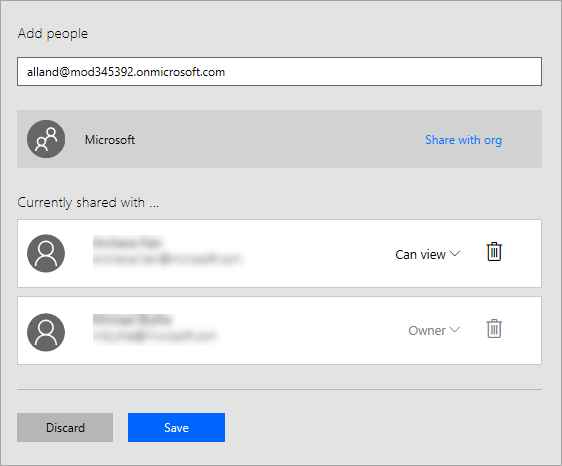

# <a name="register-and-use-custom-connectors-in-microsoft-flow"></a>Aangepaste connectors registeren en gebruiken in Microsoft Flow
Met Microsoft Flow kunt u werkstromen ontwikkelen zonder dat daarvoor programmacode nodig is. Maar in sommige gevallen moet u functies van Microsoft Flow hebben uitgebreid, en webservices zijn daarvoor een logisch hulpmiddel. Uw stroom kan verbinding maken met een service, bewerkingen uitvoeren en gegevens terugontvangen. Wanneer u een webservice hebt waarmee u verbinding wilt maken via Microsoft Flow, kunt u de service registreren als een aangepaste connector. Hierdoor kan Microsoft Flow vaststellen wat de kenmerken van uw Web-API zijn, zoals welke verificatie is vereist, welke bewerkingen worden ondersteund en wat de parameters en uitvoer voor al deze bewerkingen zijn.

In dit onderwerp gaan we kijken welke stappen vereist zijn als u een aangepaste connector wilt registeren en gebruiken, en gaan we de [Tekstanalyse-API](https://www.microsoft.com/cognitive-services/text-analytics-api) van Azure Cognitive Services gebruiken. Deze API identificeert de taal, de gevoelswaarde en belangrijke zinnen in de tekst waarop u de API uitvoert.

## <a name="prerequisites"></a>Vereisten
* Een [Microsoft Flow-account](https://flow.microsoft.com).
* Een OpenAPI 2.0-bestand (voorheen bekend als Swagger) in de JSON-indeling, een URL naar een definitie van een OpenAPI of een Postman Collection voor uw API. Als u geen van deze hebt, geven we u richtlijnen.
* Een afbeelding die wordt gebruikt als pictogram voor uw aangepaste connector (optioneel).

## <a name="steps-in-the-custom-connector-process"></a>Stappen in de procedure voor aangepaste connectors
De procedure voor aangepaste connectors omvat verschillende stappen die we hieronder kort beschrijven. In dit artikel wordt ervan uitgegaan dat u al een RESTful-API met een soort van geverifieerde toegang hebt, zodat we ons in de rest van het artikel op stap 3 - 6 kunnen concentreren. Zie [Een aangepaste Web-API maken voor Microsoft Flow](customapi-web-api-tutorial.md) voor een voorbeeld van stap 1 en 2.

1. **Bouw een RESTful-API** in de taal en platform van uw keuze. Als Microsoft-technologie wordt gebruikt, bevelen we een van de volgende aan (maar kunt u elk platform gebruiken):
   
   * Azure Functions
   * Azure Web Apps
   * Azure API Apps
2. **Beveilig uw API** met een van de volgende verificatiemechanismen. U kunt niet-geverifieerde toegang verlenen tot uw connectors, maar dat wordt niet aanbevolen.
   
   * Azure Active Directory. Zie voor meer informatie: [Azure Active Directory gebruiken met een aangepaste connector in Microsoft Flow ](customapi-azure-resource-manager-tutorial.md).
   * OAuth 2.0 voor specifieke services zoals Dropbox, Facebook en SalesForce
   * Algemene OAuth 2.0
   * API-sleutel
   * Basisverificatie
3. **Beschrijf uw API** op twee manieren die aan de industrienormen voldoen, zodat Microsoft Flow verbinding ermee kan maken.
   
   * Een OpenAPI-bestand
   * Een Postman Collection
     
     U kunt ook in stap 4 als onderdeel van het registratieproces een OpenAP-bestand maken.
4. **Registreer uw aangepaste connector** met een wizard in Microsoft Flow, waar u een beschrijving van de API, beveiligingsinformatie en andere informatie opgeeft.
5. **Gebruik uw aangepaste connector** in een app. Maak een verbinding met de connector in uw app en roep alle eventuele bewerkingen aan die de API kan uitvoeren, net zoals u standaardverbindingen in Microsoft Flow aanroept.
6. **Deel uw aangepaste connector** net zoals u andere resources in Microsoft Flow deelt. Deze stap is optioneel, maar het is vaak zinvol om aangepaste connectors te delen met meerdere makers van apps.

## <a name="describe-your-api"></a>Uw API beschrijven
Als we aannemen dat u een API met een soort van geverifieerde toegang hebt, hebt u een methode nodig om de API te beschrijven zodat Microsoft Flow er verbinding mee kan maken. Om dit te doen, maakt u een OpenAPI-bestand of een Postman Collection – dit kunt u doen vanaf *elk* REST API-eindpunt, zoals:

* Openbaar beschikbare connectors. Enkele voorbeelden zijn [Spotify](https://developer.spotify.com/), [Uber](https://developer.uber.com/), [Slack](https://api.slack.com/), [Rackspace](http://docs.rackspace.com/), enzovoort.
* Een API die u maakt en implementeert naar elke cloudhostingprovider, inclusief Azure, Amazon Web Services (AWS), Heroku, Google Cloud en meer.
* Een aangepaste line-of-business-API die is geïmplementeerd op uw netwerk, zolang de API wordt weergegeven op het openbare internet.

OpenAPI 2.0 (voorheen bekend als Swagger) en Postman Collections gebruiken verschillende indelingen, maar zijn beide taal-neutrale, machineleesbare documenten waarmee de bewerkingen en parameters van uw API's worden beschreven:

* Afhankelijk van de taal en het platform waarmee uw API is gebouwd, kunt u deze documenten met diverse hulpprogramma's genereren. Zie de [documentatie van de Tekstanalyse-API](https://westus.dev.cognitive.microsoft.com/docs/services/TextAnalytics.V2.0/export?DocumentFormat=Swagger&ApiName=Azure) voor een voorbeeld van een OpenAPI file.
* Als u nog geen OpenAPI-bestand voor uw API hebt en er geen wilt maken, kunt nog steeds eenvoudig een aangepaste connector maken met behulp van een Postman Collection. Zie [Een Postman Collection maken](postman-collection.md) voor meer informatie.
* Microsoft Flow maakt uiteindelijk achter de schermen gebruik van OpenAPI, zodat een Postman Collection wordt geparseerd en omgezet in een bestand met de OpenAPI-definitie.

**Opmerking**: de bestandsgrootte mag niet meer dan 1 MB zijn.

### <a name="getting-started-with-openapi-and-postman"></a>Aan de slag met OpenAPI en Postman
* Zie [Getting Started with OpenAPI](http://swagger.io/getting-started/) (Aan de slag met OpenAPI) op de site swagger.io als u geen ervaring met OpenAPI hebt.
* Als u geen ervaring met Postman hebt, installeert u de [Postman-app](https://www.getpostman.com/apps) van die site.
* Als uw API is gebouwd met Azure API Apps of Azure Functions, zie [Exporting an Azure hosted API to PowerApps and Microsoft Flow](https://docs.microsoft.com/azure/app-service/app-service-export-api-to-powerapps-and-flow) (Een op Azure gehoste API exporteren naar PowerApps en Microsoft Flow) voor meer informatie.

## <a name="register-your-custom-connector"></a>Uw aangepaste connector registreren
U gaat nu het OpenAPI-bestand of Postman Collection gebruiken om uw aangepaste connector in Microsoft Flow te registreren.

1. In [flow.microsoft.com](https://flow.microsoft.com) selecteert u in de bovenste balk het tandwiel om het instellingenmenu te openen. Selecteer de optie **Aangepaste connectors**.
   
      
2. Selecteer **Aangepaste connector maken**.
   
    
3. Op het tabblad **Algemeen** kiest u hoe de aangepaste connector wilt maken.
   
   * OpenAPI uploaden
   * OpenAPI URL plakken
   * Een Postman Collection V1 uploaden
     
     
     
     Een pictogram voor uw aangepaste connector uploaden De velden Beschrijving, Host en het Basis-URL zijn meestal automatisch al ingevuld met de gegevens uit het OpenAPI-bestand. Als ze niet automatisch zijn ingevuld, kunt u gegevens toevoegen aan deze velden. Selecteer **Doorgaan**.
4. Voer op het tabblad **Beveiliging** de verificatie-eigenschappen in.
   
    
   
   * Het verificatietype wordt automatisch ingevuld op basis van wat er is gedefinieerd in het `securityDefinitions`-object van uw OpenAPI. Hieronder vindt een voorbeeld van OAuth2.0.
     
       ```
       "securityDefinitions": {
           "AAD": {
           "type": "oauth2",
           "flow": "accessCode",
           "authorizationUrl": "https://login.windows.net/common/oauth2/authorize",
           "tokenUrl": "https://login.windows.net/common/oauth2/token"
           "scopes": {}
           }
       },
       ```
   * Als het OpenAPI-bestand geen `securityDefintions`-object gebruikt, zijn geen aanvullende waarden vereist.
   * Wanneer u Postman Collection gebruikt, wordt het verificatietype alleen automatisch ingevuld als er ondersteunde verificatietypen worden gebruikt, zoals OAuth 2.0 of basisverificatie.
   * Zie [Een aangepaste Web-API maken voor Microsoft Flow](customapi-web-api-tutorial.md#set-up-azure-active-directory-authentication) voor een voorbeeld van hoe AAD-verificatie (Azure Active Directory) wordt ingesteld.
5. Op het tabblad **Definities** worden alle bewerkingen die zijn gedefinieerd in uw OpenAPI-bestand of Postman Collection samen met de aanvraag- en responswaarden automatisch ingevuld. Als al uw vereiste bewerkingen zijn gedefinieerd, kunt u verdergaan naar stap 6 van het registratieproces zonder dat u iets in dit scherm hoeft te wijzigen.
   
    
   
    Als u bestaande acties wilt bewerken of nieuwe acties wilt toevoegen aan uw aangepaste connector, moet u doorgaan met lezen van de onderstaande informatie.
   
   1. Als u een nieuwe actie wilt toevoegen die nog niet in uw OpenAPI-bestand of Postman Collection voorkwam, selecteert u **Nieuwe actie** in het linkerdeelvenster en vult u in de sectie **Algemeen** de naam, beschrijving en zichtbaarheid van de bewerking in.
   2. In de sectie **Aanvragen** selecteert u **Importeren vanuit voorbeeld** in de rechterbovenhoek. Plak een voorbeeld van een aanvraag in het formulier aan de rechterkant. Voorbeeldaanvragen zijn gewoonlijk beschikbaar in de API-documentatie, waar u informatie vindt over hoe het invullen van de velden **Term**, **Aanvraag-URL**, **Headers** en **Hoofdtekst**. Zie de [documentatie van de Tekstanalyse-API](https://westus.dev.cognitive.microsoft.com/docs/services/TextAnalytics.V2.0/operations/56f30ceeeda5650db055a3c6) voor een voorbeeld.
      
      > [!IMPORTANT]
      > Zorg ervoor dat u de header `Content-type` uit de acties verwijdert; deze worden automatisch toegevoegd door Microsoft Flow. Ook verificatieheaders die in het gedeelte **Beveiliging** zijn gedefinieerd, moeten uit de acties en triggers worden verwijderd. 
      > 
      > 
      
      
   3. Selecteer **Importeren** om de definitie van de aanvraag te voltooien. Definieer het antwoord op een soortgelijke manier.
6. Zodra al uw bewerkingen zijn gedefinieerd, selecteert u **Maken** om uw aangepaste connector te maken.
7. Als u uw aangepaste connector hebt gemaakt, gaat u naar het tabblad **Testen** om de bewerkingen te testen die zijn gedefinieerd in de API. Kies een verbinding en geef invoerparameters op voor het testen van een bewerking.
   
    
   
    Als de aanroep is gelukt, krijgt u een geldig antwoord.
   
    

### <a name="quota-and-throttling"></a>Quotum en beperking
* Zie de pagina met de [prijzen voor Microsoft Flow](https://flow.microsoft.com/pricing/) voor meer informatie over quota voor aangepaste connectors. Aangepaste connectors die met u worden gedeeld, worden niet bij deze quotum meegeteld.
* Gebruikers kunnen maximaal 500 aanvragen per minuut indienen voor elke verbinding die is gemaakt op een aangepaste connector.

## <a name="share-your-custom-connector"></a>Uw aangepaste connector delen
Nu dat u een aangepaste connector hebt, kunt u deze delen met andere gebruikers in uw organisatie. Houd er rekening mee dat wanneer u een aangepaste connector deelt, anderen daar misschien afhankelijk van worden, en door een aangepaste connector te verwijderen, worden alle verbindingen met de connector verwijderd. Zie [Overview of certifying custom connectors in Microsoft Flow](api-connector-overview.md) (Overzicht van het certificeren van aangepaste connectors in Microsoft Flow) als u een connector ter beschikking wilt stellen aan gebruikers buiten uw organisatie.

1. In [flow.microsoft.com](https://flow.microsoft.com) selecteert u in de bovenste balk het tandwiel om het instellingenmenu te openen. Selecteer de optie **Aangepaste connectors**.
   
    
2. Selecteer de knop met weglatingstekens (**. . .**) voor uw connector en selecteer vervolgens **Eigenschappen weergeven**.  
   
    
3. Selecteer **Delen** en voer vervolgens de gebruikers of groepen in aan wie u toegang wilt verlenen tot de connector.  
   
    
4. Selecteer **Opslaan**.

## <a name="next-steps"></a>Volgende stappen
[Meer informatie over het maken van een Postman Collection](postman-collection.md)

[Meer informatie over aangepaste OpenAPI-extensies](customapi-how-to-swagger.md).

[Gebruik een ASP.NET Web-API](customapi-web-api-tutorial.md).

[Registreer een Azure Resource Manager-API](customapi-azure-resource-manager-tutorial.md).

