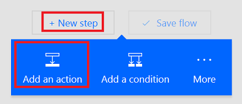
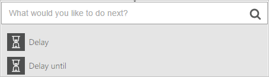

# Stromen op basis van een schema uitvoeren
Een stroom maken waarmee een of meer taken worden uitgevoerd (zoals het verzenden van een rapport per e-mail):

* eenmaal per dag, elk uur of elke minuut
* op een datum die u opgeeft
* na een aantal dagen, uren of minuten dat u opgeeft

## Een terugkerende stroom maken
1. Meld u aan bij [Microsoft Flow](https://flow.microsoft.com) en selecteer vervolgens **Mijn stromen** in de bovenste navigatiebalk.
   
    
2. Selecteer **Maken van lege**.
   
    
3. Typ **Terugkeerpatroon** in het vak **Alle connectors en triggers doorzoeken** en selecteer vervolgens **Schema: terugkeerpatroon**.
   
    
4. Geef in het dialoogvenster **Terugkeerpatroon** op hoe vaak de stroom moet worden uitgevoerd.
   
    Geef bijvoorbeeld **2** op bij **Interval** en **Week** bij **Frequentie** als u de stroom elke twee weken wilt uitvoeren.
   
    

## Geavanceerde opties opgeven
1. Volg de stappen in de vorige sectie en selecteer vervolgens **Geavanceerde opties weergeven**.
   
    **Opmerking**: Deze opties veranderen op basis van de waarden voor **Interval** en **Frequentie**. Als uw scherm niet overeenkomt met de onderstaande afbeelding, controleert u of **Interval** en **Frequentie** zijn ingesteld op dezelfde waarden als in de afbeelding.
2. Selecteer een **tijdzone** om op te geven of de **begintijd** uit een lokale tijdzone komt, een UTC-tijd (Universal Coordinated Time) is, enzovoort.
3. Geef een **begintijd** op in deze notatie:
    JJJJ-MM-DDTHH:MM:SSZ
4. Als u **Dag** hebt gekozen bij **Frequentie**, geeft u de tijd van de dag op wanneer de stroom moet worden uitgevoerd.
5. Als u **Week** hebt opgegeven bij **Frequentie**, geeft u de dag of dagen van de week op waarop de stroom moet worden uitgevoerd en de tijd of tijden van de dag waarop de stroom moet worden uitgevoerd.
   
    Neem bijvoorbeeld de weergegeven opties over om in te stellen dat een stroom niet eerder start dan twaalf uur 's middags (Pacific-tijd) op maandag 1 januari 2018 en elke twee weken op dinsdag om 17:30 (Pacific-tijd) wordt uitgevoerd.
   
    
6. Voeg de acties toe die met de stroom moeten worden uitgevoerd, zoals u kunt lezen in [Een volledig nieuwe stroom maken](get-started-logic-flow.md).

## Een stroom vertragen
1. Meld u aan bij [Microsoft Flow](https://flow.microsoft.com) en selecteer vervolgens **Mijn stromen** in de bovenste navigatiebalk.
   
    
2. Selecteer **Maken van lege**.
   
    
3. Geef een gebeurtenis op, zoals wordt beschreven in [Een volledig nieuwe stroom maken](get-started-logic-flow.md).
4. Selecteer de knop **Nieuwe stap** en vervolgens **Een actie toevoegen**.
   
    
5. Ga op een van de volgende manieren te werk in de lijst met acties:
   
   * Selecteer **Vertraging**, en geef een waarde op voor **Aantal** en **Eenheid**, zoals seconde, minuut of uur.
   * Selecteer **Uitstellen tot** en geef een datum op in deze notatie. JJJJ-MM-DDTHH:MM:SSZ
     
     
     
     

## Meer informatie

Meer informatie over de [geavanceerde opties](https://docs.microsoft.com/azure/connectors/connectors-native-recurrence) en het configureren hiervan.

