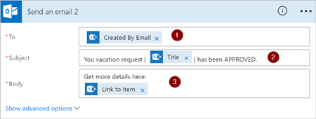
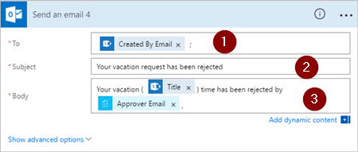

# Opeenvolgende goedkeuringen beheren met Microsoft Flow
Bij bepaalde werkstromen moet vooraf goedkeuring worden gegeven voordat de definitieve goedkeurder zijn goedkeuring geeft. Een bedrijf kan bijvoorbeeld een beleid voor opeenvolgende goedkeuring instellen waarbij facturen van meer dan € 1000,00 vooraf moeten worden goedgekeurd, voordat ze worden goedgekeurd door de financiële afdeling.

In dit scenario maken we een werkstroom met opeenvolgende goedkeuring voor vakantieaanvragen van werknemers.

## Gedetailleerde stappen in de stroom
De stroom:

1. Start wanneer een werknemer een vakantieaanvraag maakt in een [SharePoint Online-lijst](https://support.office.com/article/Introduction-to-lists-0a1c3ace-def0-44af-b225-cfa8d92c52d7).
2. Voegt de vakantieaanvraag toe aan het goedkeuringscentrum en verzendt de aanvraag per e-mail naar degene die vooraf goedkeuring moet geven.
3. Stuurt de beslissing van degene die vooraf goedkeuring moet geven via e-mail naar de werknemer.
4. Werkt de SharePoint Online-lijst bij met de beslissing en eventuele opmerkingen van degene die vooraf goedkeuring moet geven.
   
   Opmerking: Als de aanvraag vooraf is goedgekeurd, voert de stroom de volgende stappen uit:
5. Stuurt de aanvraag naar de definitieve goedkeurder.
6. Stuurt het definitieve besluit via e-mail naar de werknemer.
7. Werkt de SharePoint-lijst bij met de definitieve beslissing.

Deze afbeelding bevat een overzicht van de voorgaande stappen:

   

## Vereisten
[!INCLUDE [prerequisites-for-modern-approvals](includes/prerequisites-for-modern-approvals.md)]

De SharePoint Online lijst die u maakt, moet de volgende kolommen bevatten:

   

Noteer de naam en de URL van de SharePoint Online-lijst. We gebruiken deze items later om de trigger **SharePoint: Wanneer een nieuw item wordt gemaakt** te configureren.

## De stroom maken op basis van een lege sjabloon
[!INCLUDE [sign-in-and-create-flow-from-blank-template](includes/sign-in-and-create-flow-from-blank-template.md)]

## Een trigger toevoegen
[!INCLUDE [add-trigger-when-sharepoint-item-created](includes/add-trigger-when-sharepoint-item-created.md)]

   

## De manager van degene die de vakantieaanvraag heeft ingediend ophalen
[!INCLUDE [add-get-manager-action](includes/add-get-manager-action.md)]

1. Geef een naam voor de stroom op en selecteer vervolgens **Stroom maken** om het werk op te slaan dat u tot nu toe hebt gedaan.
   
    
   
   > [!NOTE]
   > Selecteer regelmatig **Stroom bijwerken** bovenaan in het scherm om de wijzigingen aan uw stroom op te slaan.
   > 
   > 
   
    

Nadat u alle bewerkingen hebt opgeslagen, selecteert u **Stroom bewerken** bovenaan in het scherm. Hierna kunt u doorgaan met wijzigingen aanbrengen.

## Een goedkeuringsactie voor goedkeuring vooraf toevoegen
[!INCLUDE [add-an-approval-action](includes/add-an-approval-action.md)]

Opmerking: Deze actie verzendt de aanvraag om voorafgaande goedkeuring naar het e-mailadres in het vak **Toegewezen aan**.

## Een voorwaarde toevoegen
[!INCLUDE [add-approval-condition-response](includes/add-approval-condition-response.md)]

> [!NOTE]
> Deze voorwaarde controleert de reactie van de actie **Een goedkeuring starten**.
> 
> 

## Een e-mailactie voor voorafgaande goedkeuringen toevoegen
[!INCLUDE [add-action-to-send-email-when-vacation-approved](includes/add-action-to-send-email-when-vacation-approved.md)]

   

## Een bijwerkactie voor vooraf goedgekeurde aanvragen toevoegen
[!INCLUDE [add-action-to-update-sharepoint-with-approval](includes/add-action-to-update-sharepoint-with-approval.md)]

   

## De manager van degene die vooraf toestemming heeft gegeven ophalen
1. Gebruik de stappen die we eerder hebben gedaan bij [De manager van degene die de vakantieaanvraag heeft ingediend ophalen](sequential-modern-approvals.md#get-the-manager-for-the-person-who-created-the-vacation-request) om een nieuwe **Manager ophalen**-actie toe te voegen en te configureren. Deze keer halen we de manager op van degene die vooraf toestemming heeft gegeven
2. De kaart **Manager ophalen 2** moet er, wanneer u klaar bent, uitzien zoals weergegeven in deze afbeelding. Zorg ervoor dat u het **e-mail**-token van de categorie **Manager ophalen** gebruikt in de kaart **Voeg dynamische inhoud toe van de apps en services in deze stroom**.
   
   

## De actie voor definitieve goedkeuring toevoegen
1. Gebruik de stappen die we eerder bij [Een goedkeuringsactie voor goedkeuring vooraf toevoegen](sequential-modern-approvals.md#add-an-approval-action-for-pre-approvals) hebben doorlopen om een nieuwe **Een goedkeuring starten**-actie toe te voegen en te configureren. Met deze actie wordt een aanvraag voor definitieve goedkeuring verzonden via e-mail.
2. Wanneer u klaar bent, moet de kaart lijken op deze afbeelding:
   
    

## De voorwaarde voor definitieve goedkeuring toevoegen
1. Herhaal de stappen bij [Een voorwaarde toevoegen](sequential-modern-approvals.md#add-a-condition) om een **Voorwaarde** toe te voegen die het besluit van de definitieve goedkeurder controleert.

## E-mailbericht met de definitieve goedkeuring verzenden
1. Gebruik de stappen bij [Een e-mailactie voor voorafgaande goedkeuringen toevoegen](sequential-modern-approvals.md#add-an-email-action-for-pre-approvals) om een actie toe te voegen en te configureren waarbij een e-mailbericht wordt verzonden wanneer vakantieaanvragen worden goedgekeurd.
2. Wanneer u klaar bent, moet uw kaart lijken op deze afbeelding:
   
   

## SharePoint bijwerken met goedkeuring
1. Gebruik de stappen bij [Een bijwerkactie voor vooraf goedgekeurde aanvragen toevoegen](sequential-modern-approvals.md#add-an-update-action-for-pre-approved-requests) om een actie toe te voegen en te configureren die SharePoint bijwerkt wanneer de vakantieaanvraag is goedgekeurd.
2. Wanneer u klaar bent, moet de kaart lijken op deze afbeelding:
   
    

## E-mailbericht met afwijzing van voorafgaande goedkeuring verzenden
[!INCLUDE [add-action-to-send-email-when-vacation-rejected](includes/add-action-to-send-email-when-vacation-rejected.md)]

   

Opmerking: Deze actie moet worden toegevoegd aan de vertakking **INDIEN NEE, NIETS DOEN** onder de kaart **Voorwaarde**.

## SharePoint bijwerken met afwijzing van voorafgaande goedkeuring
[!INCLUDE [add-action-to-update-sharepoint-with-rejection](includes/add-action-to-update-sharepoint-with-rejection.md)]

   

## E-mailbericht met de definitieve afwijzing verzenden
1. Gebruik de stappen bij [E-mailbericht met afwijzing van voorafgaande goedkeuring verzenden](sequential-modern-approvals.md#send-email-with-pre-approval-rejection) om een actie toe te voegen en te configureren waarbij een e-mailbericht wordt verzonden wanneer de vakantieaanvraag is afgewezen door de definitieve goedkeurder.
   
    Opmerking: Deze actie moet worden toegevoegd aan de vertakking **INDIEN NEE, NIETS DOEN** onder de kaart **Voorwaarde 2**.
2. Wanneer u klaar bent, moet de kaart lijken op deze afbeelding:
   
   

## SharePoint bijwerken met definitieve afwijzing
1. Gebruik de stappen bij [SharePoint bijwerken met afwijzing van voorafgaande goedkeuring](sequential-modern-approvals.md#update-sharepoint-with-pre-approval-rejection) om een actie toe te voegen en te configureren waarbij SharePoint wordt bijgewerkt wanneer de vakantieaanvraag is afgewezen door de definitieve goedkeurder.
2. Wanneer u klaar bent, moet de kaart lijken op deze afbeelding:
   
   
3. Selecteer **Stroom bijwerken** om uw werk op te slaan.
   
   

Als u de stappen tot zover hebt gevolgd, moet uw stroom eruitzien als deze afbeelding:

Nu we de stroom hebt gemaakt, gaan we bekijken hoe deze werkt.

## Een goedkeuring aanvragen
[!INCLUDE [request-vacation-approval](includes/request-vacation-approval.md)]

Uw aanvraag moet eruitzien als deze afbeelding:

## Goedkeuringsaanvragen in behandeling weergeven
[!INCLUDE [view-pending-approvals](includes/view-pending-approvals.md)]

## Een aanvraag vooraf goedkeuren
[!INCLUDE [approve-request-from-different-locations](includes/approve-request-from-different-locations.md)]

## De aanvraag goedkeuren
De stappen voor het goedkeuren van een aanvraag zijn identiek aan de stappen voor het [Vooraf goedkeuren van een aanvraag](sequential-modern-approvals.md#pre-approve-a-request)

Opmerking: De definitieve goedkeurder ontvangt de vakantieaanvraag pas nadat de aanvraag vooraf is goedgekeurd.

## Een aanvraag weigeren
[!INCLUDE [reject-a-request](includes/reject-a-request.md)]

## Meer informatie
[Scenario voor één goedkeurder bij moderne goedkeuringen](modern-approvals.md)

