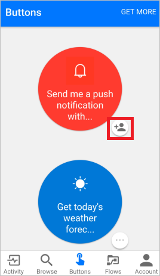
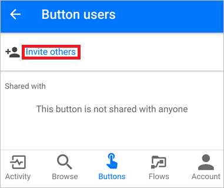
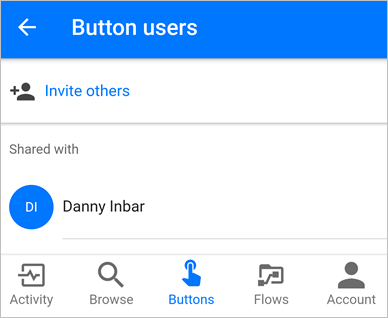

# Knopstromen delen met anderen in Microsoft Flow
In de mobiele app van Microsoft Flow kunt u [knopstromen](introduction-to-button-flows.md) (knoppen) delen met andere gebruikers of groepen in uw organisatie. Wanneer u een knop deelt, kan de persoon of groep met wie u deelt, uw knop op dezelfde manier gebruiken als de eigen knoppen. U kunt ook [een koppeling delen](share-buttons.md#re-share-a-button) naar knoppen die een andere persoon met u heeft gedeeld. U kunt op elk gewenst moment [stoppen met het delen](share-buttons.md#stop-sharing-a-button) van uw knoppen.

> De schermafbeeldingen in dit document zijn gemaakt op een Android-apparaat. Als u een iPhone hebt, zien de afbeeldingen er mogelijk anders uit, maar de functionaliteit is hetzelfde.
> 
> 

Volg [deze stappen](share-buttons.md#use-shared-buttons) om een knop te gebruiken die iemand met u heeft gedeeld.

## Vereisten
U hebt het volgende nodig om knoppen te delen:

* Een account met toegang tot [Microsoft Flow](https://flow.microsoft.com).
* Een stroom om te delen.
* Een mobiel apparaat met de Microsoft Flow-app voor [Android](https://aka.ms/flowmobiledocsandroid), [iOS](https://aka.ms/flowmobiledocsios) of [Windows Phone](https://aka.ms/flowmobilewindows).
* Een groep of gebruiker binnen uw organisatie met wie de knop moet worden gedeeld.

## Een knop delen
U kunt een knop delen vanaf het tabblad **Knoppen** van de mobiele app van Microsoft Flow.

1. Tik op het kleine pictogram naast de knop die u wilt delen.
   
    
2. Tik op **Anderen uitnodigen** op de pagina **Knopgebruikers**.
   
    
3. Zoek de groep of gebruiker met wie u de knop wilt delen en selecteer de groep of gebruiker.
   
    
4. Tik op **VERZENDEN** op de pagina **Anderen uitnodigen**.
   
    
5. Tik op **GEREED** op de pagina waarop wordt aangegeven dat het delen van de knop is voltooid.
   
    

## Vereisen dat gebruikers hun eigen verbindingen gebruiken
> [!NOTE]
> Wanneer u een knop deelt, kunt u toestaan dat personen met wie u de knop hebt gedeeld, alle verbindingen gebruiken die uw knop gebruikt. U kunt ook vereisen dat ze hun eigen verbindingen gebruiken. Als u anderen uw verbindingen laat gebruiken, hebben ze geen toegang tot de referenties in de verbinding en kunnen ze deze niet opnieuw gebruiken voor een andere stroom.
> 
> 

Volg deze stappen om te vereisen dat personen met wie u de knoppen hebt gedeeld, hun eigen verbindingen gebruiken.

1. Selecteer **VERBINDINGEN BEHEREN** op het scherm dat meteen na het delen van een knop wordt weergegeven.
2. Selecteer **BEWERKEN** op de knop die u wilt beheren.
3. Selecteer **Door gebruiker opgegeven** of uw e-mailadres.
   
    Met uw keuze geeft u aan welke verbindingen moeten worden gebruikt voor de gedeelde knop.
   
    
   
    U kunt uw keuze op elk gewenst moment weergeven of wijzigen. Hiervoor selecteert u achtereenvolgens het tabblad **Stromen** > de stroom die u hebt gedeeld > **Gebruikers/verbindingen** > het tabblad **VERBINDINGEN** > **BEWERKEN** voor de knop die u wilt beheren.
   
    

## De lijst met knopgebruikers weergeven
U kunt alle groepen of gebruikers weergeven met wie een knop is gedeeld door de volgende stappen uit te voeren op het tabblad **Knoppen**:

1. Tik op het kleine pictogram naast de knop waarin u geïnteresseerd bent.
2. Bekijk op de pagina **Knopgebruikers** alle groepen of gebruikers met wie de knop wordt gedeeld.
   
    

## Stoppen met het delen van een knop
U kunt het delen van een knop stoppen door de volgende stappen te volgen op het tabblad **Knoppen**:

1. Tik op het kleine pictogram naast de knop die u niet meer wilt delen.
2. Tik op de pagina **Knopgebruikers** op de gebruiker of groep met wie u het delen van de knop wilt stoppen.
   
    
3. Tik op **Gebruiker verwijderen** wanneer de pagina van de gebruiker wordt weergegeven.
   
    
4. Wacht totdat het verwijderen is voltooid. De lijst met **knopgebruikers** wordt vernieuwd en de gebruiker of groep die u hebt verwijderd, wordt niet meer weergegeven.
   
    

## De uitvoeringsgeschiedenis controleren
De volledige uitvoeringsgeschiedenis, inclusief de uitvoeringen die zijn gestart door iemand met wie een knop is gedeeld, wordt alleen weergegeven op het tabblad **Activiteiten** van de mobiele app van Microsoft Flow van de maker van de knop.

## Gedeelde knoppen gebruiken
Voordat u een knop kunt uitvoeren die iemand met u heeft gedeeld, moet u de knop toevoegen aan uw tabblad **Knoppen** van de pagina **Knoppen toevoegen**.

1. Tik op **MEER OPHALEN** (of de banner **Er zijn nieuwe knoppen beschikbaar** als deze wordt weergegeven) op het tabblad **Knoppen**.
   
    
2. Tik op de knop die u wilt gebruiken.
   
    De knop waarop u hebt getikt, wordt direct toegevoegd aan het tabblad **Knoppen** van de Microsoft Flow-app. Vervolgens kunt u de knop op het tabblad **Knoppen** op dezelfde manier gebruiken als alle andere knoppen die hier worden weergegeven.
   
    

## Een knop opnieuw delen
U kunt een koppeling naar een knop die met u wordt gedeeld, delen.

1. Selecteer **...** naast de knop die u wilt delen.
2. Selecteer **Knop met koppeling delen**.
   
    
3. Selecteer de app die u wilt gebruiken om de knop te delen en volg de stappen om de knop te verzenden naar de persoon met wie u deze wilt delen.

## Een gedeelde knop niet meer gebruiken
Als u een knop die met u is gedeeld niet meer wilt gebruiken, gaat u naar het tabblad **Knoppen** en voert u de volgende stappen uit:

1. Tik op het tabblad **Knoppen** op **...**  naast de knop die u niet meer wilt gebruiken.
   
    
2. Tik op **Verwijderen** in het menu dat wordt geopend.

Dat is alles. De knop wordt niet meer weergegeven op het tabblad **Knoppen** van de Microsoft Flow-app.

> [!NOTE]
> Nadat u een gedeelde knop hebt verwijderd, kunt u deze later zo nodig opnieuw toevoegen door **MEER OPHALEN** op het tabblad **Knoppen** te selecteren.
> 
> 

