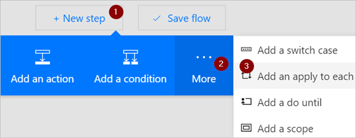

# <a name="use-expressions-in-conditions-to-check-multiple-values"></a>Expressies gebruiken in voor waarden om meerdere waarden te controleren
[!INCLUDE [view-pending-approvals](includes/cc-rebrand.md)]
In dit overzicht leert u hoe u expressies en **voor waarden** kunt gebruiken om meerdere waarden te vergelijken in de **Geavanceerde modus**.

Wanneer u een stroom maakt, kunt u de kaart [**voor waarde**](add-condition.md#add-a-condition) in de basis modus gebruiken om snel een enkele waarde te vergelijken met een andere waarde. Er zijn echter situaties waarin u meerdere waarden moet vergelijken. U kunt bijvoorbeeld de waarde van een paar kolommen in een werk blad of database tabel controleren.

U kunt elke combi natie van de volgende logische expressies in uw voor waarden gebruiken.

expressie|Beschrijvingen|Hierbij
--------|-----------|-------
|[maar](#use-the-and-expression)|Neemt twee argumenten en retourneert ' True ' als beide waarden ' True ' zijn.<br><b>Opmerking</b>: beide argumenten moeten Booleaanse waarden zijn.|Deze expressie retourneert ' false ': <br>en (groter (1, 10), is gelijk aan (0, 0))
|[of](#use-the-or-expression)|Neemt twee argumenten en retourneert ' True ' als een van beide argumenten ' True ' is. <br><b>Opmerking</b>: beide argumenten moeten Booleaanse waarden zijn.|Deze expressie retourneert ' True ':<br>of (groter (1, 10), is gelijk aan (0, 0))
|gelijk is aan|Retourneert waar als twee waarden gelijk zijn.|Als parameter1 bijvoorbeeld Eenwaarde is, retourneert deze expressie True:<br>is gelijk aan (para meters (' parameter1 '), ' Eenwaarde ')
|[jonge](#use-the-less-expression)|Neemt twee argumenten en retourneert ' True ' als het eerste argument minder is dan het tweede argument. <br><b>Opmerking</b>: de ondersteunde typen zijn integer, float en string.|Deze expressie retourneert ' True ':<br>minder (10100)
|lessOrEquals|Neemt twee argumenten en retourneert ' True ' als het eerste argument kleiner is dan of gelijk is aan het tweede argument. <br><b>Opmerking</b>: de ondersteunde typen zijn integer, float en string.|Deze expressie retourneert ' True ':<br>lessOrEquals (10, 10)
|[groter](#use-the-greater-expression)|Neemt twee argumenten en retourneert ' True ' als het eerste argument groter is dan het tweede argument. <br><b>Opmerking</b>: de ondersteunde typen zijn integer, float en string.|Deze expressie retourneert ' false ':<br>meer (10, 10)
|greaterOrEquals|Neemt twee argumenten en retourneert ' True ' als het eerste argument groter is dan of gelijk is aan het tweede argument. <br><b>Opmerking</b>: de ondersteunde typen zijn integer, float en string.|Deze expressie retourneert ' false ':<br>greaterOrEquals (10100)
|[gelaten](#use-the-empty-expression)|Retourneert waar als het object, de matrix of de teken reeks leeg is.|Deze expressie retourneert ' True ':<br>empty (' ')
|ten|Retourneert het tegenovergestelde van een Booleaanse waarde. |Deze expressie retourneert ' True ':<br>niet (bevat (' 200 geslaagd ', ' Fail '))
|If|Retourneert een specifieke waarde als de expressie resulteert in waar of onwaar.|Deze expressie retourneert ' ja ':<br>if (gelijk aan (1, 1), ' ja ', ' nee ')

## <a name="prerequisites"></a>Vereisten
* Toegang tot Microsoft Flow.
* Een werk blad met de tabellen die verderop in dit overzicht worden beschreven. Zorg ervoor dat u uw werk blad op een locatie, zoals Dropbox of micro soft OneDrive, opslaat zodat Microsoft Flow het kunt openen.
* Microsoft Office 365 Outlook (terwijl we Office 365 Outlook gebruiken, kunt u elke ondersteunde e-mail service in uw stromen gebruiken.)

## <a name="use-the-or-expression"></a>De or-expressie gebruiken
Soms moet uw werk stroom een actie uitvoeren als de waarde van een item waardea **of** valueB is. U kunt bijvoorbeeld de status van taken in een werkblad tabel volgen. Stel dat de tabel een kolom bevat met de naam *status* en dat de mogelijke waarden in de kolom *status* zijn:

* **gevuld**
* **#**
* **onnodige**
* **niet gestart**

Hier volgt een voor beeld van hoe het spread sheet eruit kan zien:


Gezien het voor gaande werk blad, wilt u Microsoft Flow gebruiken om alle rijen te verwijderen met een kolom *status* die is ingesteld op *voltooid* of *overbodig*.

We gaan de stroom maken.

### <a name="start-with-a-blank-flow"></a>Beginnen met een lege stroom
1. Meld u aan bij [Microsoft flow](https://flow.microsoft.com).

    
2. Selecteer het tabblad **mijn stromen** .

    
3. Selecteer **leeg item maken**.

    

### <a name="add-a-trigger-to-your-flow"></a>Een trigger toevoegen aan uw stroom
1. Zoek naar **schema**en selecteer vervolgens de trigger **schema-terugkeer patroon**

    
2. Stel in dat het schema één keer per dag wordt uitgevoerd.

    

### <a name="select-the-spreadsheet-and-get-all-rows"></a>Het werk blad selecteren en alle rijen ophalen
1. Selecteer **nieuwe stap** > **een actie toe te voegen**.

    
2. Zoek naar **rijen**en selecteer vervolgens **Excel-rijen ophalen**.

    Opmerking: Selecteer de actie ' rijen ophalen ' die overeenkomt met het werk blad dat u gebruikt. Als u bijvoorbeeld Google Sheets gebruikt, selecteert u **Google Sheets-rijen ophalen**.

    
3. Selecteer het mappictogram in het vak **Bestands naam** , blader naar en selecteer het werk blad dat uw gegevens bevat.

    
4. Selecteer in de lijst **tabel naam** de tabel die uw gegevens bevat.

    

### <a name="check-the-status-column-of-each-row"></a>Controleer de kolom Status van elke rij
1. Selecteer **nieuwe stap** > **meer** > **een apply toe te voegen**.

    
2. Voeg het **waarde** -token toe aan het vak **een uitvoer selecteren uit de vorige stappen** .

    
3. Selecteer **een voor waarde toevoegen** > **bewerken in de geavanceerde modus**.
4. Voeg de volgende **or** -expressie toe. Met **Deze expressie** controleert u de waarde van elke rij in de tabel (een rij wordt een item genoemd als deze wordt geopend in een expressie). Als de waarde van de kolom **status** *voltooid* **of** *onnodig*is, wordt de **or** -expressie geëvalueerd als ' True '.

    De **or** -expressie verschijnt zoals hier wordt weer gegeven:

    ````@or(equals(item()?['status'], 'unnecessary'), equals(item()?['status'], 'completed'))````

    De kaart van de **voor waarde** lijkt op deze afbeelding:

    

### <a name="delete-matching-rows-from-the-spreadsheet"></a>Overeenkomende rijen verwijderen uit het werk blad
1. Selecteer **een actie toevoegen** in de vertakking **Indien ja, niets doen** van de voor waarde.
2. Zoek naar **rij verwijderen**en selecteer vervolgens **Excel-rij verwijderen**.

    
3. Zoek in het vak **Bestands naam** naar het spreadsheet bestand dat de gegevens bevat die u wilt verwijderen en selecteer het.
4. Selecteer in de lijst **tabel naam** de tabel die uw gegevens bevat.
5. Plaats het token **rij-id** in het vak **rij-id** .

    

### <a name="name-the-flow-and-save-it"></a>Geef de stroom een naam en sla deze op
1. Geef uw stroom een naam en selecteer vervolgens de knop **stroom maken** .

    

### <a name="run-the-flow-with-the-or-expression"></a>De stroom uitvoeren met de or-expressie
De stroom wordt uitgevoerd nadat u deze hebt opgeslagen. Als u het werk blad hebt gemaakt dat eerder in dit overzicht wordt weer gegeven, ziet u hier hoe het eruitziet als de uitvoering is voltooid:


Let op dat alle gegevens uit rijen die in de kolom Status ' voltooid ' of ' overbodig ' zijn, zijn verwijderd.

## <a name="use-the-and-expression"></a>De and-expressie gebruiken
Stel dat u een werkblad tabel hebt met twee kolommen. De kolom namen zijn status en toegewezen. Stel dat u alle rijen wilt verwijderen als de waarde van de kolom Status ' geblokkeerd ' is en de waarde van de toegewezen kolom ' John wonder ' is.  Volg alle eerdere stappen in dit overzicht om deze taak uit te voeren. Als u de kaart **voor waarde** in de geavanceerde modus bewerkt, moet u echter de **and** -expressie gebruiken die hier wordt weer gegeven:

````@and(equals(item()?['Status'], 'blocked'), equals(item()?['Assigned'], 'John Wonder'))````

De kaart van de **voor waarde** lijkt op deze afbeelding:


### <a name="run-the-flow-with-the-and-expression"></a>De stroom uitvoeren met de and-expressie
Als u de bewerking hebt gevolgd, lijkt uw werk blad op de volgende afbeelding:


Nadat de stroom is uitgevoerd, lijkt uw werk blad op de volgende afbeelding:


## <a name="use-the-empty-expression"></a>De lege expressie gebruiken
U ziet dat er nu meerdere lege rijen in het werk blad staan. Als u deze wilt verwijderen, gebruikt u de **lege** expressie om alle rijen te identificeren die geen tekst bevatten in de kolommen toegewezen en status.

Volg alle stappen in **de sectie en expressie** eerder in dit overzicht om deze taak uit te voeren. Als u de kaart **voor waarde** in de geavanceerde modus bewerkt, moet u echter de lege expressie op deze manier gebruiken:

````@and(empty(item()?['Status']), empty(item()?['Assigned']))````

De kaart van de **voor waarde** lijkt op deze afbeelding:


Nadat de stroom is uitgevoerd, lijkt het werk blad op de volgende afbeelding:


U ziet dat er extra regels uit de tabel worden verwijderd.

## <a name="use-the-greater-expression"></a>De hogere expressie gebruiken
Stel dat u Baseball tickets voor uw collega's hebt gekocht en dat u een werk blad gebruikt om ervoor te zorgen dat elke persoon terugbetaalt. U kunt snel een stroom maken waarmee dagelijks een e-mail wordt verzonden naar elke persoon die het volledige bedrag niet heeft betaald.

Gebruik de **meer** -expressie om de werk nemers te identificeren die het volledige bedrag niet hebben betaald. U kunt vervolgens automatisch een gebruiks vriendelijke herinnerings-e-mail verzenden naar degenen die niet volledig zijn betaald.

Hier volgt een overzicht van het werk blad:


Hier volgt de implementatie van de **hogere** expressie waarmee alle personen worden geïdentificeerd die minder dan het verschuldigde bedrag hebben betaald:

````@greater(item()?['Due'], item()?['Paid'])````

## <a name="use-the-less-expression"></a>Gebruik de less-expressie
Stel dat u Baseball tickets voor uw collega's hebt gekocht en dat u een werk blad gebruikt om ervoor te zorgen dat elke persoon terugbetaalt op de datum waarmee iedereen akkoord gaat. U kunt een stroom maken waarmee een herinnerings-e-mail wordt verzonden naar elke persoon die het volledige bedrag niet heeft betaald als de huidige datum minder dan één dag voor de verval datum is.

Gebruik de **and** -expressie samen met de **less** -expressie, omdat er twee voor waarden worden gevalideerd:


|          Voor waarde voor validatie          | te gebruiken expressie |                    Hierbij                     |
|-----------------------------------------|-------------------|------------------------------------------------|
|   Is het volledige bedrag betaald?    |      groter      |   @greater(item ()? [' Verval '], item ()? [' Betaald '])    |
| Is de verval datum minder dan één dag verwijderd? |       jonge        | @less(item ()? [' DueDate], addDays (utcNow (), 1)) |

## <a name="combine-the-greater-and-less-expressions-in-an-and-expression"></a>De grotere en minder expressies combi neren in een and-expressie
Gebruik de **meer** -expressie om de werk nemers te identificeren die minder dan het volledige bedrag hebben betaald en gebruik de **minder** -expressie om te bepalen of de verval datum van de betaling minder dan één dag van de huidige datum is verwijderd. U kunt vervolgens de actie **een E-mail verzenden om een** gebruiks vriendelijke herinnerings-e-mail te verzenden naar degenen die niet volledig zijn betaald en de verval datum minder dan één dag is verwijderd.

Hier volgt een overzicht van de werkblad tabel:


Hier volgt de implementatie van de **and** -expressie waarmee alle personen worden geïdentificeerd die minder dan het verschuldigde bedrag hebben betaald en de verval datum minder dan één dag van de huidige datum is verwijderd:

````@and(greater(item()?['Due'], item()?['Paid']), less(item()?['dueDate'], addDays(utcNow(),1)))````

## <a name="use-functions-in-expressions"></a>Functies gebruiken in expressies

Sommige expressies halen hun waarden uit runtime-acties die mogelijk nog niet bestaan wanneer een stroom wordt uitgevoerd. Als u wilt verwijzen naar of wilt werken met deze waarden in expressies, kunt u functies gebruiken die door de werk stroom definitie taal zijn geleverd. Meer informatie: [Functie-naslag informatie voor de werk stroom definitie taal in Microsoft flow](https://docs.microsoft.com/azure/logic-apps/workflow-definition-language-functions-reference)
