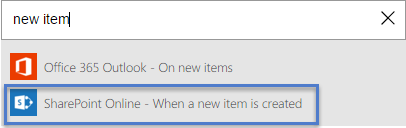

# Wachten op goedkeuring in Microsoft Flow
<iframe width="560" height="315" src="https://www.youtube.com/embed/W6oxcYRtW-8?list=PL8nfc9haGeb55I9wL9QnWyHp3ctU2_ThF" frameborder="0" allowfullscreen></iframe>

Maak een stroom waarmee, als u een item in SharePoint maakt, een goedkeurings-e-mail wordt verzonden en u vervolgens wordt geïnformeerd of het item is goedgekeurd of afgewezen. Als u deze zelfstudie exact wilt volgen, maakt u een eenvoudige SharePoint-lijst als een triggeractie. U kunt echter ook een andere gegevensbron gebruiken, zoals Dropbox of OneDrive.

**Vereisten**

* Maak een eenvoudige lijst in SharePoint Online met de naam **Projecttracker** met een kolom met de naam **Titel** en voeg een kolom voor personen of groepen toe met de naam **Toegewezen aan**.
  
   

## Een gebeurtenis voor het activeren van de stroom toevoegen
1. Ga naar [flow.microsoft.com](https://flow.microsoft.com), selecteer **Mijn stromen** in de navigatiebalk bovenin en selecteer **Nieuwe stroom maken**.
   
    
2. Typ of plak **nieuw item** in het vak met de tekst **Hoe wilt u beginnen?** en selecteer **SharePoint Online - wanneer een nieuw item wordt gemaakt**.
   
    
3. Meld u aan bij SharePoint Online als u hierom wordt gevraagd.
4. Typ of plak de URL van de site met de lijst onder **URL van de site**.
   
    
5. Selecteer een lijst onder **Lijstnaam**, zoals **Projecttracker**.
   
    

## De resulterende actie toevoegen
1. Selecteer de knop **+** en selecteer **Een actie toevoegen**.
   
    
2. Typ of plak **e-mail verzenden** in het vak met de tekst **Wat wilt u vervolgens doen?** en selecteer **Office 365 Outlook - goedkeurings-e-mail verzenden**.
   
    
3. Meld u aan Office 365 Outlook als u hierom wordt gevraagd.
4. Selecteer het veld **Aan** en selecteer vervolgens **E-mailadres Toegewezen aan**.
   
    De gebruiker in de kolom **Toegewezen aan** ontvangt de e-mail om het item goed te keuren of af te wijzen. Wanneer u een item maakt om de stroom te testen, moet u uzelf in dit veld opgeven. Op deze manier kunt u het item niet alleen goedkeuren of afwijzen, maar ontvangt u ook de e-mailmelding.
   
    **Opmerking**: u kunt de velden **Onderwerp** en **Gebruikersopties** aan uw wensen aanpassen.
   
    

## Een voorwaarde toevoegen
1. Selecteer de knop **+** en selecteer **Een voorwaarde toevoegen**.
   
    
2. Selecteer **Geselecteerde optie** in het veld **Objectnaam**.
3. Typ of plak **Goedkeuren** in het veld **Waardeveld**.
   
    
4. Selecteer **Een actie toevoegen** in het gebied **Indien ja**.
   
    
5. Typ of plak **e-mail verzenden** in het vak met de tekst **Wat wilt u vervolgens doen?** en selecteer **Office 365 Outlook - e-mail verzenden**.
   
    
6. Geef in het vak **Onderwerp** een onderwerp op.
   
    Selecteer bijvoorbeeld **Weergavenaam Toegewezen aan**, typ **heeft goedgekeurd** met een spatie aan het begin en het einde, en selecteer vervolgens **Titel**.
7. Geef in het vak **Hoofdtekst** de hoofdtekst van de e-mail op, zoals **Klaar voor volgende fase van project**.
8. Voer de ontvanger in het veld **Aan** in, zoals **E-mailadres Gemaakt door**.
   
    De persoon die het item in de SharePoint-lijst heeft gemaakt, ontvangt een melding of het project is goedgekeurd of afgewezen.
   
    
9. Herhaal de laatste vijf stappen in het gebied **Indien nee**, maar geef nu in de velden **Onderwerp** en **Hoofdtekst** aan dat het project is afgewezen.
   
     

## Uw stroom voltooien en testen
1. Geef uw stroom een naam en selecteer vervolgens **Stroom maken**.
   
     
2. Maak een item in uw SharePoint-lijst.
   
    Er wordt een goedkeurings-e-mail verzonden naar de ontvanger die u hebt opgegeven. Wanneer de ontvanger in die e-mail **Goedkeuren** of **Afwijzen** selecteert, ontvangt u een e-mail met het antwoord. 

